# Synthesis Summary — Evening Analysis 2026-04-28

**Author**: James Pether Sörling  
**Date**: 2026-04-28  
**Source**: Cross-type synthesis of propositions, motions, committee reports, interpellations, realtime-pulse

---

## Lead Story

**The Tidö coalition executed its most legislatively dense day of riksmöte 2025/26 on 28 April 2026**, advancing simultaneous fronts in financial regulation, welfare policy, national security, citizenship law, and constitutional accountability — while the Social Democrats mounted their most coordinated opposition challenge of the year across five legislative domains. The convergence of the EU Banking Package (HD03253), Spring Fiscal Bill endorsement (HC01FiU20), citizenship tightening (HD01SfU28), CER/military legislation (HD01FöU20/FöU14), and S's anti-corruption counter-motion (HD024099) reveals both the breadth of the government's pre-election agenda and the fragility of minority governance under coordinated opposition pressure.

## DIW-Weighted Ranking (Decisive-Important-Watch)

| Priority | Document | DIW | Rationale |
|----------|----------|-----|-----------|
| 1 | HC01FiU20 + HC01FiU24 (Spring Fiscal + Riksbank) | **DECISIVE** | Defines Sweden's economic trajectory for 2026–2027; four-party opposition bloc ready to reject; US tariff risk unquantified |
| 2 | HD01SfU28 (Citizenship tightening) | **DECISIVE** | Coalition cohesion test (L vs SD); high voter salience; September 2026 positioning |
| 3 | HD03253 (EU Banking Package) | **DECISIVE** | Most significant financial regulation in a decade; CRR3/Basel III changes to banking capital structure |
| 4 | HD024099 (S anti-corruption motion) | **IMPORTANT** | Tests M/SD coalition on criminal justice; pre-election accountability narrative |
| 5 | HD01FöU20 + HD01FöU14 (Security legislation) | **IMPORTANT** | EU CER Directive + NATO cooperation; June 2026 votes |
| 6 | HD10449–HD10451 (Interpellations) | **IMPORTANT** | S's pre-election accountability strategy; minister responses due May 2026 |
| 7 | HD024100 (Spring Budget motions) | **WATCH** | Opposition coordination against fiscal priorities; signals 2026 election budget battle |

## Integrated Intelligence Picture

```mermaid
graph TD
    A[Tidö Coalition Pre-Election Sprint] --> B[Economic Front]
    A --> C[Security Front]
    A --> D[Social Policy Front]
    A --> E[Criminal Justice Front]
    
    B --> B1[Spring Fiscal Bill HC01FiU20]
    B --> B2[EU Banking Package HD03253]
    B --> B3[Riksbank Endorsement HC01FiU24]
    
    C --> C1[CER Directive HD01FöU20]
    C --> C2[Military Cooperation HD01FöU14]
    
    D --> D1[Citizenship HD01SfU28]
    D --> D2[Welfare-Crime HD03252]
    D --> D3[Sickness Insurance HD10450]
    
    E --> E1[Anti-Corruption Challenge HD024099]
    E --> E2[Corporate Crime HD10451]
    
    style A fill:#1a1e3d,color:#00d9ff
    style B fill:#0a0e27,color:#ffbe0b
    style C fill:#0a0e27,color:#ff006e
    style D fill:#0a0e27,color:#00d9ff
    style E fill:#0a0e27,color:#ffbe0b
    style B1 fill:#1a1e3d,color:#e0e0e0
    style B2 fill:#1a1e3d,color:#e0e0e0
    style B3 fill:#1a1e3d,color:#e0e0e0
    style C1 fill:#1a1e3d,color:#e0e0e0
    style C2 fill:#1a1e3d,color:#e0e0e0
    style D1 fill:#1a1e3d,color:#e0e0e0
    style D2 fill:#1a1e3d,color:#e0e0e0
    style D3 fill:#1a1e3d,color:#e0e0e0
    style E1 fill:#1a1e3d,color:#e0e0e0
    style E2 fill:#1a1e3d,color:#e0e0e0
```

## Key Cross-Type Synthesis Findings

**Pattern 1 — Security Convergence**: The simultaneous tabling of military cooperation (FöU14), CER critical infrastructure resilience (FöU20), and citizenship tightening (SfU28) reflects the Tidö coalition's deliberate strategy of packaging security-adjacent measures together to frame S/V/MP/C as weak on defence. This is the sharpest security-legislative convergence in any single riksdag day since Russia's 2022 invasion changed Sweden's foreign policy trajectory.

**Pattern 2 — Opposition Coordination**: S filed simultaneous action in five domains: counter-motion to Spring Bill (HD024100), anti-corruption challenge (HD024099), interpellations on railway (HD10449), sickness insurance (HD10450), and corporate crime (HD10451). This level of coordination is unprecedented in 2025/26 and signals S has entered full election-campaign mode.

**Pattern 3 — Economic Vulnerability**: The Finance Committee's 1.9% GDP forecast endorsement (FiU20) is adopted under explicit US tariff pressure that the government has not stress-tested publicly. Riksbank's 2024 monetary policy was endorsed (FiU24) but external evaluators noted faster rate cuts were possible — leaving a policy-credibility exposure that S/V can exploit.

**Pattern 4 — Coalition Fault Lines**: The citizenship tightening (SfU28) creates the highest internal coalition tension with Liberalerna (L), whose urban voter base is more resistant to identity-politics framing than SD or M's core constituencies. The banking package (HD03253) creates a second fault line with business-friendly L voters who may question capital-requirement increases.

## Sibling Analysis Cross-Reference

- `analysis/daily/2026-04-28/propositions/` — EU Banking Package, welfare restrictions, debt management
- `analysis/daily/2026-04-28/motions/` — S anti-corruption challenge
- `analysis/daily/2026-04-28/committeeReports/` — Spring Fiscal Bill, Riksbank endorsement, Constitutional scrutiny
- `analysis/daily/2026-04-28/interpellations/` — Railway, sickness insurance, corporate crime
- `analysis/daily/2026-04-28/realtime-pulse/` — Full legislative calendar synthesis
