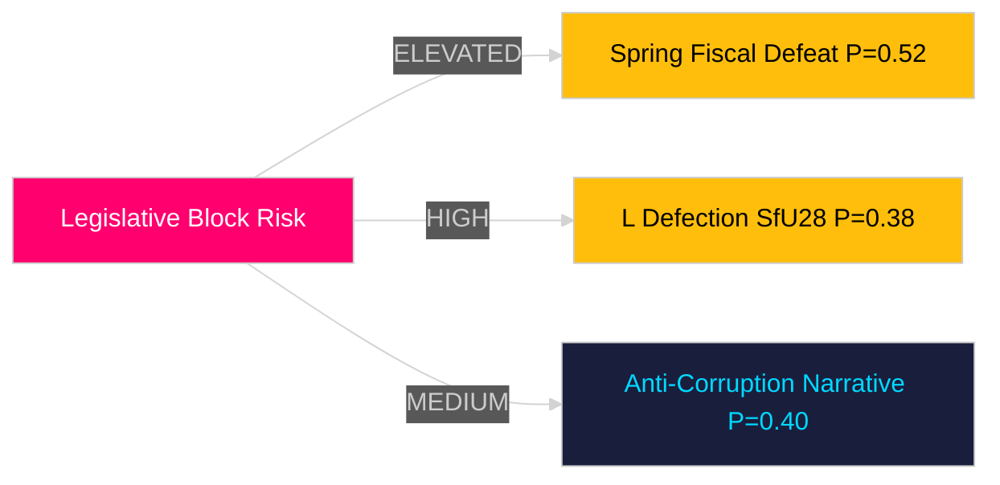

# Threat Analysis — Evening Analysis 2026-04-28

**Author**: James Pether Sörling  
**Date**: 2026-04-28

---

## Political Threat Taxonomy

### Institutional Threats

| Threat Actor | Target | Method | Evidence | Admiralty |
|-------------|--------|--------|----------|-----------|
| S opposition bloc (Teresa Carvalho, S-V-C-MP) | Government anti-corruption agenda | Legislative counter-motion HD024099 challenging "missbruk av offentlig ställning" | [riksdagen.se] HD024099 text | [A2] |
| Four-party opposition (S, V, C, MP) | Spring Fiscal Bill economic legitimacy | Coordinated reservations in FiU20 + Spring Budget counter-motions HD024100 | [riksdagen.se] committee proceedings | [A2] |
| Liberalerna internal dissent | Coalition majority on SfU28 citizenship vote | Potential abstention or reservation on SD-driven language requirements | SfU28 betänkande; L party position statements | [B2] |

### Systemic Threats

| Threat | Vector | Probability | Consequence |
|--------|--------|-------------|-------------|
| US tariff escalation | Global trade policy → Swedish export sector → GDP undershoot | MEDIUM (P=0.45 per IMF WEO Apr-2026) | 1.9% GDP forecast fails; S/V credibility restored |
| Criminal economy expansion | 352 BSEK criminal economy + 23,000 criminal-linked companies | HIGH (established, per ESO) | Corporate crime becomes election liability for Justice Minister Strömmer |
| Banking sector capital adequacy stress | CRR3/Basel III output floor 72.5% for Swedish IRB banks | LOW-MEDIUM (P=0.25) | 10–15 bps funding cost increase; Bankföreningen lobbying intensifies |

## Attack Tree Analysis

**Root: Government loses 2026 parliamentary mandate**

- Branch A: Economic legitimacy undermined
  - US tariffs cause GDP undershoot [P=0.45]
  - Riksbank rate cuts delayed → household pressure [P=0.35]
  - Banking capital requirements increase credit costs [P=0.25]
- Branch B: Coalition cohesion collapse
  - L defects on SfU28 [P=0.38]
  - KD dissatisfied on infrastructure (Carlson interpellation) [P=0.20]
  - SD demands further welfare cuts beyond coalition agreement [P=0.30]
- Branch C: Opposition coordination succeeds
  - S-V-C-MP unite on Spring Fiscal vote [P=0.52]
  - Anti-corruption narrative damages government credibility [P=0.40]
  - Constitutional accountability (KU20) triggers political crisis [P=0.15]

## Adversarial Sequence Analysis — Legislative Block Scenario

1. **Reconnaissance**: S identifies government anti-corruption legislative weakness (HD024099)
2. **Weaponisation**: S prepares legal critique of "missbruk av offentlig ställning" as too broad
3. **Delivery**: Files HD024099 simultaneously with interpellations HD10449-HD10451
4. **Exploitation**: JuU debate forces M/SD to publicly defend an imperfect law
5. **Installation**: Media narrative: "government weak on real corruption while overcriminalising civil servants"
6. **Command**: S uses narrative in election campaign to dominate criminal justice framing

**Detection point**: FiU/JuU committee debates (April-May 2026). **Intervention window**: Government can propose amendment (social-interest exemption) to de-fuse narrative.

## MITRE-Style TTP Mapping (Political)

| ID | Tactic | Technique | Actor | Evidence |
|----|--------|-----------|-------|----------|
| PT-001 | Legislative Disruption | Counter-motion filing | S | HD024099, HD024100 |
| PT-002 | Coalition Fragmentation | Public differentiation on SfU28 | L (potential) | SfU28 committee proceedings |
| PT-003 | Accountability Pressure | Coordinated interpellation burst | S | HD10449, HD10450, HD10451 |
| PT-004 | Economic Credibility Attack | Fiscal reservation + alternative budget | S, V, C, MP | FiU20 reservations |

## Threat Level Assessment

