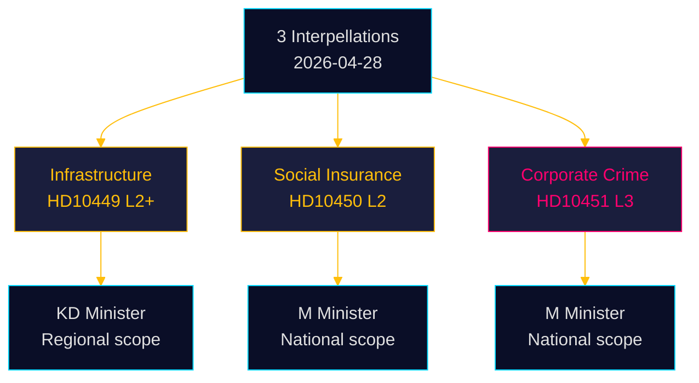

# Classification Results — Interpellations 2026-04-28

**Date**: 2026-04-28  
**Author**: James Pether Sörling

## Classification Framework

Each document is classified across 7 dimensions: Policy area, Political axis, Urgency, Geographic scope, Institutional target, Electoral relevance, and Data classification.

## HD10449 — Södra stambanan och dubbelspår Alvesta-Växjö

| Dimension | Classification |
|-----------|---------------|
| Policy area | Infrastructure / Transport / Regional development |
| Political axis | Centre-left accountability (S) vs Centre-right governance (KD) |
| Urgency | Medium-High — Response deadline 2026-05-18; investments at risk now |
| Geographic scope | Regional (Kronoberg + Skåne, Sydsverige) with national infrastructure implications |
| Institutional target | Infrastruktur- och bostadsminister Andreas Carlson (KD); Trafikverket |
| Electoral relevance | High — Sydsvenska constituencies; key for S regional vote share |
| Data classification | PUBLIC — Offentlighetsprincipen; GDPR Art 9(2)(e) (MP exercise of public mandate) |

**Priority tier**: L2+ Priority  
**Retention**: Permanent (parliamentary record)  
**Access**: Public — riksdagen.se

## HD10450 — Undantaget i sjukförsäkringen efter dag 180

| Dimension | Classification |
|-----------|---------------|
| Policy area | Social insurance / Labor market / Welfare state |
| Political axis | Centre-left defence of welfare exception (S) vs Centre-right signalled reform (M) |
| Urgency | Medium — Preemptive; no announced government change yet |
| Geographic scope | National — applies uniformly across Försäkringskassan |
| Institutional target | Äldre- och socialförsäkringsminister Anna Tenje (M); Försäkringskassan |
| Electoral relevance | High — Long-term sick; workers; trade unions; nationwide |
| Data classification | PUBLIC — No personal data; GDPR Art 9(2)(e,g) (policy debate on social rights) |

**Priority tier**: L2 Strategic  
**Retention**: Permanent (parliamentary record)  
**Access**: Public — riksdagen.se

## HD10451 — Ytterligare åtgärder mot bolag som används som brottsverktyg

| Dimension | Classification |
|-----------|---------------|
| Policy area | Justice / Economic crime / Corporate governance / Financial crime |
| Political axis | Cross-party concern (framed as shared responsibility); S criticises M for passivity on economic crime |
| Urgency | High — ESO 352 BSEK criminal economy; 11.5 BSEK overdue state debts from criminal firms |
| Geographic scope | National; international (money laundering, cross-border crime) |
| Institutional target | Justitieminister Gunnar Strömmer (M); Ekobrottsmyndigheten; Bolagsverket |
| Electoral relevance | High — Rule of law, tax fairness, business integrity all salient voter concerns |
| Data classification | PUBLIC — Statistical aggregates only; no individual personal data; GDPR Art 9(2)(g) |

**Priority tier**: L3 Intelligence-grade  
**Retention**: Permanent (parliamentary record)  
**Access**: Public — riksdagen.se

## Aggregate Classification Matrix

