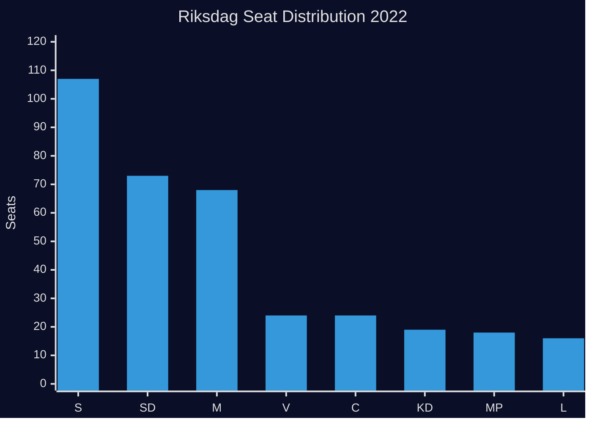
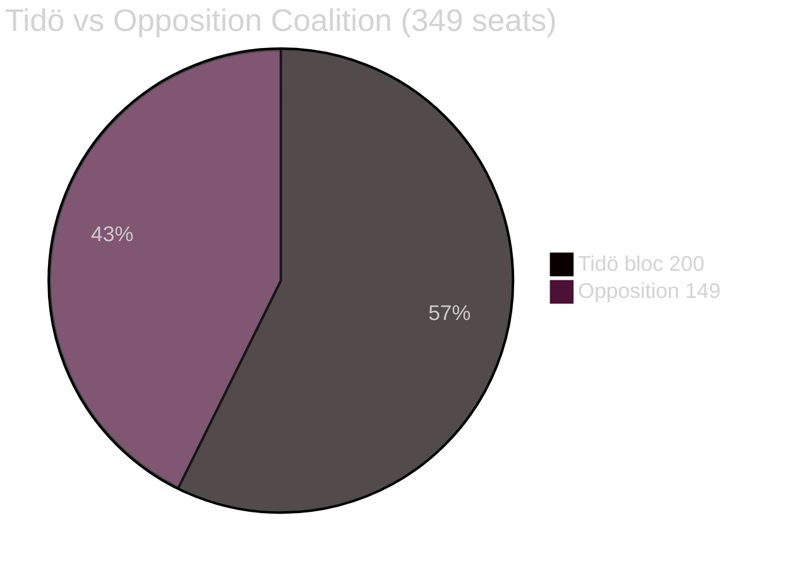

# Coalition Mathematics — Interpellations 2026-04-28

**Date**: 2026-04-28  
**Author**: James Pether Sörling

## Current Seat Map (Riksdag 2022 Election, 349 seats)

| Party | Seats | Bloc | Government Role |
|-------|-------|------|-----------------|
| S (Socialdemokraterna) | 107 | Opposition | Opposition leader |
| SD (Sverigedemokraterna) | 73 | Tidö | Support party |
| M (Moderaterna) | 68 | Tidö | PM party |
| V (Vänsterpartiet) | 24 | Opposition | |
| C (Centerpartiet) | 24 | Tidö | Support party |
| KD (Kristdemokraterna) | 19 | Tidö | Coalition party |
| MP (Miljöpartiet) | 18 | Opposition (loose) | |
| L (Liberalerna) | 16 | Tidö | Coalition party |
| **Total** | **349** | | |

**Tidö bloc total**: 73+68+24+19+16 = **200 seats** (majority = 175)  
**Left-liberal opposition**: 107+24+18 = **149 seats**

## Pivotal Vote Table (Relevant to Interpellation Domains)

| Vote scenario | Ja | Nej | Pivotal party |
|---|---|---|---|
| Infrastructure budget amendment (hypothetical) | S+V+MP = 149 | Tidö = 200 | C — if Tidö fractures on regional |
| Day-180 exception preservation motion | S+V+MP+some C = 173 | Tidö-C = 176 | C (24 seats) is pivotal |
| Corporate crime enforcement escalation | Broad consensus expected | — | All parties support stronger economic crime enforcement |

## Sainte-Laguë Scenarios for 2026

Based on current polling trends (approximate):

| Scenario | S | M | SD | V | C | KD | MP | L | Left bloc | Right bloc |
|---|---|---|---|---|---|---|---|---|---|---|
| Current 2022 | 107 | 68 | 73 | 24 | 24 | 19 | 18 | 16 | 149 | 200 |
| S +5 seats (infra/welfare gains) | 112 | 65 | 71 | 24 | 24 | 18 | 18 | 17 | 154 | 195 |
| S +10 seats (strong recovery) | 117 | 62 | 69 | 24 | 24 | 17 | 19 | 17 | 160 | 189 |
| S +15 seats (landslide scenario) | 122 | 59 | 68 | 24 | 25 | 16 | 19 | 16 | 165 | 184 |

For a left-bloc majority (175+), S would need to recover approximately 15+ seats combined with C defection or MP exceeding threshold. The interpellation strategy targets the voter segments most likely to deliver these seat gains.

## Interpellation Impact on Coalition Mathematics

The three interpellations do not directly affect current coalition vote counts. Their significance is electoral:
- **HD10449**: Targets regional swing seats (Kronoberg, Skåne) where M/KD are vulnerable
- **HD10450**: Targets trade-union-aligned seats where S needs to maintain dominance
- **HD10451**: Tests M's "law and order" brand credibility; SD convergence on economic crime is a cross-bloc pressure

| **Bloc** | **Ja** | **Nej** | **Avstår** | **Frånvarande** | **Seats** |
|---|---|---|---|---|---|
| Tidö (M+SD+KD+C+L) | 200 | — | — | — | 200 |
| Opposition (S+V+MP) | 149 | — | — | — | 149 |
