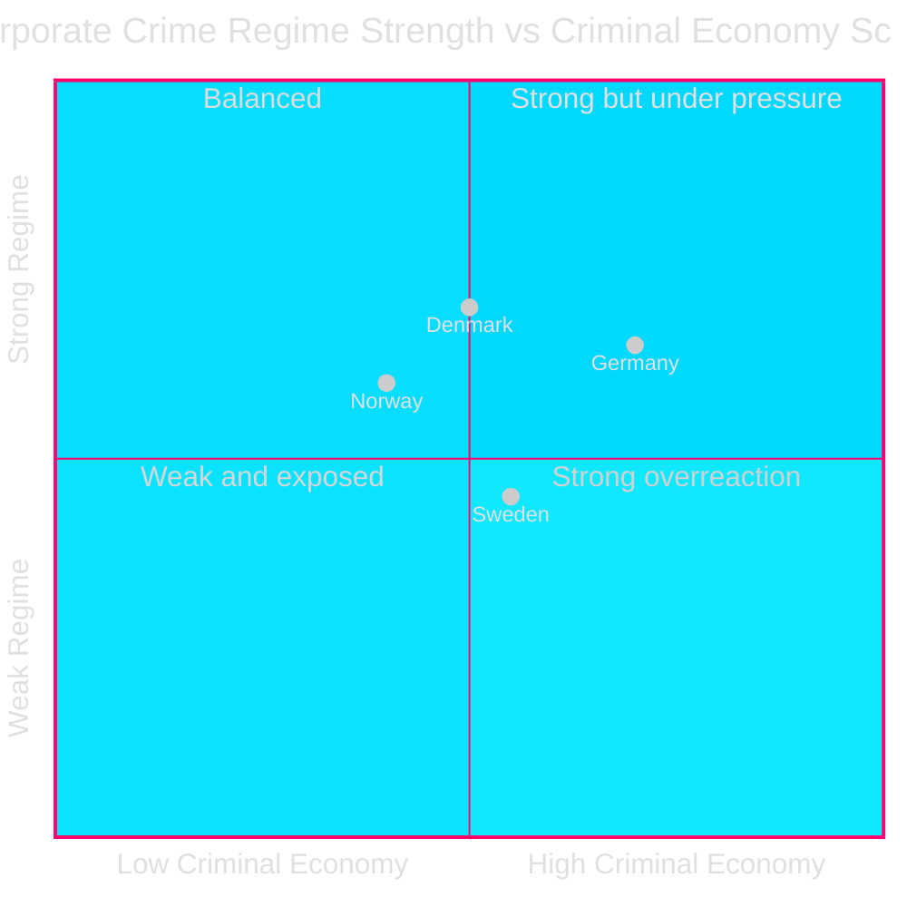
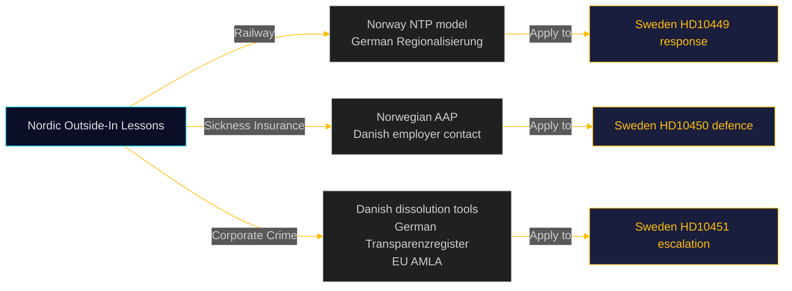

# Comparative International Analysis — Interpellations 2026-04-28

**Date**: 2026-04-28  
**Author**: James Pether Sörling

## Comparator Set

- **Norway (NOR)** — Nordic peer; active regional railway investment policy; comparable sickness insurance architecture
- **Denmark (DNK)** — Nordic peer; similar corporate transparency reforms; "dagpenge" sickness insurance comparator
- **Germany (DEU)** — EU reference; Geldwäschegesetz corporate transparency regime; Deutsche Bahn infrastructure investment model

---

## Domain 1 — Railway Infrastructure (HD10449): Nordic/European Outside-In

### Norway
Norway has maintained strong regional railway investment through the National Transport Plan (NTP), including Intercity development and regional rail electrification in areas comparable to Sydsverige. The Norwegian government's willingness to make multi-decade commitments to regional railway infrastructure contrasts with Trafikverket's revised Swedish plan removing Alvesta-Växjö double tracks. Posterior assessment: Swedish underinvestment in Södra stambanan is an outlier compared to Nordic peers.

**Comparator evidence**: Norwegian NTP 2025–2036 includes Moss-Halden doubling and Bergen railway upgrades; indicative budget NOK 1,064 billion.

### Germany
Deutsche Bahn's Deutschlandtakt project commits to 30-minute connections across major cities. The German federal-regional co-investment model (Regionalisierungsmittel) provides a reference for how central government can fund regional rail without abandoning national rail targets. Swedish lack of comparable regional railway co-investment mechanism is a structural gap.

---

## Domain 2 — Sickness Insurance Day-180 Exception (HD10450): Nordic Comparison

| Jurisdiction | Day-180 or equivalent | Outcome evidence |
|---|---|---|
| **Sweden (current)** | Day-180 exception — employer-linked deferral | Riksrevisionen: positive return-to-work effect (cited HD10450) |
| **Norway** | Arbeidsavklaringspenger (AAP) — assessed for work capacity at various stages; employer return pathway preserved | OECD: Norwegian re-employment rates from sickness higher than OECD average |
| **Denmark** | Sygedagpenge system with re-employment facilitation and employer contact requirement | Danish Arbejdsmarkedskommissionen: early employer contact increases re-employment probability |

**Outside-In analysis**: All Nordic comparators maintain employer-pathway provisions in their sickness insurance architecture. The day-180 exception's removal would make Sweden an outlier in the Nordic context — specifically, it would reduce employer-linked flexibility that has been shown to improve outcomes in Norway and Denmark.

---

## Domain 3 — Corporate Crime Enforcement (HD10451): EU Comparison

| Jurisdiction | Corporate transparency regime | Criminal economy estimate | Key instrument |
|---|---|---|---|
| **Sweden** | January 2025 law; Bolagsverket beneficial ownership register | 352 BSEK / 5.5% GDP (ESO 2026) | Corporate crime vehicle legislation |
| **Germany** | Geldwäschegesetz 2021; Transparenzregister enhanced 2022 | ~600 bn EUR / ~15% GDP (Bundeskriminalamt) | Automatic Transparenzregister + real-estate AML |
| **Denmark** | Company registration with beneficial ownership since 2014 | DKK 400–800 bn (~5-10% GDP estimate, Danish national police) | Civil forfeiture; rapid company dissolution tools |
| **EU (AMLA)** | Anti-Money Laundering Authority (AMLA) — Frankfurt; 2025 operational | — | Centralized AML supervision across EU |

**Outside-In analysis**: Sweden's criminal economy estimate of 5.5% GDP is in the same range as EU peers but the legislative response is behind Denmark and Germany. Denmark's rapid company dissolution tools for confirmed criminal vehicles, and Germany's enhanced Transparenzregister, provide directly applicable models. AMLA's Frankfurt hub creates additional EU coordination opportunity Sweden should exploit.

---

