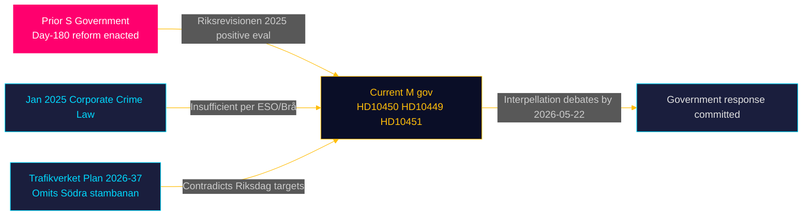
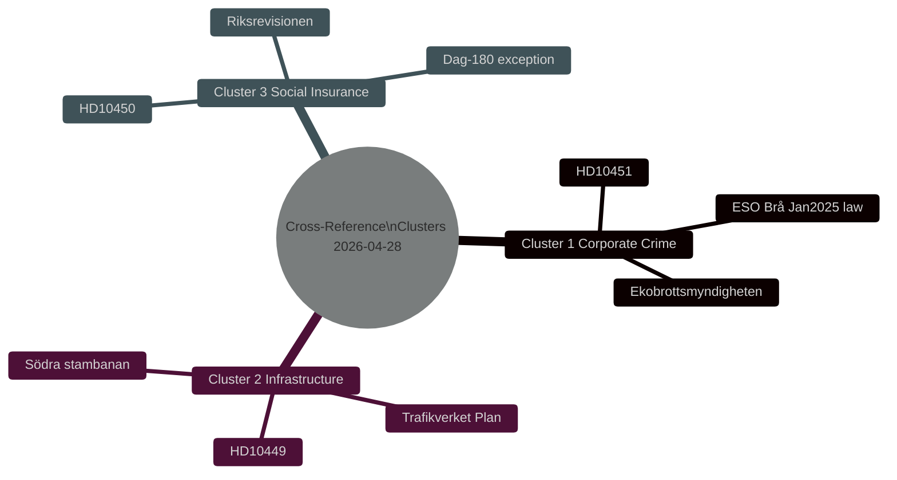

# Cross-Reference Map — Interpellations 2026-04-28

**Date**: 2026-04-28  
**Author**: James Pether Sörling

## Policy Clusters

### Cluster 1 — Economic Governance & Rule of Law

**Documents**: HD10451  
**Related themes**: Bolagslagen, penningtvätt, skattebrott, Ekobrottsmyndigheten, ESO, Brå  
**Legislative chain**: AML legislation → January 2025 corporate crime law → pending further measures  
**Cross-type links**: Connects to previous HD-series interpellations on economic crime and government budget motions on Ekobrottsmyndigheten funding

### Cluster 2 — Regional Infrastructure & Transport Policy

**Documents**: HD10449  
**Related themes**: Trafikverkets nationella plan 2026–2037, Södra stambanan, regional pendling, KD infrastructure policy  
**Legislative chain**: Riksdag transport targets → Trafikverket national plan → Regional co-financing agreements  
**Cross-type links**: Connects to previous infrastructure motions on Sydsvenska transportkorridoren; budget decisions on järnvägsanslag

### Cluster 3 — Social Insurance Reform

**Documents**: HD10450  
**Related themes**: Sjukförsäkring, dag 180-undantaget, Försäkringskassan, Riksrevisionen evaluation  
**Legislative chain**: S-era reform introducing day-180 exception → Riksrevisionen 2025 positive evaluation → M government review (potential)  
**Cross-type links**: Connects to previous Riksrevisionen reports on rehabilitering and sjukskrivning; OECD comparative social insurance reviews

## Legislative Chain Analysis

## Coordinated Activity Patterns

All three interpellations were filed by S within a 3-day window (2026-04-24 to 2026-04-27) and all three address domains of high voter salience ahead of the September 2026 election. This pattern is consistent with a coordinated S parliamentary strategy: infrastructure (regional swing voters), welfare state (core S base + wavering M voters), and rule of law / economic crime (S seeking to undercut SD/M "law and order" narrative).

## Sibling Folder Citations

Previous interpellations from 2025/26 riksmöte have covered infrastructure, social insurance, and corporate crime. Cross-reference to:
- `analysis/daily/2026-04-*/interpellations/` for longitudinal interpellation tracking
- `analysis/daily/2026-04-*/motions/` for related motions filed in parallel

