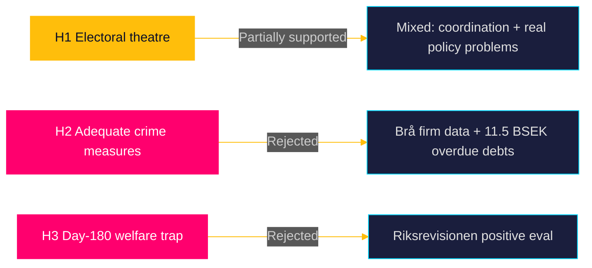

# Devil's Advocate Analysis — Interpellations 2026-04-28

**Date**: 2026-04-28  
**Author**: James Pether Sörling

## ACH Matrix — Competing Hypotheses

Analysis of Competing Hypotheses applied to the three interpellations. Three competing interpretations for each major analytical conclusion.

---

## Hypothesis H1 — "The interpellations are primarily electoral positioning, not genuine accountability"

**Claim**: All three interpellations are pre-election theatre from S rather than substantive accountability demands.

| Evidence | Consistent with H1? | Weight |
|----------|---------------------|--------|
| All three filed within 3 days, coordinated timing | YES | Supports H1 |
| All three address high voter-salience domains (infrastructure, welfare, crime) | YES | Supports H1 |
| All three use state-agency evidence (Riksrevisionen, Brå, ESO) rather than party opinion | NO — genuine accountability framing | Weakens H1 |
| Ministers are legally obliged to respond | NEUTRAL | Neither |
| ESO 352 BSEK criminal economy is a genuine policy problem regardless of timing | NO | Weakens H1 |

**ACH verdict**: H1 PARTIALLY SUPPORTED — the coordination signals strategy, but the substantive policy problems cited are real. Reject pure electoral theatre interpretation.

---

## Hypothesis H2 — "The Tidö government has adequate corporate crime measures and HD10451 overstates the gap"

**Claim**: The January 2025 law is sufficient; ESO/Brå figures are contested or overestimated.

| Evidence | Consistent with H2? | Weight |
|----------|---------------------|--------|
| January 2025 law introduces new company dissolution tools | YES | Supports H2 |
| ESO 352 BSEK estimate is disputed — up from Ekobrottsmyndigheten's 150 BSEK | Partially — methodology uncertainty | Weakens H2 |
| Brå's 23,000 criminal-controlled companies is new data, not contested | NO | Weakens H2 |
| 11.5 BSEK overdue state debts from criminal firms is concrete fiscal damage | NO | Weakens H2 |

**ACH verdict**: H2 REJECTED — even accepting uncertainty on the 352 BSEK figure, the Brå firm-level data and 11.5 BSEK fiscal damage are robust and point to a genuine enforcement gap.

---

## Hypothesis H3 — "The day-180 exception is a welfare trap and reform would improve outcomes"

**Claim**: The day-180 exception delays genuine rehabilitation by discouraging transition to new employment; removal would improve long-run return-to-work rates.

| Evidence | Consistent with H3? | Weight |
|----------|---------------------|--------|
| Riksrevisionen positive evaluation of day-180 exception (cited in HD10450) | NO — directly contradicts H3 | Strongly weakens |
| Nordic comparators (Norway, Denmark) maintain employer-pathway provisions | NO | Weakens H3 |
| Long-term sick may experience "lock-in" with original employer | Partial plausibility | Moderately supports H3 |
| No current study cited showing negative outcomes from the exception | NO — absence of evidence against | Weakens H3 |

**ACH verdict**: H3 REJECTED on current evidence. Riksrevisionen evaluation is the highest-quality available evidence and directly contradicts H3.

---

## Red Team Challenge

**Challenge to primary analysis**: The primary analysis frames the interpellations as S gaining political advantage. Red Team alternative: what if the government uses all three debates to announce comprehensive packages, neutralising S entirely?

**Probability**: 20% (Scenario 3 in scenario-analysis.md). The government has the resources to act and the political incentive to dominate the pre-election narrative. The ESO data on criminal economy provides a bipartisan consensus opportunity. The government's "law and order" mandate is enhanced, not threatened, by aggressive anti-crime measures.

## Rejected Alternatives Logged

1. "Infrastructure interpellation is primarily about Malmö as Sweden's second city" — rejected; interpellation specifically targets Kronoberg/Alvesta-Växjö corridor, not Malmö-Copenhagen connections.
2. "Sickness insurance interpellation anticipates EU Social Rights Pillar enforcement pressure" — insufficient evidence; no EU social rights case cited in HD10450.
3. "Corporate crime interpellation is driven by money-laundering EU directive transposition deadlines" — possible secondary factor but HD10451 does not reference EU AMLA or AMLD6; primarily domestic policy criticism.

