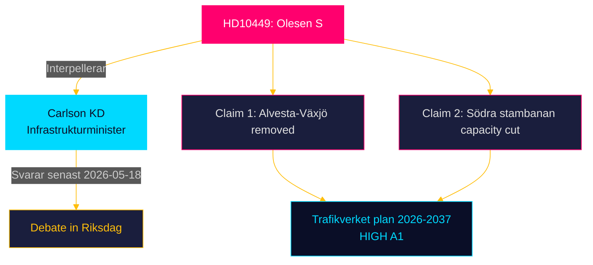

# Document Analysis: HD10449 — Södra stambanan och dubbelspår Alvesta-Växjö

**Dok-ID**: HD10449  
**Type**: Interpellation  
**Filed**: 2026-04-27  
**Filed by**: Robert Olesen (S), Kronobergs läns valkrets  
**Addressed to**: Andreas Carlson (KD), Infrastrukturminister  
**Response deadline**: 2026-05-18  

---

## Document Summary

Robert Olesen (S) interpellates Infrastructure Minister Andreas Carlson (KD) on the removal of two critical rail investments from Trafikverket's national infrastructure plan 2026–2037:

1. **Södra stambanan north of Hässleholm**: The Tidö government's plan removes Södra stambanan capacity increases north of Hässleholm from the national plan, cutting off key connections between Sydsverige and Stockholm.
2. **Alvesta-Växjö double track**: The plan removes the committed Alvesta-Växjö double track investment, which would have created double capacity on a key bottleneck in Kronoberg.

Olesen asks the minister two specific questions:
- When does the minister plan to restore the Alvesta-Växjö double track investment to the plan?
- What other measures is the minister taking to solve the transport capacity problems for passengers and freight on Södra stambanan?

## Key Claims and Evidence

| Claim | Evidence | Reliability |
|---|---|---|
| Alvesta-Växjö double track removed from plan | National plan 2026–2037 (Trafikverket) | HIGH [A1] |
| Södra stambanan capacity removed north of Hässleholm | National plan 2026–2037 (Trafikverket) | HIGH [A1] |
| This affects regional connectivity in Sydsverige | Direct implication of infrastructure removal | MEDIUM [B2] |

## Interpellation Quality Assessment

- **Legal form**: Correct — two specific questions to a named minister (interpellation, not written question)
- **Evidence basis**: STRONG — cites specific government plan; Trafikverket documents are publicly verifiable
- **Political timing**: Filed 2026-04-27, nearly 17 months before election — early enough for a full accountability chain
- **Escalation potential**: HIGH — debate will be televised on riksdagen.se; media in Sydsverige will cover

## DIW Significance Score

**7.0/10**

- Issue scope: Regional (Kronobergs/Skåne), not national — deducts 1.0
- Evidence quality: HIGH (Trafikverket plan reference) — adds 0.5
- Electoral salience: MEDIUM-HIGH (Sydsverige swing region) — adds 0.5
- Policy reversibility: LOW-MEDIUM (requires multi-BSEK reallocation) — maintains baseline

## Ministerial Response Prediction

Andreas Carlson (KD) will likely:
- Defend Trafikverket's prioritisation framework
- Reference alternative investments elsewhere in Sydsverige
- Decline to commit to Alvesta-Växjö timeline
- Reference the 2026–2037 plan as a starting point subject to revision

