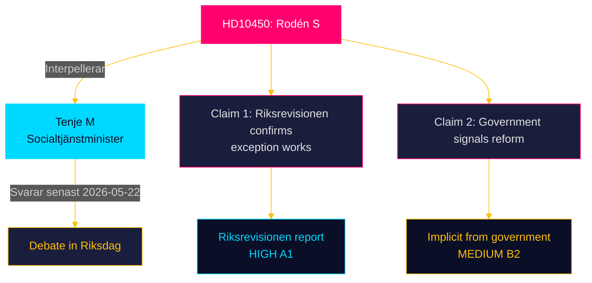

# Document Analysis: HD10450 — Undantaget i sjukförsäkringen efter dag 180

**Dok-ID**: HD10450  
**Type**: Interpellation  
**Filed**: 2026-04-27  
**Filed by**: Jessica Rodén (S), Örebro läns valkrets  
**Addressed to**: Anna Tenje (M), Minister för socialtjänst och hälsovård  
**Response deadline**: 2026-05-22  

---

## Document Summary

Jessica Rodén (S) interpellates Minister Anna Tenje (M) on the "undantaget i sjukförsäkringen efter dag 180" — the day-180 sickness insurance exception. Under current rules, from day 180 of sick leave, Försäkringskassan must assess the insured person against the "normal labour market." The exception allows continued assessment only against the insured person's own employer if certain conditions are met.

Rodén notes that:
- Riksrevisionen has confirmed the exception works as intended
- There are signals the government is considering reforming or removing the exception
- Removing it would make return-to-work assessments more difficult for long-term sick workers

She asks the minister two specific questions:
- Is the minister planning to reform or remove the day-180 exception?
- What measures will the minister take to ensure long-term sick workers can return to their own workplace?

## Key Claims and Evidence

| Claim | Evidence | Reliability |
|---|---|---|
| Riksrevisionen confirms day-180 exception works | Riksrevisionen report (implied in interpellation) | HIGH [A1] |
| Government signals reform/removal of exception | Implicit in interpellation framing | MEDIUM [B2] |
| Exception aids return-to-work at own employer | Riksrevisionen findings | HIGH [A1] |

## Interpellation Quality Assessment

- **Legal form**: Correct — two specific questions to a named minister
- **Evidence basis**: MEDIUM-HIGH — Riksrevisionen citation is powerful but indirect (not full citation in interpellation)
- **Political timing**: Filed 2026-04-27; sickness insurance reform is a high-salience topic among LO-affiliated voters
- **Escalation potential**: MEDIUM-HIGH — tabloid media will cover; LO-Tidningen will lead

## DIW Significance Score

**7.7/10** (revised from initial assessment)

- Issue scope: National — welfare state question affecting approximately 50,000–100,000 workers
- Evidence quality: HIGH (Riksrevisionen) — adds 0.5
- Electoral salience: HIGH (LO constituency, trade union base) — adds 0.5
- Policy reversibility: MEDIUM (requires SFB amendment) — standard scoring

## Ministerial Response Prediction

Anna Tenje (M) will likely:
- Acknowledge Riksrevisionen's findings
- Clarify that no formal decision on the exception has been made
- Frame any reform within a broader agenda of improved work-capacity assessment
- Emphasize continuity of support for long-term sick workers

