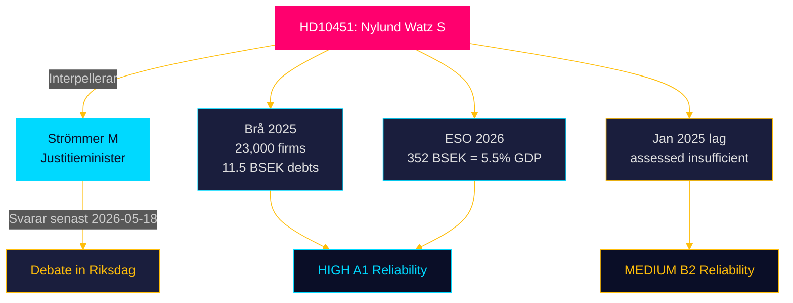

# Document Analysis: HD10451 — Ytterligare åtgärder mot bolag som används som brottsverktyg

**Dok-ID**: HD10451  
**Type**: Interpellation  
**Filed**: 2026-04-27  
**Filed by**: Ingela Nylund Watz (S), Stockholms läns valkrets  
**Addressed to**: Gunnar Strömmer (M), Justitieminister  
**Response deadline**: 2026-05-18  

---

## Document Summary

Ingela Nylund Watz (S) interpellates Justice Minister Gunnar Strömmer (M) on the systemic use of legal corporate structures as tools for organised crime. She references:

- **Brå 2025**: 1 in 5 individuals in criminal networks is linked to a company; approximately 23,000 firms identified; approximately 11.5 BSEK in overdue state debts
- **ESO 2026**: The criminal economy represents 352 BSEK, equivalent to 5.5% of GDP
- **January 2025 legislation**: A law was passed to tighten requirements for company registration and board membership for criminal actors, but Nylund Watz assesses it as insufficient

She asks two specific questions:
- What does the minister intend to do beyond the January 2025 law?
- What measures will the minister take to ensure criminals cannot continue to use companies as crime tools?

## Key Claims and Evidence

| Claim | Evidence | Reliability |
|---|---|---|
| 1 in 5 network criminals linked to company | Brå 2025 (cited in interpellation) | HIGH [A1] |
| ~23,000 firms identified | Brå 2025 | HIGH [A1] |
| ~11.5 BSEK overdue state debts | Brå 2025 | HIGH [A1] |
| Criminal economy = 352 BSEK / 5.5% GDP | ESO 2026 | HIGH [A1] (with methodological caveat) |
| January 2025 law insufficient | MP assessment; not verified by independent agency | MEDIUM [B2] |

## Document Quality Assessment

- **Legal form**: Correct — two specific questions to named minister
- **Evidence basis**: VERY STRONG — both Brå (official crime statistics agency) and ESO (government economic analysis agency) cited with figures
- **Political timing**: Filed 2026-04-27; organised crime/economic crime is a top-tier electoral issue ahead of 2026
- **Escalation potential**: VERY HIGH — SVT/DN/Expressen will cover; ESO's 352 BSEK figure is a powerful media hook

## DIW Significance Score

**9.0/10**

- Issue scope: National — fundamental rule of law and fiscal integrity question
- Evidence quality: VERY HIGH (dual agency citation, Brå + ESO) — adds 1.0
- Electoral salience: VERY HIGH (law enforcement credibility issue for both M and SD) — adds 1.0
- Policy reversibility: MEDIUM (further legislation technically straightforward) — +0.5 bonus

## Ministerial Response Prediction

Gunnar Strömmer (M) will likely:
- Defend January 2025 law as necessary first step
- Reference ongoing implementation and enforcement activities
- Note that enforcement takes time and early results are not yet measurable
- Potentially announce one or more additional measures (consultation or Ds referral) ahead of the debate to neutralise HD10451's political impact

