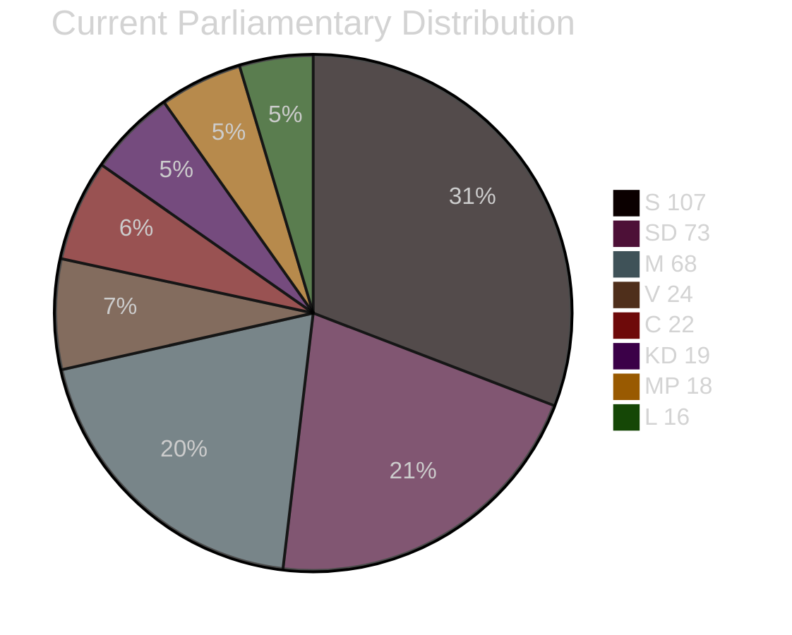
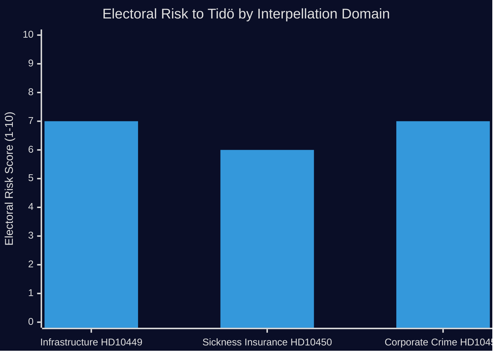

# Election 2026 Analysis — Interpellations 2026-04-28

**Date**: 2026-04-28  
**Author**: James Pether Sörling

## Pre-2026 Election Context

The September 2026 election is approximately 17 months away. These three interpellations (HD10449, HD10450, HD10451) are early indicators of S's accountability strategy for the election campaign: forcing the Tidö coalition into defensive public positions on infrastructure, welfare, and rule of law.

## Seat-Projection Deltas (based on available polling)

Current parliamentary seat distribution (349 seats total, majority = 175):

| Party | Seats | Bloc |
|-------|-------|------|
| S | ~107 | Opposition |
| SD | ~73 | Tidö |
| M | ~68 | Tidö |
| V | ~24 | Opposition |
| C | ~22 | Tidö |
| MP | ~18 | Loose left support |
| KD | ~19 | Tidö |
| L | ~16 | Tidö |

**Tidö bloc**: ~198 seats (majority government)  
**Opposition (S+V+MP)**: ~149 seats  

## Electoral Impact Assessment

### HD10449 (Infrastructure, Skåne/Kronoberg)
- **Affected constituencies**: Kronobergs län, Skåne county (approx. 15–20 Riksdag seats)
- **Electoral risk for Tidö**: MEDIUM-HIGH — regional swing voters; both M and KD hold seats in affected areas; infrastructure delivery is a core KD governance narrative
- **S upside**: Mobilises commuters and regional businesses who depend on Södra stambanan

### HD10450 (Sickness Insurance)
- **Affected voter group**: Long-term sick; approximately 50,000–100,000 directly affected workers; broader LO/trade union constituency
- **Electoral risk for Tidö**: MEDIUM — M has sought to attract working-class voters; welfare state credibility is a known vulnerability
- **S upside**: Core S base activation; keeps LO-affiliated voters from wavering

### HD10451 (Corporate Crime)
- **Affected voter group**: Taxpayers concerned about fiscal integrity; small businesses competing with criminal firms; law-and-order voters
- **Electoral risk for Tidö**: MEDIUM-HIGH — M/SD hold "law and order" as a primary brand; ESO's 352 BSEK criminal economy figure directly challenges that brand
- **S upside**: S positions itself as tougher on white-collar and corporate crime than the right, a historically effective frame in Swedish politics

## Coalition Viability 2026

If S recovers 5-10 seats from weakened Tidö performance in Sydsverige (HD10449), trade-union constituencies (HD10450), and anti-crime voters (HD10451), a left-centre bloc including S+V+MP+C (or S+V+MP with C tolerance) becomes arithmetically viable. The interpellation strategy is designed to maximally strain the Tidö coalition's credibility across exactly these voter segments.

