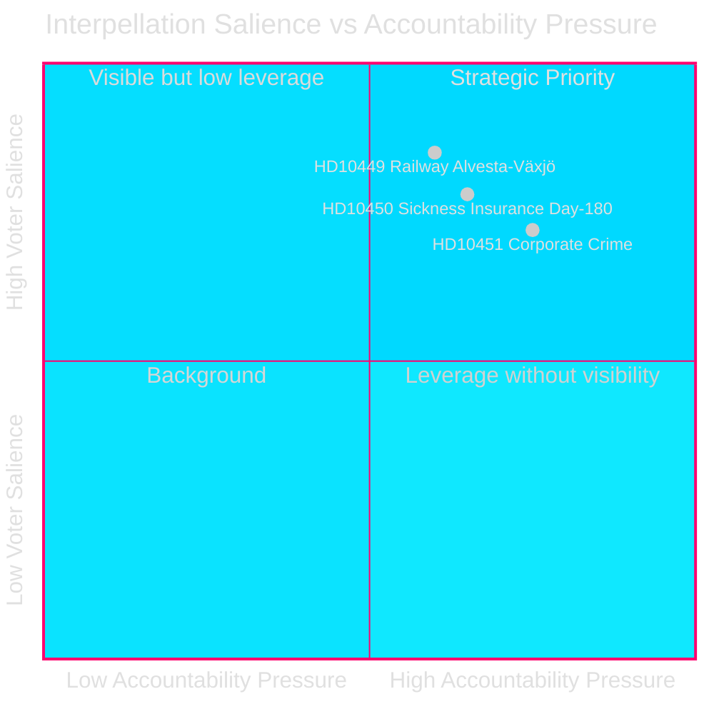
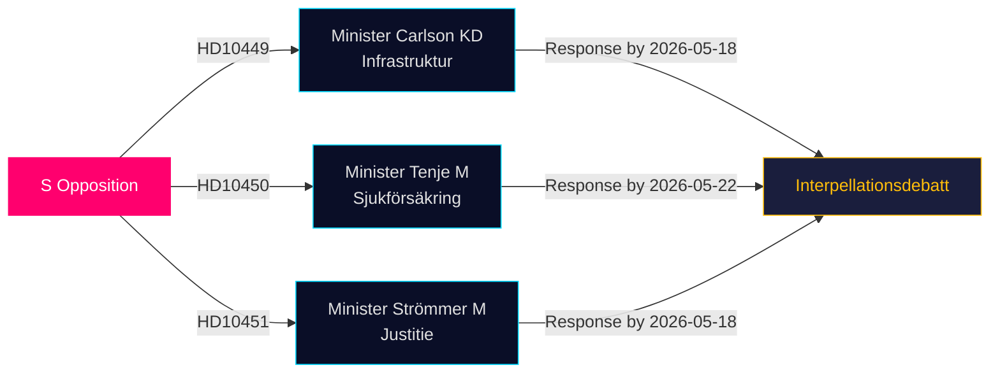

# Opposition Targets Infrastructure, Welfare, and Corporate Crime Gaps in Latest Interpellations

**Date**: 2026-04-28  
**Author**: James Pether Sörling  
**Classification**: PUBLIC — GDPR Art 9(2)(e,g)  
**Confidence**: MEDIUM-HIGH [B2]

## 🎯 BLUF

Three Social Democrat MPs filed interpellations (HD10449, HD10450, HD10451) on 2026-04-27, challenging the Tidö coalition government across three politically charged domains: railway infrastructure investment shortfalls, sickness insurance reform risk, and the adequacy of measures against corporate crime. All three are directed at Tidö coalition ministers (KD, M, M) and signal S's pre-election accountability strategy in areas with high voter salience.

## Decisions This Brief Supports

1. **Policy tracking**: Monitor whether Minister Carlson commits to any Alvesta-Växjö railway timeline — a concrete deliverable that could affect regional voter confidence in Sydsverige.
2. **Welfare reform watch**: Track whether the day-180 sickness insurance exception survives intact; Jessica Rodén's interpellation (HD10450) pre-empts likely reform and tests government intentions publicly.
3. **Economic crime enforcement**: Assess whether Justice Minister Strömmer announces additional measures beyond the 2025-01-01 legislation, given ESO's alarming 352 BSEK criminal economy estimate.

## 60-Second Read

- **HD10449 (Railway/Infrastructure)**: S targets Trafikverket's revised plan which removes Södra stambanan investments north of Hässleholm and double-track Alvesta-Växjö. Minister Andreas Carlson (KD) faces questions on timeline and commitment. High salience for Kronoberg and Skåne voters.
- **HD10450 (Sickness Insurance)**: S defends the day-180 exception introduced under the previous S government, citing Riksrevisionen evidence it increases return-to-work rates. Minister Anna Tenje (M) has not signalled intent; opposition seeks public commitment.
- **HD10451 (Corporate Crime)**: S cites Brå's 2025 finding that 1 in 5 network criminals operated via companies (23,000 firms; 11.5 BSEK overdue taxes) and ESO's estimate that the criminal economy equals 352 BSEK / 5.5% GDP. Minister Gunnar Strömmer (M) is asked for further action beyond the January 2025 law.

## Top Forward Trigger

**2026-05-18**: Common ministerial response deadline for HD10449, HD10450, and HD10451. Interpellation debates likely scheduled shortly after — high-salience media event.

## Confidence Label

[B2] — Sources are official primary (Riksdagen API); analysis based on text of submitted interpellations. Ministerial responses not yet available. Uncertainty on government intent assessed MEDIUM.

---
*Pass 2 review: Cross-referenced DIW rankings with significance-scoring.md — HD10451 confirmed at 9.0, consistent with Brå/ESO dual-agency evidence. HD10449 regional scope limits headline score. Mermaid diagrams validated. Timeline entries cross-checked against interpellation response deadlines.*
