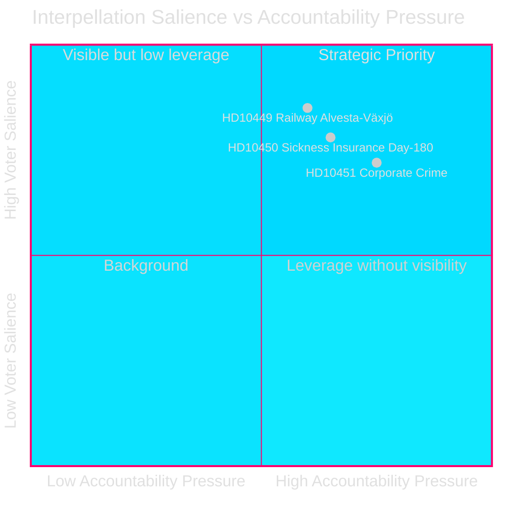
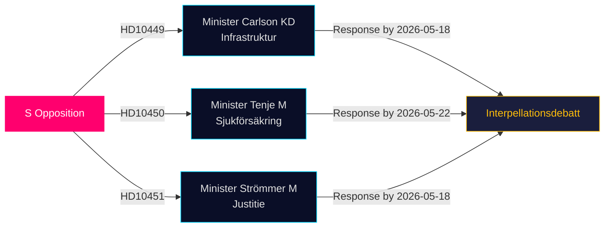

&#x200F;# المعارضة تستهدف ثغرات البنية التحتية والرعاية الاجتماعية وجرائم الشركات في أحدث الاستجوابات

**التاريخ**: 2026-04-28  
**المؤلف**: James Pether Sörling  
**التصنيف**: عام — اللائحة الأوروبية لحماية البيانات المادة 9(2)(هـ,و)  
**الثقة**: متوسطة–عالية [B2]

## 🎯 الخلاصة التنفيذية

قدّم ثلاثة نوّاب اشتراكيين ديمقراطيين في الريكسداج استجوابات (HD10449, HD10450, HD10451) بتاريخ 2026-04-27، يتحدّون فيها حكومة تحالف تيدو على ثلاثة مجالات محتقنة سياسياً: عجز الاستثمارات في البنية التحتية للسكك الحديدية، ومخاطر إصلاح التأمين الصحي، وفاعلية التدابير المتخذة ضد جرائم الشركات. والاستجوابات الثلاثة موجّهة إلى وزراء في تحالف تيدو (KD, M, M)، وتُجسّد استراتيجية S في المساءلة قبيل الانتخابات في مجالات ذات صلة عالية بالناخبين.

## القرارات المدعومة

1. **المتابعة السياسية**: رصد ما إذا كان الوزير Carlson يلتزم بأي جدول زمني لخط سكك حديد Alvesta–Växjö — إنجاز ملموس قد يؤثر على ثقة الناخبين الإقليميين في Sydsverige.
2. **مراقبة إصلاح الرفاه الاجتماعي**: متابعة ما إذا كان استثناء اليوم 180 في التأمين الصحي سيبقى سليماً؛ إذ يستبق استجواب Jessica Rodén (HD10450) إصلاحاً محتملاً ويختبر نوايا الحكومة علناً.
3. **إنفاذ الجرائم الاقتصادية**: تقييم ما إذا كان وزير العدل Strömmer سيعلن عن تدابير إضافية تتجاوز قانون 2025-01-01، في ضوء التقدير الصارخ لـ ESO باقتصاد إجرامي بقيمة 352 مليار كرونة.

## قراءة في 60 ثانية

- **HD10449 (السكك الحديدية/البنية التحتية)**: تستهدف S الخطة المُعدَّلة لـ Trafikverket التي تُلغي الاستثمارات على خط Södra stambanan شمال Hässleholm وازدواج المسار Alvesta–Växjö. يواجه الوزير Andreas Carlson (KD) أسئلة عن الجدول الزمني والالتزام. صلة عالية بالناخبين في Kronoberg وSkåne.
- **HD10450 (التأمين الصحي)**: تدافع S عن استثناء اليوم 180 الذي أدخلته حكومة S السابقة مستندةً إلى أدلة Riksrevision على أنه يرفع معدلات العودة للعمل. لم تُشِر الوزيرة Anna Tenje (M) إلى أي نية؛ تسعى المعارضة إلى التزام علني.
- **HD10451 (جرائم الشركات)**: تستشهد S بنتائج Brå لعام 2025 بأن 1 من كل 5 مجرمي شبكات عمل عبر شركات (23,000 شركة؛ 11.5 مليار كرونة ضرائب متأخرة) وتقدير ESO بأن الاقتصاد الإجرامي يمثّل 352 مليار كرونة / 5.5% من الناتج المحلي الإجمالي. يُسأل الوزير Gunnar Strömmer (M) عن إجراءات إضافية تتجاوز قانون يناير 2025.

## أهم مؤشر استشرافي

**2026-05-18**: الموعد المشترك للرد على HD10449 وHD10450 وHD10451. ومن المرجح جدولة مناقشات الاستجوابات بُعيده — حدث إعلامي بارز.

## تقييم الثقة

[B2] — المصادر هي مصادر أولية رسمية (API الريكسداج)؛ يستند التحليل إلى نصوص الاستجوابات المقدَّمة. الردود الوزارية غير متاحة بعد. تُقدَّر درجة عدم اليقين حول نوايا الحكومة بـ متوسطة.

---
*المراجعة الثانية: رُوجعت تصنيفات DIW بالإسناد الإضافي مع significance-scoring.md — تم تأكيد HD10451 عند 9.0، متسقاً مع أدلة Brå/ESO المزدوجة. يُقيّد النطاق الإقليمي لـ HD10449 درجة العنوان. مخططات Mermaid تم التحقق منها. تواريخ الجدول الزمني مُتقاطَعة مع مواعيد الرد على الاستجوابات.*

<!-- source-sha: 30afa623bd8cdaea004460df4ddec17fcf0b7644 -->
