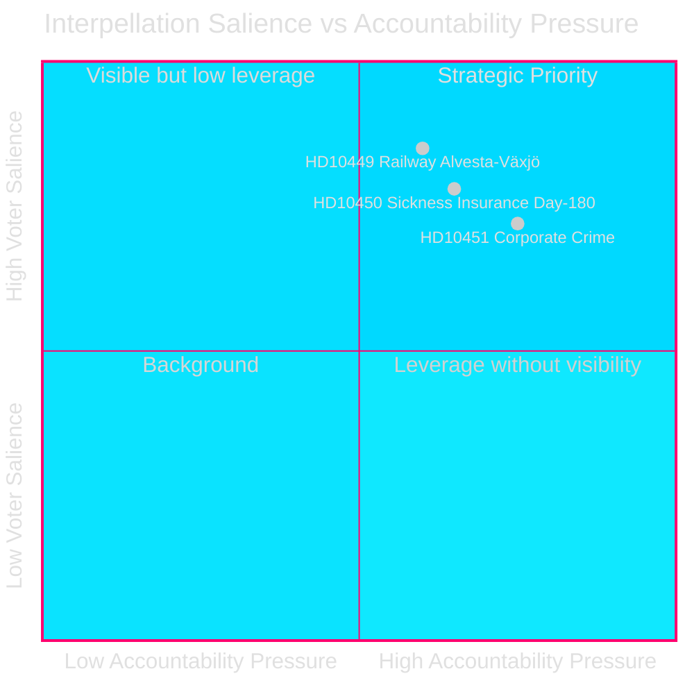
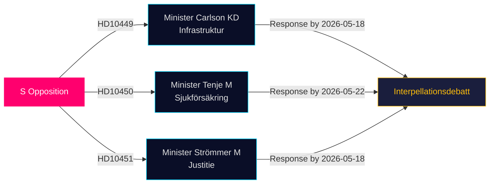

# Oppositionen Udfordrer Infrastruktur-, Velfærds- og Virksomhedsforbrydelseshuller i Seneste Interpellationer

**Dato**: 2026-04-28  
**Forfatter**: James Pether Sörling  
**Klassificering**: OFFENTLIG — GDPR Art 9(2)(e,g)  
**Konfidens**: MEDIUM–HØJ [B2]

## 🎯 Kernevurdering

Tre socialdemokratiske riksdagsmedlemmer indgav interpellationer (HD10449, HD10450, HD10451) den 2026-04-27, der udfordrer Tidø-koalitionsregeringen på tre politisk ladede områder: investeringsmangler i jernbaneinfrastruktur, risici ved sygesikringsreformen og effektiviteten af foranstaltninger mod virksomhedsforbrydelser. Alle tre er rettet mod Tidø-koalitionsministre (KD, M, M) og signalerer S's forvalgsstrategi for ansvarlighed inden for områder med høj vælgerrelevans.

## Beslutsstøtte

1. **Politisk sporing**: Overvåg om minister Carlson forpligter sig til en tidslinje for Alvesta–Växjö-jernbanen — en konkret leverance der kan påvirke regional vælgertillid i Sydsverige.
2. **Velfærdsreformovervågning**: Følg om dag-180-undtagelsen i sygesikringen overlever intakt; Jessica Rodéns interpellation (HD10450) foregriber sandsynlig reform og tester regeringens intentioner offentligt.
3. **Bekæmpelse af økonomisk kriminalitet**: Vurder om justitsminister Strømmer annoncerer yderligere foranstaltninger ud over loven fra 2025-01-01, i betragtning af ESO's alarmerende estimat om en kriminel økonomi på 352 mia. SEK.

## 60-Sekunders Læsning

- **HD10449 (Jernbane/Infrastruktur)**: S retter sig mod Trafikverkets reviderede plan, der fjerner investeringer på Södra stambanan nord for Hässleholm og dobbeltsporet Alvesta–Växjö. Minister Andreas Carlson (KD) stilles over for spørgsmål om tidslinje og forpligtelse. Høj relevans for vælgere i Kronoberg og Skåne.
- **HD10450 (Sygesikring)**: S forsvarer dag-180-undtagelsen indført under den forrige S-regering med henvisning til Riksrevisionens dokumentation for at den øger tilbagevendingshyppighed til arbejdet. Minister Anna Tenje (M) har ikke signaleret intention; oppositionen søger en offentlig forpligtelse.
- **HD10451 (Virksomhedsforbrydelser)**: S citerer Brå's 2025-fund om at 1 ud af 5 netværkskriminelle opererede via virksomheder (23.000 firmaer; 11,5 mia. SEK i restancer) og ESO's estimat om at den kriminelle økonomi udgør 352 mia. SEK / 5,5% af BNP. Minister Gunnar Strømmer (M) spørges om yderligere foranstaltninger ud over januar 2025-loven.

## Vigtigste Fremadrettede Indikator

**2026-05-18**: Fælles svarsfrist for HD10449, HD10450 og HD10451. Interpellationsdebattes sandsynligvis planlagt kort efter — mediernes opmærksomhed påkrævet.

## Konfidensvurdering

[B2] — Kilderne er officielle primærkilder (Riksdagens API); analysen baserer sig på teksten i de indgivne interpellationer. Ministerielle svar er endnu ikke tilgængelige. Usikkerhed om regeringens hensigt vurderes MEDIUM.

---
*2. gennemgang: DIW-rangeringer krydshenviste med significance-scoring.md — HD10451 bekræftet til 9,0, konsistent med Brå/ESO dobbelt-agenturgrundlag. HD10449's regionale omfang begrænser overskriftscore. Mermaid-diagrammer validerede. Tidslinjeposter krydsvaliderede mod interpellationssvarfrister.*

<!-- source-sha: 30afa623bd8cdaea004460df4ddec17fcf0b7644 -->
