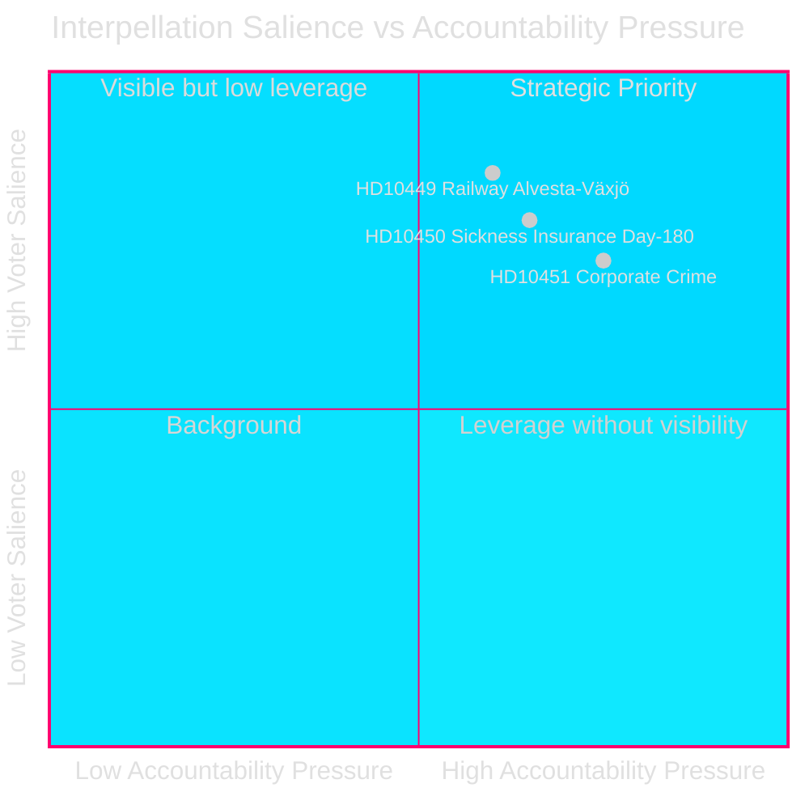
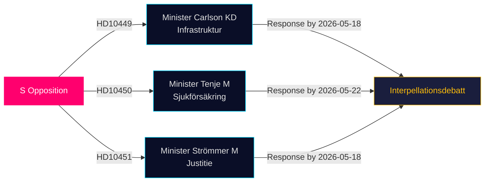

# Opposition Fordert Infrastruktur-, Sozial- und Unternehmenskriminalitätslücken in Neuesten Anfragen

**Datum**: 2026-04-28  
**Autor**: James Pether Sörling  
**Klassifizierung**: ÖFFENTLICH — DSGVO Art 9(2)(e,g)  
**Konfidenz**: MITTEL–HOCH [B2]

## 🎯 Kernaussage

Drei sozialdemokratische Riksdag-Abgeordnete reichten am 2026-04-27 Anfragen (HD10449, HD10450, HD10451) ein und fordern die Tidö-Koalitionsregierung in drei politisch aufgeladenen Bereichen heraus: Investitionsdefizite bei der Eisenbahninfrastruktur, Risiken der Krankenversicherungsreform und die Wirksamkeit von Maßnahmen gegen Unternehmenskriminalität. Alle drei richten sich an Tidö-Koalitionsminister (KD, M, M) und signalisieren die Vorwahl-Rechenschaftspflicht-Strategie von S in Bereichen mit hoher Wählerrelevanz.

## Unterstützte Entscheidungen

1. **Politisches Monitoring**: Verfolgen, ob Minister Carlson sich zu einem Zeitplan für die Eisenbahnstrecke Alvesta–Växjö verpflichtet — eine konkrete Leistung, die das regionale Wählervertrauen in Sydsverige beeinflussen könnte.
2. **Sozialreform-Beobachtung**: Verfolgen, ob die 180-Tage-Ausnahme in der Krankenversicherung intakt überlebt; Jessica Rodéns Anfrage (HD10450) antizipiert wahrscheinliche Reformen und testet öffentlich die Regierungsabsichten.
3. **Bekämpfung der Wirtschaftskriminalität**: Einschätzen, ob Justizminister Strömmer über das Gesetz vom 2025-01-01 hinausgehende Maßnahmen ankündigt, angesichts der alarmierenden ESO-Schätzung einer kriminellen Wirtschaft von 352 Mrd. SEK.

## 60-Sekunden-Überblick

- **HD10449 (Eisenbahn/Infrastruktur)**: S zielt auf Trafikverkets überarbeiteten Plan, der Investitionen auf der Södra stambanan nördlich von Hässleholm und das Doppelgleis Alvesta–Växjö streicht. Minister Andreas Carlson (KD) sieht sich Fragen zu Zeitplan und Verpflichtung gegenüber. Hohe Relevanz für Wähler in Kronoberg und Skåne.
- **HD10450 (Krankenversicherung)**: S verteidigt die 180-Tage-Ausnahme der vorherigen S-Regierung mit Verweis auf Riksrevisionens Belege, dass sie die Rückkehr zur Arbeit verbessert. Minister Anna Tenje (M) hat keine Absichten signalisiert; die Opposition sucht ein öffentliches Bekenntnis.
- **HD10451 (Unternehmenskriminalität)**: S zitiert Brås 2025-Befund, dass 1 von 5 Netzwerkkriminellen über Unternehmen operierte (23.000 Firmen; 11,5 Mrd. SEK rückständige Steuern) und ESOs Schätzung, dass die kriminelle Wirtschaft 352 Mrd. SEK / 5,5% des BIP ausmacht. Minister Gunnar Strömmer (M) wird nach weiteren Maßnahmen über das Januar-2025-Gesetz hinaus gefragt.

## Wichtigster Vorausschauender Indikator

**2026-05-18**: Gemeinsamer Antworttermin für HD10449, HD10450 und HD10451. Anfragen-Debatten wahrscheinlich kurz danach angesetzt — hochrelevantes Medienereignis.

## Konfidenzbewertung

[B2] — Quellen sind offizielle Primärquellen (Riksdagens API); Analyse basiert auf den Texten der eingereichten Anfragen. Ministerantworten noch nicht verfügbar. Unsicherheit über Regierungsabsicht wird als MITTEL bewertet.

---
*2. Überprüfung: DIW-Rankings mit significance-scoring.md querverwiesen — HD10451 bei 9,0 bestätigt, konsistent mit Brå/ESO Doppel-Behörden-Belegen. HD10449 regionaler Umfang begrenzt Schlagzeilen-Score. Mermaid-Diagramme validiert. Zeiteinträge gegen Anfragen-Antwortfristen quergeprüft.*

<!-- source-sha: 30afa623bd8cdaea004460df4ddec17fcf0b7644 -->
