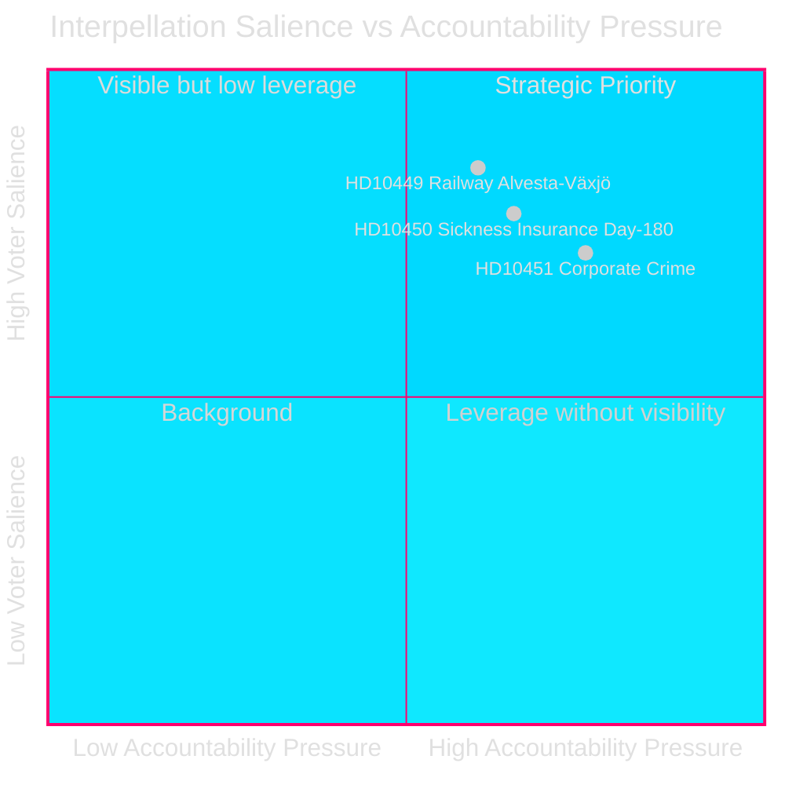
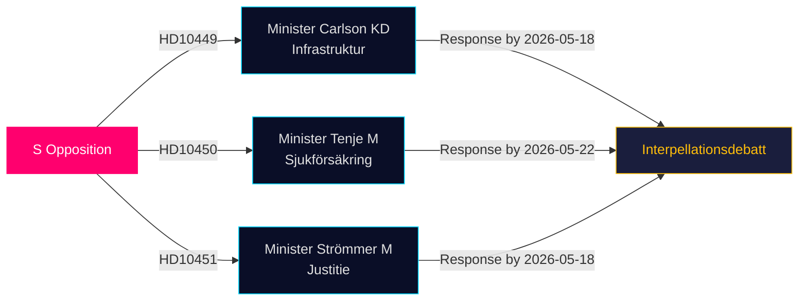

# La Oposición Desafía las Brechas en Infraestructura, Bienestar y Delincuencia Empresarial en las Últimas Interpelaciones

**Fecha**: 2026-04-28  
**Autor**: James Pether Sörling  
**Clasificación**: PÚBLICO — RGPD Art 9(2)(e,g)  
**Confianza**: MEDIA–ALTA [B2]

## 🎯 Resumen Ejecutivo

Tres diputados socialdemócratas del Riksdag presentaron interpelaciones (HD10449, HD10450, HD10451) el 2026-04-27, desafiando al gobierno de coalición Tidö en tres ámbitos políticamente cargados: déficits de inversión en infraestructura ferroviaria, riesgos de la reforma del seguro de enfermedad y la eficacia de las medidas contra la delincuencia empresarial. Las tres están dirigidas a ministros de la coalición Tidö (KD, M, M) y señalan la estrategia de responsabilidad preelectoral de S en áreas de alta relevancia para el electorado.

## Decisiones que Apoya

1. **Seguimiento político**: Monitorear si el ministro Carlson se compromete con algún calendario para la línea ferroviaria Alvesta–Växjö — una entrega concreta que podría afectar la confianza electoral regional en Sydsverige.
2. **Seguimiento de la reforma del bienestar**: Seguir si la excepción del día 180 del seguro de enfermedad sobrevive intacta; la interpelación de Jessica Rodén (HD10450) anticipa una probable reforma y pone a prueba públicamente las intenciones del gobierno.
3. **Aplicación de la ley penal económica**: Evaluar si el ministro de Justicia Strömmer anuncia medidas adicionales más allá de la ley del 2025-01-01, dada la alarmante estimación de la ESO de una economía criminal de 352.000 millones SEK.

## Lectura en 60 Segundos

- **HD10449 (Ferroviario/Infraestructura)**: S apunta al plan revisado de Trafikverket que elimina inversiones en la Södra stambanan al norte de Hässleholm y la doble vía Alvesta–Växjö. El ministro Andreas Carlson (KD) se enfrenta a preguntas sobre el calendario y el compromiso. Alta relevancia para los votantes de Kronoberg y Skåne.
- **HD10450 (Seguro de enfermedad)**: S defiende la excepción del día 180 introducida bajo el gobierno S anterior, citando evidencias de la Riksrevision de que aumenta las tasas de retorno al trabajo. La ministra Anna Tenje (M) no ha señalado intención alguna; la oposición busca un compromiso público.
- **HD10451 (Delincuencia empresarial)**: S cita el hallazgo de Brå de 2025 de que 1 de cada 5 criminales de red operaba a través de empresas (23.000 firmas; 11.500 millones SEK en impuestos atrasados) y la estimación de la ESO de que la economía criminal equivale a 352.000 millones SEK / 5,5% del PIB. El ministro Gunnar Strömmer (M) es consultado sobre medidas adicionales más allá de la ley de enero de 2025.

## Principal Indicador Prospectivo

**2026-05-18**: Plazo de respuesta común para HD10449, HD10450 y HD10451. Debates de interpelación probablemente programados poco después — evento mediático de alta relevancia.

## Evaluación de Confianza

[B2] — Las fuentes son fuentes primarias oficiales (API Riksdag); el análisis está basado en el texto de las interpelaciones presentadas. Las respuestas ministeriales aún no están disponibles. La incertidumbre sobre la intención gubernamental se evalúa como MEDIA.

---
*2.ª revisión: Clasificaciones DIW cruzadas con significance-scoring.md — HD10451 confirmado en 9,0, coherente con la evidencia de doble agencia Brå/ESO. El alcance regional de HD10449 limita la puntuación en titulares. Diagramas Mermaid validados. Entradas de cronología verificadas con los plazos de respuesta a las interpelaciones.*

<!-- source-sha: 30afa623bd8cdaea004460df4ddec17fcf0b7644 -->
