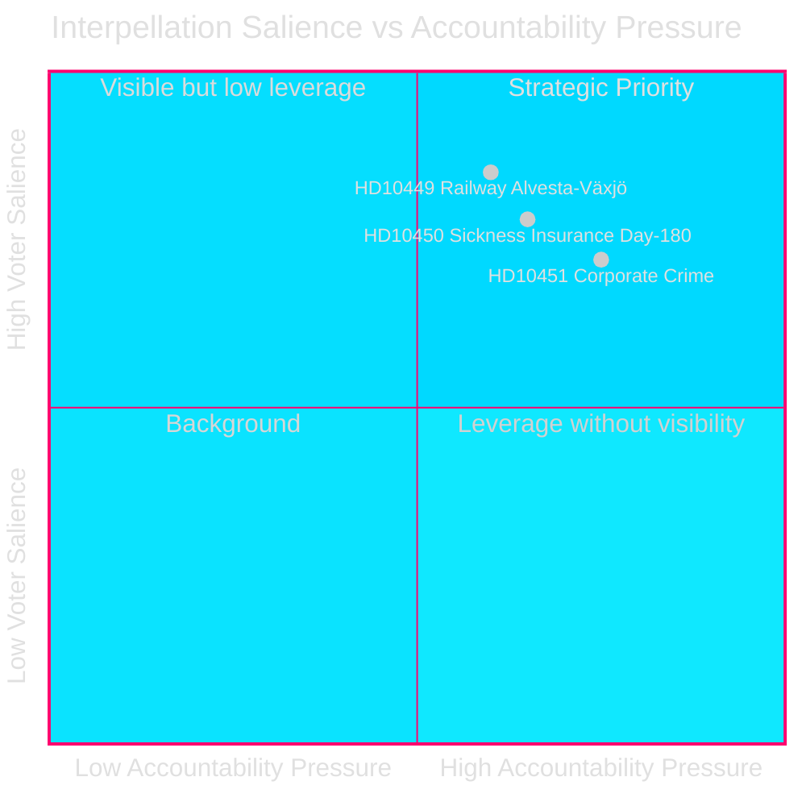
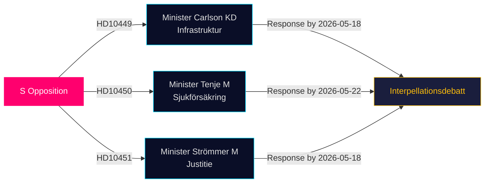

# Oppositio Haastaa Infrastruktuuri-, Hyvinvointi- ja Yritysrikospuutteet Viimeisimmissä Kyselyissä

**Päiväys**: 2026-04-28  
**Kirjoittaja**: James Pether Sörling  
**Luokitus**: JULKINEN — GDPR Art 9(2)(e,g)  
**Luottamus**: KESKITASO–KORKEA [B2]

## 🎯 Ydinarvio

Kolme sosiaalidemokraattista kansanedustajaa jätti kyselyt (HD10449, HD10450, HD10451) 27.4.2026, haastamalla Tidö-koalition hallituksen kolmella poliittisesti latautuneella alueella: rautatie-investointien puutteet, sairausvakuutusuudistuksen riskit ja yritysten vastaisiin toimiin liittyvät riittävyyskysymykset. Kaikki kolme on osoitettu Tidö-koalition ministereille (KD, M, M) ja ne kuvastavat S:n vaalienedeltävää vastuullisuu­strategiaa korkean äänestäjärelevanssin alueilla.

## Tuettavat Päätökset

1. **Politiikan seuranta**: Valvo sitoutuuko ministeri Carlson johonkin Alvesta–Växjö-radan aikatauluun — konkreettinen toimitettava, joka voi vaikuttaa alueelliseen äänestäjäluottamukseen Etelä-Ruotsissa.
2. **Hyvinvointiuudistuksen seuranta**: Seuraa selviääkö sairausvakuutuksen 180. päivän poikkeus ehjänä; Jessica Rodénin kysely (HD10450) ennakoi todennäköistä uudistusta ja testaa hallituksen aikomuksia julkisesti.
3. **Talousrikollisuuden torjunta**: Arvioi ilmoittaako oikeusministeri Strömmer lisätoimenpiteitä 1.1.2025 voimaan tulleen lain lisäksi, ottaen huomioon ESO:n hälyttävän arvion 352 miljardin SEK:n rikollisesta taloudesta.

## 60 Sekunnin Katsaus

- **HD10449 (Rautatie/Infrastruktuuri)**: S kohdistaa Trafikverketin tarkistettuun suunnitelmaan, jossa poistetaan investoinnit Södra stambanenilla Hässleholmin pohjoispuolella ja kaksoisraide Alvesta–Växjö. Ministeri Andreas Carlson (KD) joutuu vastaamaan aikataulua ja sitoutumista koskeviin kysymyksiin. Korkea merkitys äänestäjille Kronobergissa ja Skånessa.
- **HD10450 (Sairausvakuutus)**: S puolustaa edellisen S-hallituksen käyttöönottamaa 180. päivän poikkeusta viitaten Riksrevisionenin näyttöön siitä, että se parantaa paluuta töihin. Ministeri Anna Tenje (M) ei ole ilmoittanut aikomuksistaan; oppositio hakee julkista sitoumusta.
- **HD10451 (Yritysrikokset)**: S viittaa Brå:n vuoden 2025 löydökseen, jonka mukaan joka 5. verkostorikollinenoperoi yhtiöiden kautta (23 000 yritystä; 11,5 miljardia SEK maksamattomia veroja) ja ESO:n arvioon, jonka mukaan rikollinen talous on 352 miljardia SEK / 5,5% BKT:sta. Ministeri Gunnar Strömmer (M) joutuu vastaamaan lisätoimista tammikuun 2025 lain lisäksi.

## Tärkein Tulevaisuuteen Suuntautuva Indikaattori

**2026-05-18**: HD10449:n, HD10450:n ja HD10451:n yhteinen vastausmääräaika. Kyselydebatit todennäköisesti suunniteltu pian sen jälkeen — korkean salienssin mediatapahtuma.

## Luottamusarvio

[B2] — Lähteet ovat virallisia primäärilähteitä (Riksdagens API); analyysi perustuu jätettyjen kyselyjen tekstiin. Ministerivastauksia ei ole vielä saatavilla. Hallituksen aikomukseen liittyvä epävarmuus on KESKITASOA.

---
*2. läpikäynti: DIW-rankkaukset ristiin viitattu significance-scoring.md -tiedoston kanssa — HD10451 vahvistettu 9,0:aan, yhdenmukainen Brå/ESO kahden viraston näytön kanssa. HD10449:n alueellinen laajuus rajoittaa otsikkopisteitä. Mermaid-kaaviot validoitu. Aikajanakirjaukset ristiin tarkistettu kyselyvastausten määräaikojen kanssa.*

<!-- source-sha: 30afa623bd8cdaea004460df4ddec17fcf0b7644 -->
