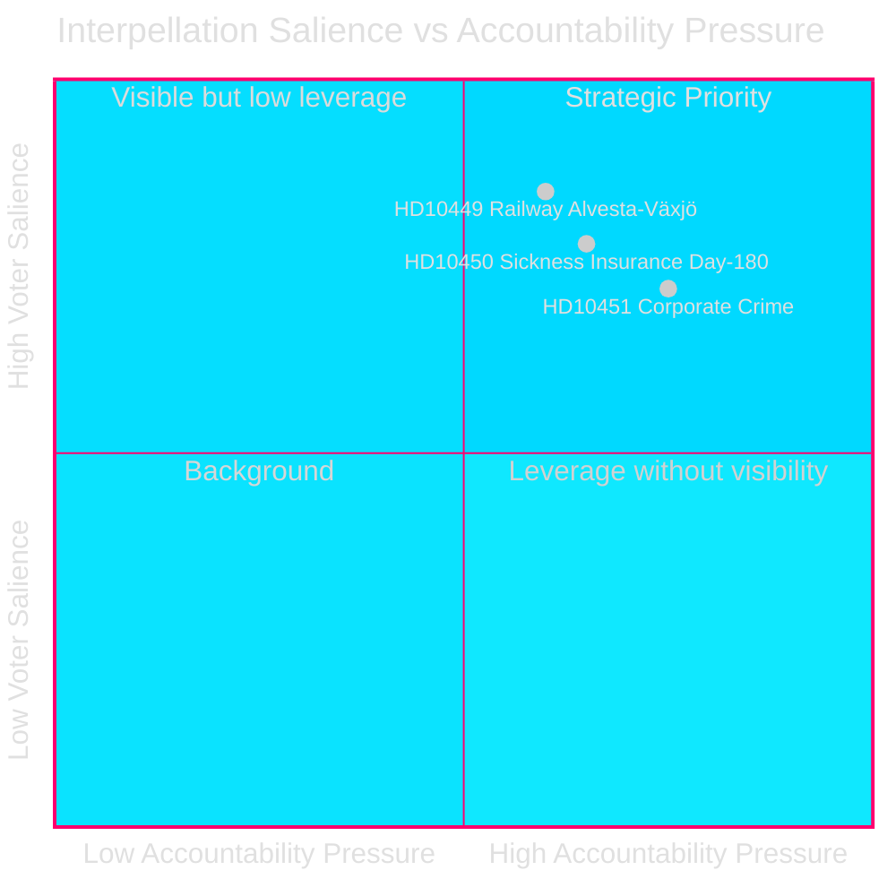
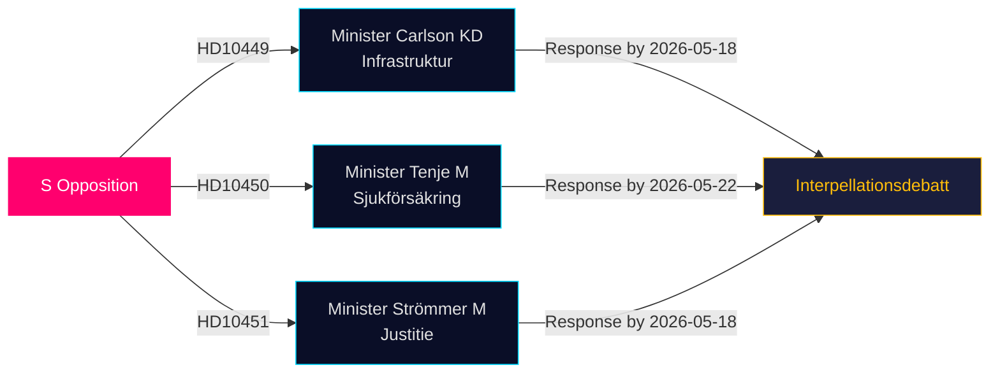

# L'Opposition Cible les Lacunes en Infrastructure, Protection Sociale et Criminalité d'Entreprise dans les Dernières Interpellations

**Date**: 2026-04-28  
**Auteur**: James Pether Sörling  
**Classification**: PUBLIC — RGPD Art 9(2)(e,g)  
**Confiance**: MOYEN–ÉLEVÉ [B2]

## 🎯 Synthèse

Trois députés socialistes du Riksdag ont déposé des interpellations (HD10449, HD10450, HD10451) le 2026-04-27, mettant au défi le gouvernement de coalition Tidö sur trois domaines politiquement chargés : les déficits d'investissement dans les infrastructures ferroviaires, les risques de la réforme de l'assurance maladie, et l'efficacité des mesures contre la criminalité d'entreprise. Les trois sont adressées à des ministres de la coalition Tidö (KD, M, M) et signalent la stratégie de responsabilisation pré-électorale de S dans des domaines à forte résonance auprès des électeurs.

## Décisions Soutenues

1. **Suivi politique** : Surveiller si le ministre Carlson s'engage à respecter un calendrier pour la ligne ferroviaire Alvesta–Växjö — une réalisation concrète pouvant affecter la confiance électorale régionale en Sydsverige.
2. **Observation de la réforme sociale** : Suivre si l'exception du jour 180 dans l'assurance maladie survit intacte ; l'interpellation de Jessica Rodén (HD10450) anticipe une réforme probable et teste publiquement les intentions du gouvernement.
3. **Lutte contre la criminalité économique** : Évaluer si le ministre de la Justice Strömmer annonce des mesures supplémentaires au-delà de la loi du 2025-01-01, compte tenu de l'estimation alarmante de l'ESO d'une économie criminelle de 352 milliards SEK.

## Lecture en 60 Secondes

- **HD10449 (Ferroviaire/Infrastructure)** : S cible le plan révisé de Trafikverket qui supprime les investissements sur la Södra stambanan au nord de Hässleholm et la double voie Alvesta–Växjö. Le ministre Andreas Carlson (KD) fait face à des questions sur le calendrier et les engagements. Haute résonance pour les électeurs de Kronoberg et de Skåne.
- **HD10450 (Assurance maladie)** : S défend l'exception du jour 180 introduite sous le gouvernement S précédent, citant les preuves de la Riksrevision qu'elle augmente les taux de retour au travail. La ministre Anna Tenje (M) n'a pas signalé ses intentions ; l'opposition cherche un engagement public.
- **HD10451 (Criminalité d'entreprise)** : S cite la découverte de Brå en 2025 selon laquelle 1 criminel sur 5 dans les réseaux opérait via des entreprises (23 000 firmes ; 11,5 milliards SEK d'arriérés fiscaux) et l'estimation de l'ESO que l'économie criminelle représente 352 milliards SEK / 5,5% du PIB. Le ministre Gunnar Strömmer (M) est interrogé sur de nouvelles mesures au-delà de la loi de janvier 2025.

## Principal Indicateur Prospectif

**2026-05-18** : Délai de réponse commun pour HD10449, HD10450 et HD10451. Débats d'interpellation probablement prévus peu après — événement médiatique à haute saillance.

## Évaluation de Confiance

[B2] — Les sources sont des sources primaires officielles (API Riksdagen) ; l'analyse est basée sur le texte des interpellations déposées. Les réponses ministérielles ne sont pas encore disponibles. L'incertitude sur l'intention gouvernementale est évaluée comme MOYENNE.

---
*Revue 2 : Classements DIW croisés avec significance-scoring.md — HD10451 confirmé à 9,0, cohérent avec les preuves à double agence Brå/ESO. La portée régionale de HD10449 limite le score de titre. Diagrammes Mermaid validés. Entrées de chronologie vérifiées croisées avec les délais de réponse aux interpellations.*

<!-- source-sha: 30afa623bd8cdaea004460df4ddec17fcf0b7644 -->
