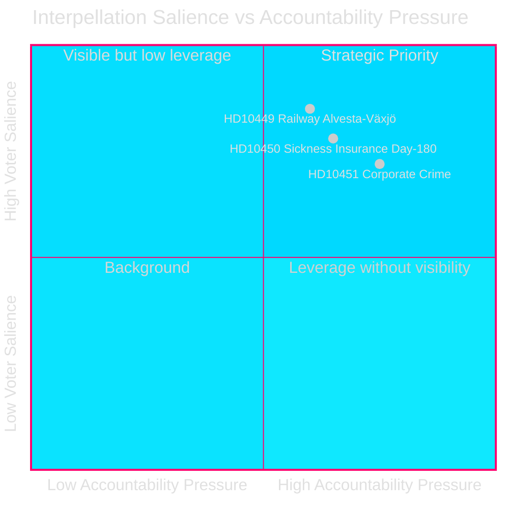
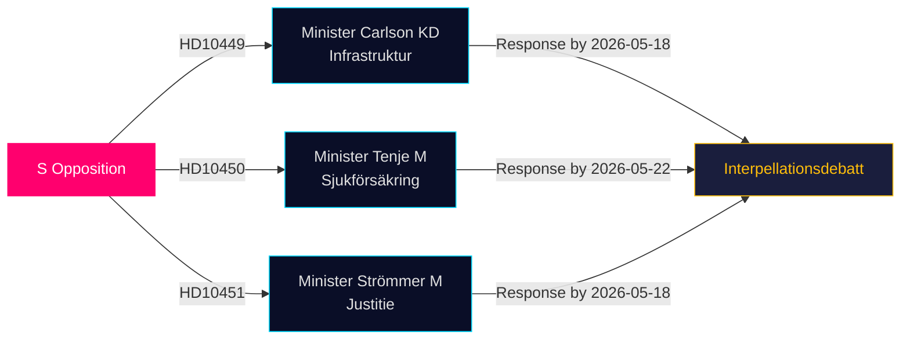

&#x200F;# האופוזיציה תוקפת פרצות בתשתיות, רווחה ופשעי תאגידים בשאילתות האחרונות

**תאריך**: 2026-04-28  
**מחבר**: James Pether Sörling  
**סיווג**: ציבורי — GDPR סעיף 9(2)(ה,ו)  
**אמינות**: בינונית–גבוהה [B2]

## 🎯 תמצית ביצועית

שלושה חברי כנסת (ריקסדאג) סוציאל-דמוקרטים הגישו שאילתות (HD10449, HD10450, HD10451) ב-2026-04-27, שמאתגרות את ממשלת הקואליציה טידו בשלושה תחומים טעונים פוליטית: גירעונות בהשקעות בתשתיות רכבת, סיכוני רפורמת ביטוח הבריאות ויעילות הצעדים נגד פשעי תאגידים. שלושתן מופנות לשרים בקואליציה טידו (KD, M, M) ומאותתות על אסטרטגיית האחריות הבחירתית של S בתחומים בעלי רלוונטיות בחירתית גבוהה.

## החלטות נתמכות

1. **מעקב מדיניות**: לעקוב האם שר Carlson מתחייב לציר זמן כלשהו לקו הרכבת Alvesta–Växjö — הישג קונקרטי שעשוי להשפיע על אמון בוחרים אזורי ב-Sydsverige.
2. **מעקב אחר רפורמת הרווחה**: לעקוב האם חריג יום 180 בביטוח הבריאות שורד שלם; שאילתת Jessica Rodén (HD10450) מקדימה רפורמה סבירה ובוחנת את כוונות הממשלה פומבית.
3. **אכיפת פשע כלכלי**: להעריך האם שר המשפטים Strömmer מכריז על צעדים נוספים מעבר לחוק מ-2025-01-01, לנוכח הערכת ESO המדאיגה על כלכלה פלילית של 352 מיליארד SEK.

## קריאה של 60 שניות

- **HD10449 (רכבת/תשתיות)**: S מכוון לתוכנית המתוקנת של Trafikverket שמסירה השקעות ב-Södra stambanan צפון להסלהולם ומסילת כפולה Alvesta–Växjö. שר Andreas Carlson (KD) מתמודד עם שאלות על לוח זמנים ומחויבות. רלוונטיות גבוהה לבוחרים ב-Kronoberg ו-Skåne.
- **HD10450 (ביטוח בריאות)**: S מגנה על חריג יום 180 שהונהג תחת ממשלת S הקודמת, בציטוט ראיות Riksrevision שהוא משפר שיעורי חזרה לעבודה. השרה Anna Tenje (M) לא איתתה כוונות; האופוזיציה מחפשת מחויבות פומבית.
- **HD10451 (פשעי תאגידים)**: S מצטטת ממצא Brå משנת 2025 ש-1 מכל 5 פושעי רשת פעלו דרך חברות (23,000 פירמות; 11.5 מיליארד SEK חובות מס) ואת הערכת ESO שהכלכלה הפלילית מסתכמת ב-352 מיליארד SEK / 5.5% תמ"ג. שר Gunnar Strömmer (M) נשאל על צעדים נוספים מעבר לחוק ינואר 2025.

## המחוון הפרוספקטיבי המרכזי

**2026-05-18**: מועד תגובה משותף ל-HD10449, HD10450 ו-HD10451. דיוני שאילתות כנראה יתוכנן בסמוך לאחר — אירוע תקשורתי בעל בולטות גבוהה.

## הערכת אמינות

[B2] — המקורות הם מקורות ראשוניים רשמיים (API ריקסדאג); הניתוח מבוסס על טקסט השאילתות שהוגשו. תגובות שרים אינן זמינות עדיין. אי-הוודאות לגבי כוונת הממשלה מוערכת כבינונית.

---
*סקירה 2: דירוגי DIW הוצלבו עם significance-scoring.md — HD10451 אושר ב-9.0, עקבי עם ראיות הסוכנות הכפולה Brå/ESO. היקפה האזורי של HD10449 מגביל ציון הכותרת. תרשימי Mermaid אומתו. רשומות ציר הזמן הוצלבו עם מועדי התגובה לשאילתות.*

<!-- source-sha: 30afa623bd8cdaea004460df4ddec17fcf0b7644 -->
