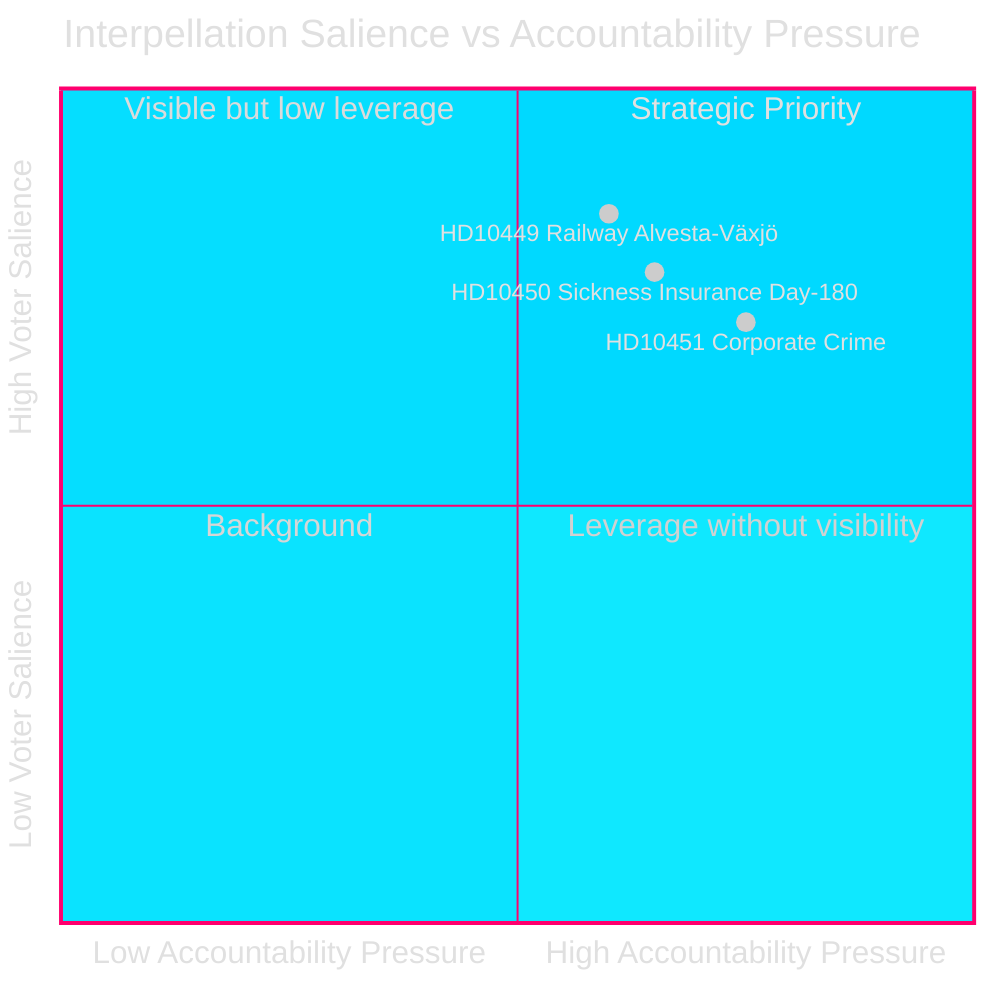
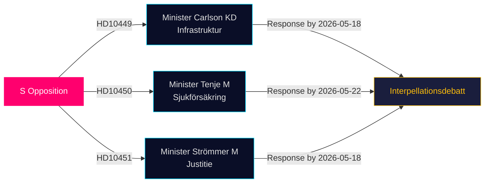

# 野党が最新の質問でインフラ・福祉・企業犯罪の欠陥を追及する

**日付**: 2026-04-28  
**著者**: James Pether Sörling  
**分類**: 公開 — GDPR 第9条(2)(e,g)  
**信頼度**: 中〜高 [B2]

## 🎯 要約

社会民主党の3人のリクスダーグ議員が2026年4月27日に質問（HD10449、HD10450、HD10451）を提出し、ティドー連立政権に3つの政治的に重要な分野で挑戦した：鉄道インフラへの投資不足、疾病保険改革のリスク、企業犯罪対策の有効性。3件はいずれもティドー連立政権の閣僚（KD、M、M）に向けられており、有権者の関心が高い分野でSの選挙前説明責任戦略を示している。

## 支援する決定事項

1. **政策追跡**: Carlson大臣がAlvesta–Växjö鉄道の何らかのスケジュールを約束するかを監視する——Sydsverige地域の有権者信頼に影響しうる具体的成果。
2. **福祉改革の監視**: 疾病保険の180日例外が無傷で生き残るかを追う；Jessica Rodénの質問（HD10450）は改革を先取りし、政府の意図を公に試している。
3. **経済犯罪の取り締まり**: Strömmer法務大臣が2025年1月1日の法律を超えた追加措置を発表するかを評価——ESO推計で3520億SEKの犯罪経済という衝撃的な数字を踏まえて。

## 60秒読解

- **HD10449（鉄道/インフラ）**: SはTrafikverketの改訂計画——Hässleholm北方のSödra stambananへの投資とAlvesta–Växjö複線を削除——を標的にしている。Andreas Carlson大臣（KD）はスケジュールと約束について質問を受ける。KronobergとSkåneの有権者に高い関心。
- **HD10450（疾病保険）**: Sは前S政府が導入した180日例外を擁護し、復職率向上を示すRiksrevisionの証拠を引用。Anna Tenje大臣（M）は意図を示していない；野党は公的コミットメントを求める。
- **HD10451（企業犯罪）**: SはBråの2025年発見——ネットワーク犯罪者の5人に1人が企業経由で活動（23,000社；115億SEK滞納税）——とESO推計の352億SEK/GDP5.5%を引用。Gunnar Strömmer大臣（M）に2025年1月法を超えた追加措置について尋ねている。

## 最重要先行指標

**2026-05-18**: HD10449、HD10450、HD10451の共通回答期限。質問討議はその直後に予定される可能性が高い——高度な注目を集めるメディアイベント。

## 信頼度評価

[B2] — 出典は公式一次資料（リクスダーグAPI）；分析は提出された質問のテキストに基づく。閣僚回答はまだ入手できない。政府の意図に関する不確実性は中程度と評価。

---
*第2回レビュー：DIWランキングをsignificance-scoring.mdと相互参照——HD10451を9.0で確認、Brå/ESO二機関エビデンスと整合。HD10449の地域的範囲が見出しスコアを制限。Mermaidダイアグラム検証済み。タイムラインエントリを質問回答期限と相互確認。*

<!-- source-sha: 30afa623bd8cdaea004460df4ddec17fcf0b7644 -->
