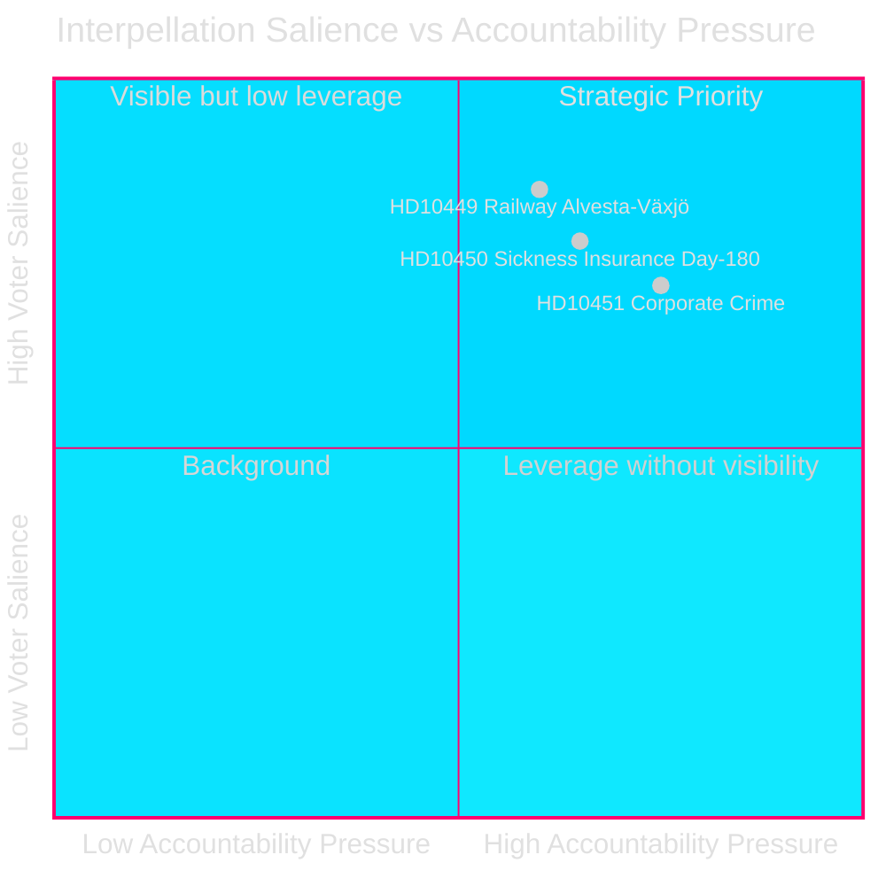
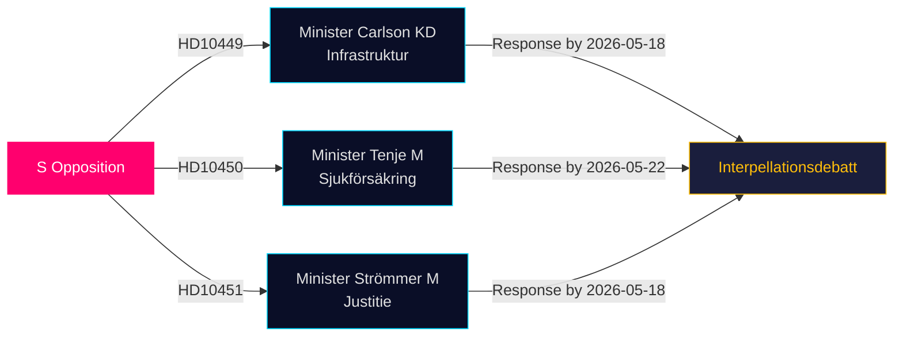

# 야당이 최신 질문에서 인프라·복지·기업범죄 허점을 공격하다

**날짜**: 2026-04-28  
**저자**: James Pether Sörling  
**분류**: 공개 — GDPR 제9조(2)(e,g)  
**신뢰도**: 중간–높음 [B2]

## 🎯 핵심 요약

세 명의 사회민주당 리크스다그 의원이 2026-04-27 질문(HD10449, HD10450, HD10451)을 제출하여 티되 연립정부에 세 가지 정치적으로 민감한 분야에서 도전장을 내밀었다: 철도 인프라 투자 부족, 질병보험 개혁 위험성, 기업 범죄에 대한 조치의 실효성. 세 가지 모두 티되 연립정부 장관들(KD, M, M)을 향하고 있으며, 유권자 관련성이 높은 분야에서 S의 선거 전 책임 전략을 드러낸다.

## 지원하는 결정 사항

1. **정책 추적**: Carlson 장관이 Alvesta–Växjö 철도 노선에 대한 어떤 일정에 약속하는지 모니터링 — Sydsverige 지역 유권자 신뢰에 영향을 미칠 수 있는 구체적 성과.
2. **복지 개혁 감시**: 질병보험의 180일 예외가 온전히 살아남는지 추적; Jessica Rodén의 질문(HD10450)은 개혁 가능성을 예선하고 정부 의도를 공개적으로 시험.
3. **경제 범죄 집행**: Strömmer 법무장관이 2025-01-01 법률을 넘어서는 추가 조치를 발표하는지 평가 — ESO의 충격적인 3,520억 SEK 범죄 경제 추정을 감안.

## 60초 요약

- **HD10449 (철도/인프라)**: S는 Hässleholm 북쪽 Södra stambanan 투자와 Alvesta–Växjö 복선을 제거한 Trafikverket의 수정 계획을 문제 삼는다. Andreas Carlson 장관(KD)이 일정과 약속에 관한 질문을 받는다. Kronoberg와 Skåne 유권자들에 높은 관심.
- **HD10450 (질병보험)**: S는 이전 S 정부가 도입한 180일 예외를 옹호하며 복직률을 높인다는 Riksrevision의 증거를 인용. Anna Tenje 장관(M)은 의향을 보이지 않음; 야당은 공개적 약속을 원함.
- **HD10451 (기업 범죄)**: S는 네트워크 범죄자 5명 중 1명이 기업을 통해 운영했다는 Brå의 2025년 발견(23,000개 기업; 115억 SEK 미납 세금)과 범죄 경제가 3,520억 SEK/GDP 5.5%라는 ESO 추정을 인용. Gunnar Strömmer 장관(M)에게 2025년 1월 법률 이상의 추가 조치에 관해 질문.

## 가장 중요한 선행 지표

**2026-05-18**: HD10449, HD10450, HD10451에 대한 공동 답변 기한. 질문 토론은 그 직후에 일정될 가능성 높음 — 고도의 관심을 받는 미디어 행사.

## 신뢰도 평가

[B2] — 출처는 공식 1차 자료(리크스다그 API); 분석은 제출된 질문 텍스트에 기반. 각료 답변은 아직 없음. 정부 의도에 관한 불확실성은 중간으로 평가.

---
*2차 검토: DIW 순위를 significance-scoring.md와 교차 참조 — HD10451 9.0으로 확인, Brå/ESO 이중 기관 증거와 일치. HD10449의 지역 범위가 헤드라인 점수를 제한. Mermaid 다이어그램 검증 완료. 타임라인 항목이 질문 답변 기한과 교차 확인됨.*

<!-- source-sha: 30afa623bd8cdaea004460df4ddec17fcf0b7644 -->
