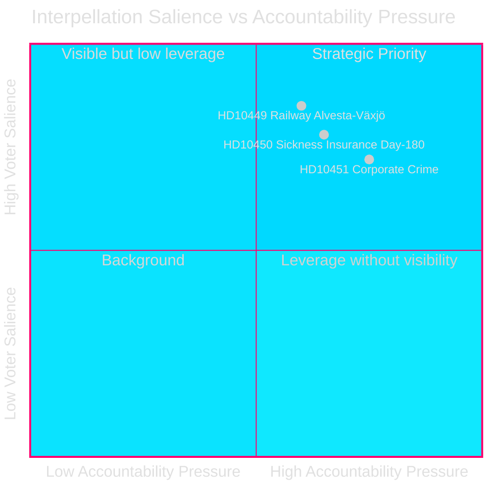
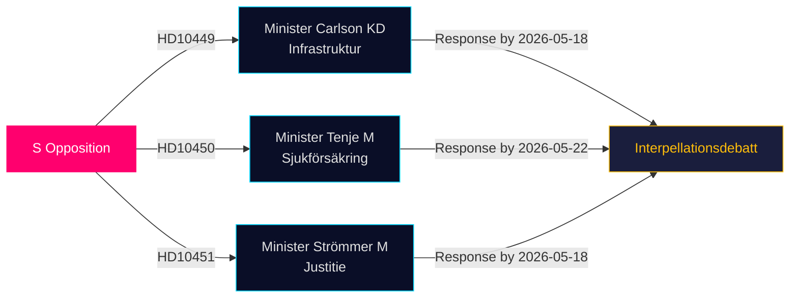

# Oppositie Daagt Infrastructuur-, Welzijns- en Bedrijfscriminaliteitskloven Uit in Laatste Interpellaties

**Datum**: 2026-04-28  
**Auteur**: James Pether Sörling  
**Classificatie**: OPENBAAR — AVG Art 9(2)(e,g)  
**Betrouwbaarheid**: GEMIDDELD–HOOG [B2]

## 🎯 Kernbeoordeling

Drie sociaaldemocratische Riksdag-leden dienden op 2026-04-27 interpellaties in (HD10449, HD10450, HD10451), waarmee ze de Tidö-coalitieregering uitdagen op drie politiek geladen gebieden: investeringstekorten in spoorweginfrastructuur, risico's van de ziektekostenverzekeringshervorming en de doeltreffendheid van maatregelen tegen bedrijfscriminaliteit. Alle drie zijn gericht aan Tidö-coalitieministers (KD, M, M) en signaleren de voor-verkiezingsstrategie van S voor verantwoordingsplicht op gebieden met hoge relevantie voor kiezers.

## Ondersteunde Beslissingen

1. **Politieke monitoring**: Volgen of minister Carlson zich verbindt aan een tijdlijn voor de spoorwegverbinding Alvesta–Växjö — een concrete prestatie die het regionaal kiezersvertrouwen in Sydsverige kan beïnvloeden.
2. **Welzijnshervorming-observatie**: Volgen of de dag-180-uitzondering in de ziektekostenverzekering intact overleeft; Jessica Rodéns interpellatie (HD10450) anticipeert waarschijnlijke hervorming en test openbaar de regeringsintentie.
3. **Economische criminaliteitshandhaving**: Beoordelen of minister van Justitie Strömmer aanvullende maatregelen aankondigt boven op de wet van 2025-01-01, gezien de alarmerende ESO-schatting van een criminele economie van 352 miljard SEK.

## 60-Seconden Lezing

- **HD10449 (Spoorweg/Infrastructuur)**: S richt zich op het herziene plan van Trafikverket dat investeringen in de Södra stambanan ten noorden van Hässleholm en het dubbelspoor Alvesta–Växjö schrapt. Minister Andreas Carlson (KD) staat voor vragen over tijdlijn en toezegging. Hoge relevantie voor kiezers in Kronoberg en Skåne.
- **HD10450 (Ziektekostenverzekering)**: S verdedigt de dag-180-uitzondering ingevoerd onder de vorige S-regering, met verwijzing naar Riksrevisionens bewijs dat dit de terugkeer naar werk verhoogt. Minister Anna Tenje (M) heeft geen intentie gesignaleerd; de oppositie zoekt een publieke toezegging.
- **HD10451 (Bedrijfscriminaliteit)**: S citeert Brås 2025-bevinding dat 1 op 5 netwerkcriminelen via bedrijven opereerde (23.000 firma's; 11,5 miljard SEK achterstallige belastingen) en ESO's schatting dat de criminele economie 352 miljard SEK / 5,5% van het BBP bedraagt. Minister Gunnar Strömmer (M) wordt gevraagd naar verdere maatregelen boven op de wet van januari 2025.

## Belangrijkste Vooruitblikkende Indicator

**2026-05-18**: Gemeenschappelijke antwoorddeadline voor HD10449, HD10450 en HD10451. Interpellatiedebattes waarschijnlijk kort erna gepland — mediagebeurtenis met hoge saillantie.

## Betrouwbaarheidsbeoordeling

[B2] — Bronnen zijn officiële primaire bronnen (Riksdagen API); analyse is gebaseerd op de tekst van ingediende interpellaties. Ministeriële antwoorden zijn nog niet beschikbaar. Onzekerheid over regeringsintenties wordt als GEMIDDELD beoordeeld.

---
*2e beoordeling: DIW-rangschikkingen kruisreferentie met significance-scoring.md — HD10451 bevestigd op 9,0, consistent met Brå/ESO dubbel-agentschap bewijs. Regionale reikwijdte HD10449 beperkt koptekstscore. Mermaid-diagrammen gevalideerd. Tijdlijnvermeldingen gekruist met antwoorddeadlines voor interpellaties.*

<!-- source-sha: 30afa623bd8cdaea004460df4ddec17fcf0b7644 -->
