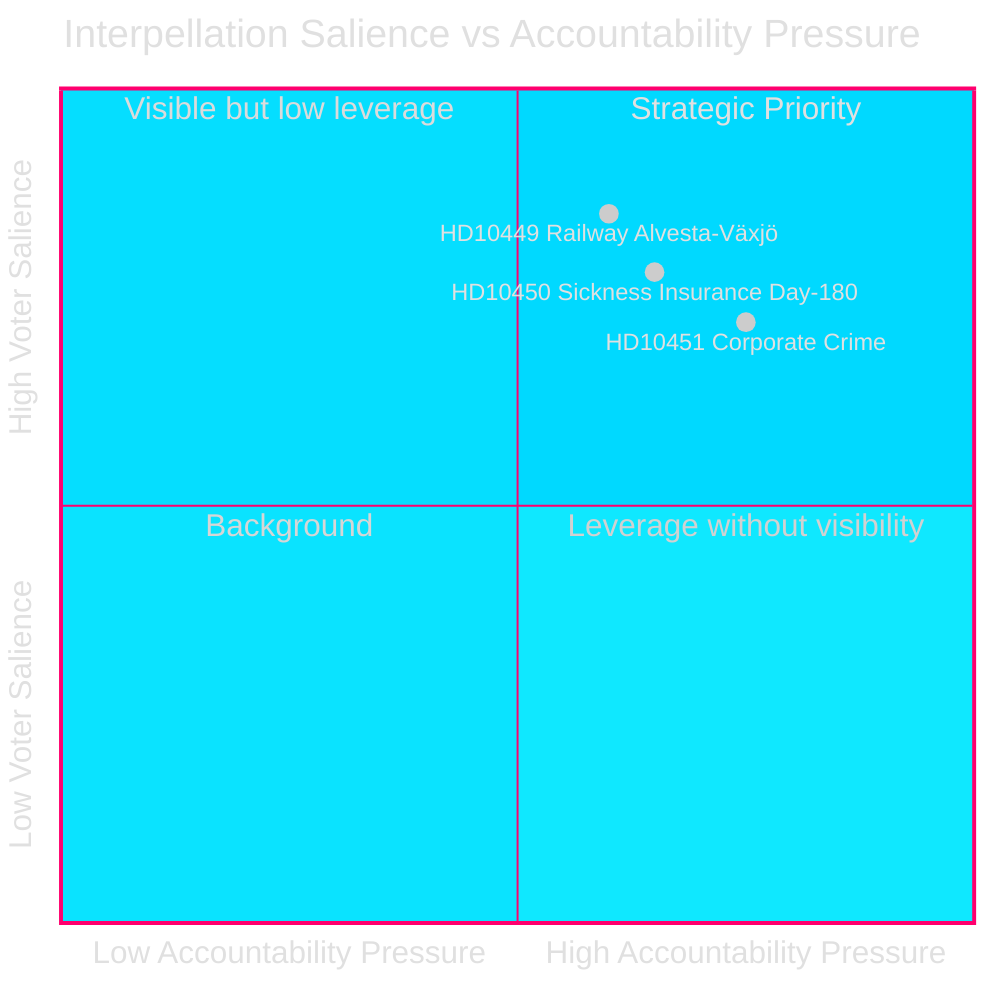
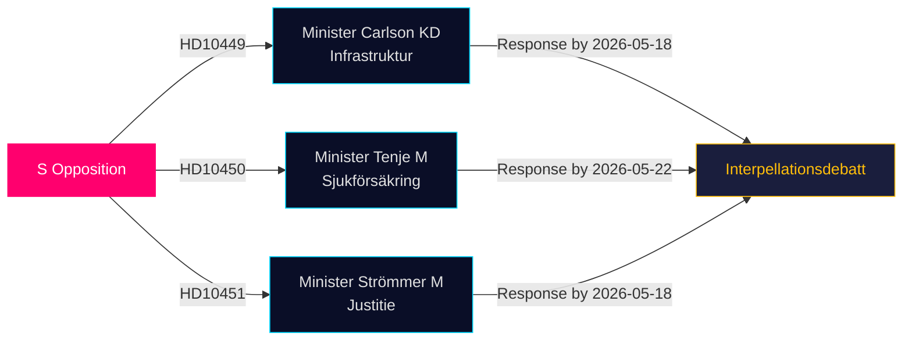

# Opposisjonen Utfordrer Infrastruktur-, Velferd- og Foretakskriminalitetshull i Siste Interpellasjoner

**Dato**: 2026-04-28  
**Forfatter**: James Pether Sörling  
**Klassifisering**: OFFENTLIG — GDPR Art 9(2)(e,g)  
**Konfidens**: MEDIUM–HØY [B2]

## 🎯 Kjernevurdering

Tre sosialdemokratiske riksdagsmedlemmer leverte interpellasjoner (HD10449, HD10450, HD10451) den 2026-04-27, og utfordrer Tidø-koalisjonsregjeringen på tre politisk ladede områder: investeringsunderskudd i jernbaneinfrastruktur, risiko ved trygdereformen og effektiviteten av tiltak mot foretakskriminalitet. Alle tre er rettet mot Tidø-koalisjonsministre (KD, M, M) og signaliserer S' ansvarsstrategien for valget innen områder med høy velgerrelevans.

## Beslutsstøtte

1. **Politisk oppfølging**: Overvåk om minister Carlson forplikter seg til en tidslinje for Alvesta–Växjö-jernbanen — en konkret leveranse som kan påvirke regional velgertillit i Sydsverige.
2. **Velferdreformovervåking**: Følg om dag-180-unntaket i sykeforsikringen overlever intakt; Jessica Rodéns interpellasjon (HD10450) foregriber sannsynlig reform og tester regjeringens intensjoner offentlig.
3. **Bekjempelse av økonomisk kriminalitet**: Vurder om justisminister Strömmer annonserer ytterligere tiltak utover loven fra 2025-01-01, tatt i betraktning ESO's alarmerande estimat om en kriminell økonomi på 352 mrd. SEK.

## 60-sekunders Lesning

- **HD10449 (Jernbane/Infrastruktur)**: S retter seg mot Trafikverkets reviderte plan som fjerner investeringer på Södra stambanan nord for Hässleholm og dobbeltspor Alvesta–Växjö. Minister Andreas Carlson (KD) stilles overfor spørsmål om tidslinje og forpliktelse. Høy relevans for velgere i Kronoberg og Skåne.
- **HD10450 (Sykeforsikring)**: S forsvarer dag-180-unntaket innført under den forrige S-regjering med henvisning til Riksrevisjonens dokumentasjon for at det øker tilbakevendraten til arbeid. Minister Anna Tenje (M) har ikke signalisert intensjon; opposisjonen søker en offentlig forpliktelse.
- **HD10451 (Foretakskriminalitet)**: S siterer Brå's 2025-funn om at 1 av 5 nettverkskriminelle opererte via selskaper (23 000 firmaer; 11,5 mrd. SEK i restanser) og ESO's estimat om at den kriminelle økonomien utgjør 352 mrd. SEK / 5,5% av BNP. Minister Gunnar Strömmer (M) spørres om ytterligere tiltak utover januar 2025-loven.

## Viktigste Fremtidlige Indikator

**2026-05-18**: Felles svarsfrist for HD10449, HD10450 og HD10451. Interpellasjonsdebattes sannsynligvis planlagt kort etter — høysalient mediehendelse.

## Konfidensvurdering

[B2] — Kildene er offisielle primærkilder (Riksdagens API); analysen baserer seg på teksten i innleverte interpellasjoner. Ministersvar er ikke tilgjengelige ennå. Usikkerhet om regjeringens intensjon vurderes MEDIUM.

---
*2. gjennomgang: DIW-rangeringer kryssreferert med significance-scoring.md — HD10451 bekreftet til 9,0, konsistent med Brå/ESO dobbelt-byrå-grunnlag. HD10449's regionale omfang begrenser overskriftscore. Mermaid-diagrammer validert. Tidslinjeposter krysskontrollert mot interpellasjons-svarfrister.*

<!-- source-sha: 30afa623bd8cdaea004460df4ddec17fcf0b7644 -->
