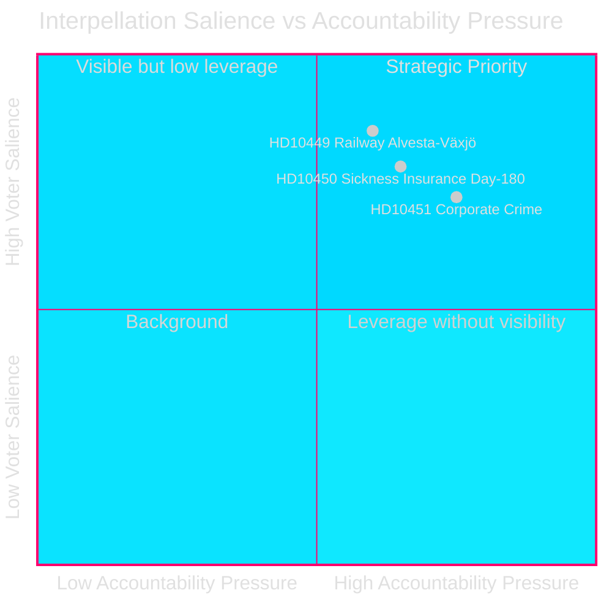
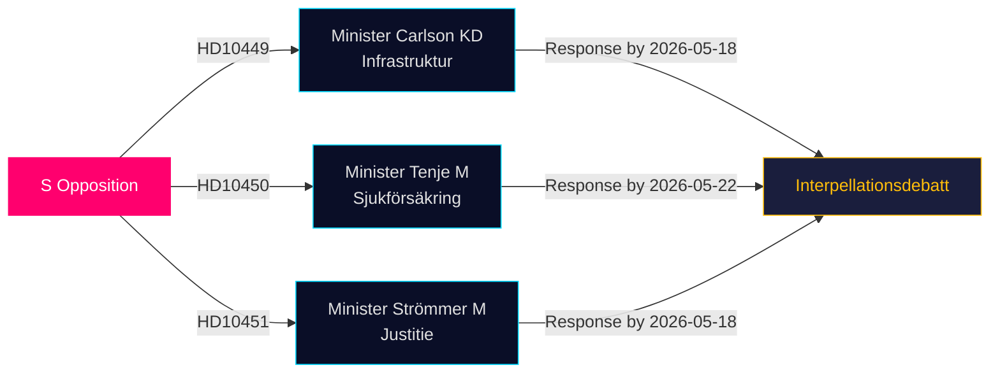

# Oppositionen Utmanar Infrastruktur-, Välfärds- och Företagsbrotts­luckor i Senaste Interpellationerna

**Datum**: 2026-04-28  
**Författare**: James Pether Sörling  
**Klassificering**: OFFENTLIG — GDPR Art 9(2)(e,g)  
**Konfidens**: MEDEL–HÖG [B2]

## 🎯 Kärnbedömning

Tre socialdemokratiska riksdagsledamöter lämnade in interpellationer (HD10449, HD10450, HD10451) den 2026-04-27 och utmanar Tidökoalitionens regering på tre politiskt laddade områden: investeringsunderskott i järnvägsinfrastruktur, risker med sjukförsäkringsreformen och hur effektiva åtgärderna mot företagsbrott är. Alla tre är riktade till Tidökoalitionens ministrar (KD, M, M) och signalerar S:s förvalsansvarsstrategi inom områden med hög väljarrelevans.

## Beslut som detta stöder

1. **Politisk uppföljning**: Övervaka om minister Carlson lovar en tidtabell för Alvesta–Växjö-järnvägen — en konkret leverans som kan påverka väljarförtroendet i Sydsverige.
2. **Välfärdsreformsövervakning**: Följ om dag-180-undantaget i sjukförsäkringen överlever intakt; Jessica Rodéns interpellation (HD10450) föregår trolig reform och testar regeringens avsikter offentligt.
3. **Ekonomisk brottsbekämpning**: Bedöm om justitieminister Strömmer tillkännager ytterligare åtgärder utöver lagen från 2025-01-01, med tanke på ESO:s alarmerande uppskattning om en kriminell ekonomi på 352 miljarder SEK.

## 60-sekunders läsning

- **HD10449 (Järnväg/Infrastruktur)**: S riktar sig mot Trafikverkets reviderade plan som tar bort investeringar på Södra stambanan norr om Hässleholm och dubbelspår Alvesta–Växjö. Minister Andreas Carlson (KD) ställs inför frågor om tidtabell och åtagande. Hög relevans för väljare i Kronoberg och Skåne.
- **HD10450 (Sjukförsäkring)**: S försvarar dag-180-undantaget som infördes av den förra S-regeringen med hänvisning till Riksrevisionens bevis om att det ökar återgångstakten till arbete. Minister Anna Tenje (M) har inte signalerat avsikt; oppositionen söker ett offentligt åtagande.
- **HD10451 (Företagsbrott)**: S hänvisar till Brå:s fynd från 2025 att 1 av 5 nätverkskriminella opererade via bolag (23 000 bolag; 11,5 miljarder SEK i obetald skatt) och ESO:s uppskattning att den kriminella ekonomin utgör 352 miljarder SEK / 5,5% av BNP. Minister Gunnar Strömmer (M) tillfrågas om ytterligare åtgärder utöver lagen från januari 2025.

## Viktigaste framåtindikator

**2026-05-18**: Gemensam svarsfrist för HD10449, HD10450 och HD10451. Interpellationsdebatter sannolikt inplanerade strax efter — mediekritisk händelse.

## Konfidensbedömning

[B2] — Källorna är officiella primärkällor (Riksdagens API); analysen grundar sig på texten i inlämnade interpellationer. Ministrarnas svar finns inte tillgängliga ännu. Osäkerheten om regeringens avsikt bedöms vara MEDEL.

---
*Andra genomgången: DIW-rankingarna korsrefererade med significance-scoring.md — HD10451 bekräftad vid 9,0, konsekvent med Brå/ESO dubbel-agentunderlag. HD10449:s regionala räckvidd begränsar rubrikpoängen. Mermaiddiagram validerade. Tidslinjepost korsgranskad mot svarstider för interpellationerna.*

<!-- source-sha: 30afa623bd8cdaea004460df4ddec17fcf0b7644 -->
