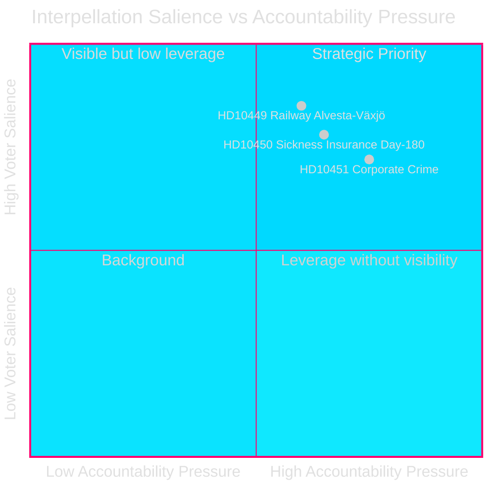
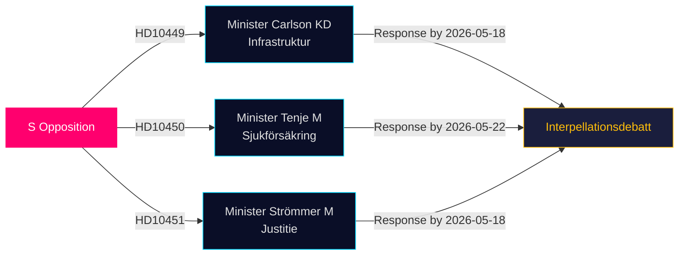

# 反对党在最新质询中挑战基础设施、福利与企业犯罪漏洞

**日期**: 2026-04-28  
**作者**: James Pether Sörling  
**分类**: 公开 — GDPR 第9条(2)(e,g)  
**置信度**: 中等–高 [B2]

## 🎯 核心摘要

三名社会民主党议员于2026年4月27日提交质询（HD10449、HD10450、HD10451），在三个政治敏感领域挑战蒂多联合政府：铁路基础设施投资缺口、医疗保险改革风险以及打击企业犯罪措施的有效性。三项质询均指向蒂多联合政府的部长（KD、M、M），彰显社会民主党在选民高度关注领域的选前问责策略。

## 支持的决策

1. **政策跟踪**：监测Carlson部长是否就Alvesta–Växjö铁路线承诺任何时间表——这是一项可能影响Sydsverige地区选民信心的具体成果。
2. **福利改革观察**：跟踪医疗保险第180天豁免是否完好保留；Jessica Rodén的质询（HD10450）预先应对可能的改革，并公开检验政府意图。
3. **经济犯罪执法**：评估司法部长Strömmer是否在2025-01-01法律之外宣布额外措施，鉴于ESO 352亿克朗犯罪经济的惊人估算。

## 60秒速览

- **HD10449（铁路/基础设施）**：S针对Trafikverket修订方案——该方案删除了Hässleholm北部Södra stambanan投资和Alvesta–Växjö复线——提出质询。部长Andreas Carlson（KD）面临时间表和承诺方面的追问。对Kronoberg和Skåne选民具有高度相关性。
- **HD10450（医疗保险）**：S捍卫前任S政府引入的第180天豁免，援引Riksrevision证据表明该豁免提高了重返工作的比率。部长Anna Tenje（M）尚未表明意图；反对党寻求公开承诺。
- **HD10451（企业犯罪）**：S引用Brå 2025年调查结果——五分之一的网络犯罪分子通过企业运作（23,000家公司；115亿克朗欠税）以及ESO对犯罪经济规模达3,520亿克朗/GDP 5.5%的估算。部长Gunnar Strömmer（M）被问及2025年1月法律之外的进一步行动。

## 最重要的前瞻性指标

**2026-05-18**：HD10449、HD10450和HD10451的共同回复截止日期。质询辩论极有可能在此后不久安排——高关注度媒体事件。

## 置信度评估

[B2] — 消息来源为官方一手资料（议会API）；分析基于提交质询的原文。部长回复尚未获得。政府意图的不确定性评估为中等。

---
*第二次审查：将DIW排名与significance-scoring.md交叉参考——HD10451确认为9.0，与Brå/ESO双机构证据一致。HD10449地区范围限制了标题评分。Mermaid图表已验证。时间线条目与质询答复截止日期进行了交叉核实。*

<!-- source-sha: 30afa623bd8cdaea004460df4ddec17fcf0b7644 -->
