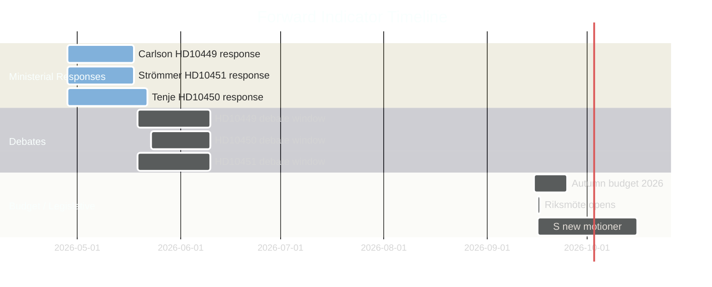
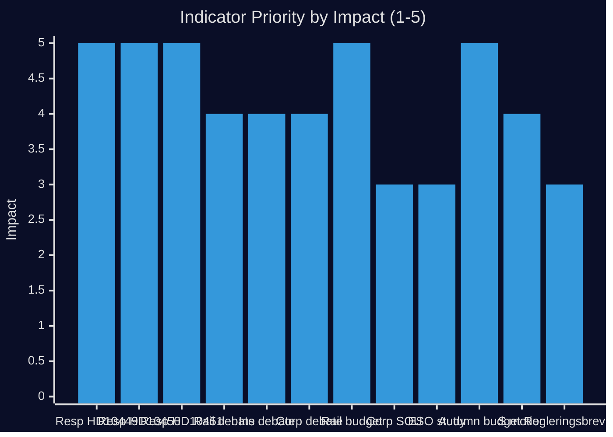

# Forward Indicators — Interpellations 2026-04-28

**Date**: 2026-04-28  
**Author**: James Pether Sörling

## Monitoring Dashboard — 12 Dated Indicators

| # | Indicator | Expected Date | Source | Threshold | Status |
|---|-----------|---------------|--------|-----------|--------|
| 1 | Minister Andreas Carlson files written response to HD10449 | ≤ 2026-05-18 | riksdagen.se dok-register | Response filed or constitutionally overdue | PENDING |
| 2 | Minister Anna Tenje files written response to HD10450 | ≤ 2026-05-22 | riksdagen.se dok-register | Response filed or constitutionally overdue | PENDING |
| 3 | Minister Gunnar Strömmer files written response to HD10451 | ≤ 2026-05-18 | riksdagen.se dok-register | Response filed or constitutionally overdue | PENDING |
| 4 | Trafikverket reviderar nationell plan — consultation notice | 2026-Q3 | Trafikverket.se press | Plan opened for supplemental consultation | WATCH |
| 5 | Government issues regleringsbrev supplement re: Alvesta-Växjö | 2026-Q2 or 2027 budget | Regeringen.se press | "Alvesta" or "Alvesta-Växjö" in regleringsbrev text | WATCH |
| 6 | Riksdag debate (interpellationsdebatt) HD10449 | 2026-05-19 – 2026-06-10 | riksdagen.se calendar | Debate listed in kammarens agenda | PENDING |
| 7 | Riksdag debate (interpellationsdebatt) HD10450 | 2026-05-23 – 2026-06-10 | riksdagen.se calendar | Debate listed in kammarens agenda | PENDING |
| 8 | Riksdag debate (interpellationsdebatt) HD10451 | 2026-05-19 – 2026-06-10 | riksdagen.se calendar | Debate listed in kammarens agenda | PENDING |
| 9 | Government table SOU or Ds on corporate crime follow-up | 2026-Q2–Q4 | Regeringen.se remiss | New Ds or Kommittédirektiv on bolagar-som-brottsverktyg | WATCH |
| 10 | ESO/Brå follow-up study on criminal economy methodology | 2026-H2 | ESO / Brå press | New publication refining the 352 BSEK estimate | WATCH |
| 11 | Budget autumn 2026 — rail infrastructure supplementary allocation | 2026-09-20 (likely) | Government autumn budget proposal | Additional BSEK allocation to Sydsverige rail | WATCH |
| 12 | S tables new motion on day-180 exception at autumn opening | 2026-09-16 (riksmöte opening) | riksdagen.se motioner | Motion filed citing Riksrevisionen findings | WATCH |

## Early Warning Signals

1. **GREEN — HDI delay signal**: If any ministerial response is filed late (>2026-05-22 for HD10450, >2026-05-18 for HD10449/HD10451), it signals government political difficulty with the topic
2. **RED — Corporate crime silence**: If no new legislative action on bolag-som-brottsverktyg within 12 months of January 2025 law, it validates HD10451's core claim
3. **AMBER — Rail budget exclusion**: If the autumn 2026 budget does not include Alvesta-Växjö funding, Carlson's position becomes electorally untenable in Sydsverige

## Collection Strategy

