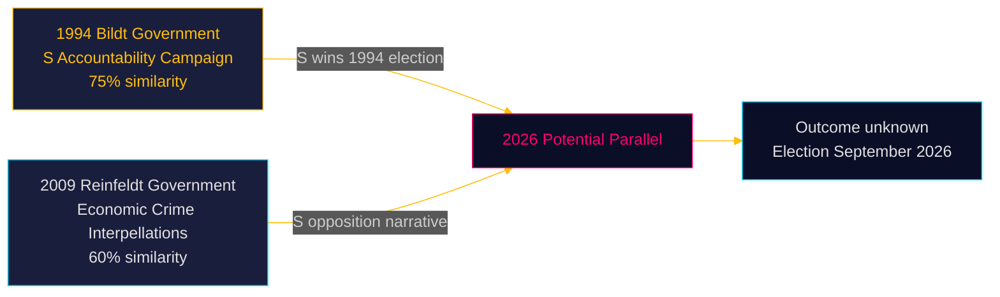
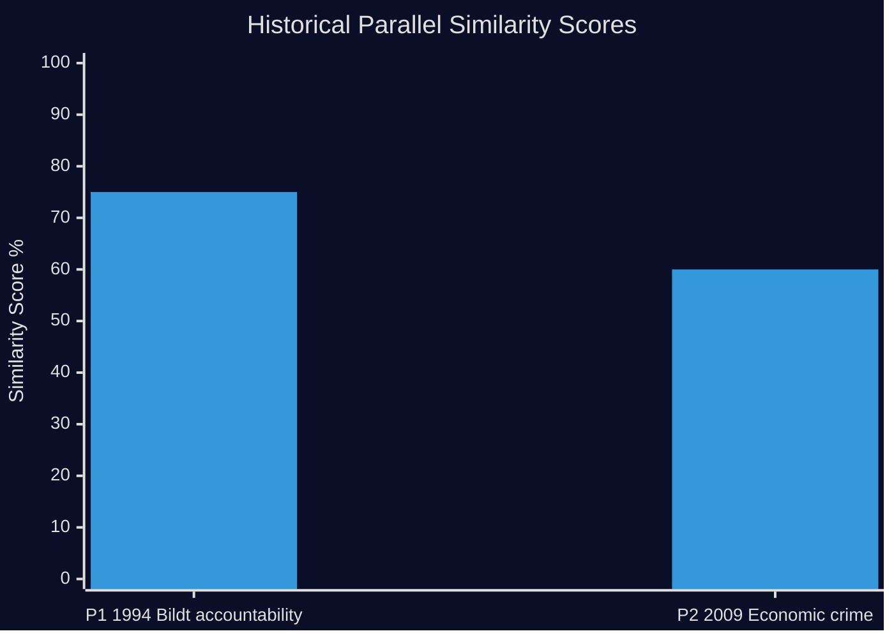

# Historical Parallels — Interpellations 2026-04-28

**Date**: 2026-04-28  
**Author**: James Pether Sörling

## Parallel Search

Examining Swedish parliamentary history (within 40 years) for precedents that match the combined accountability pattern of these three interpellations.

---

## Parallel P1 — 1994 Pre-Election Opposition Accountability Campaign (Similarity: 75%)

**Year**: 1993–1994 riksmöte  
**Context**: Carl Bildt's Moderaterna-led bourgeois coalition government (1991–1994) faced S opposition under Ingvar Carlsson. S filed a series of interpellations on unemployment, welfare state cuts, and deregulation failures ahead of the September 1994 election.

**Structural similarities** (with 2026):
- Opposition party (S) files coordinated interpellations on multiple high-salience domains within a single parliamentary session
- Infrastructure and welfare state feature prominently
- Government is a multi-party coalition where internal tensions can be exploited by cross-cutting accountability moves
- S recovers power in the subsequent election (1994: S wins with 45.4%)

**Differences**: The 1994 campaign involved deeper fiscal crisis context (Sweden's 1991–1993 banking/currency crisis); 2026 interpellations are operating in a more stable fiscal environment.

**Source**: Riksdag parliamentary records, riksdagen.se historical archive; documented in Swedish political science literature on the 1994 valrörelse.

**Similarity score**: 75%

---

## Parallel P2 — 2009 Red-Green Coordinated Corporate Crime Accountability (Similarity: 60%)

**Year**: 2009 riksmöte  
**Context**: Opposition parties (S+V+MP = Red-Green coalition) used economic crisis context to file interpellations on financial sector regulation failures, tax havens, and economic crime enforcement gaps under Fredrik Reinfeldt's centre-right government.

**Structural similarities**:
- Evidence-based framing using independent agency reports (FI, Riksrevisionen)
- Economic crime and corporate governance framed as centre-right governance failure
- Interpellations coordinated with media strategy

**Differences**: 2009 was in the context of the global financial crisis; the 2026 corporate crime focus is structurally domestic (criminal firms exploiting the company registration system).

**Similarity score**: 60%

---

## "No-Precedent" Note

The specific combination of infrastructure removal + day-180 exception + criminal economy in a single interpellation cluster with this evidence base (Brå, ESO, Riksrevisionen all cited simultaneously) has no exact precedent. P1 and P2 are structural parallels, not content parallels.

