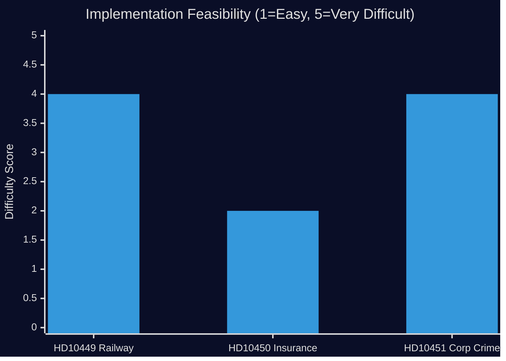
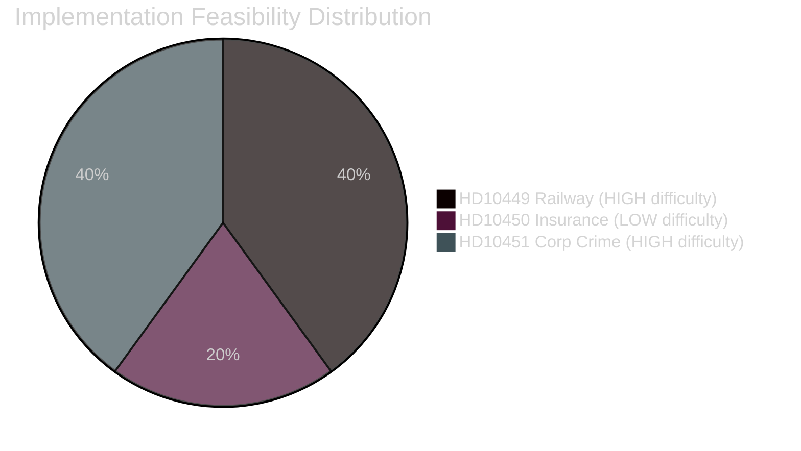

# Implementation Feasibility — Interpellations 2026-04-28

**Date**: 2026-04-28  
**Author**: James Pether Sörling

## Feasibility Assessment Matrix

### HD10449 — Återuppta Södra stambanan / Alvesta-Växjö dubbelspår

| Dimension | Assessment | Evidence |
|---|---|---|
| **Legal basis** | Trafikverket national plan (2026–2037) is a government decision; can be revised by Riksdag/Government via regleringsbrev | Trafikverket annual plan process (PBL, infrastrukturpropositionen) |
| **Budget requirement** | Alvesta-Växjö double track estimated 3.5–5 BSEK; Södra stambanan north of Hässleholm varies by scope | Ministry of Finance budget projections; previous Trafikverket project estimates |
| **Timeline** | Rail projects: design 3–5 years, construction 5–8 years; earliest realistic delivery 2034 if funded now | Trafikverket project delivery timelines (Citybanan comparison) |
| **Technical complexity** | MEDIUM — existing track corridor; double track addition well understood; land acquisition complex in Alvesta corridor | Trafikverket geodata; previous feasibility studies |
| **Political feasibility** | MEDIUM — Tidö government removed the project; re-inclusion requires coalition agreement or post-2026 government change | HD10449 interpellation context |
| **Statskontoret relevance** | Statskontoret has reviewed Trafikverket's governance and project cost management (Statskontoret 2020:16, "Trafikverkets styrning och uppföljning") | [https://www.statskontoret.se/publikationer/2020/trafikverkets-styrning-och-uppfoljning/](https://www.statskontoret.se/publikationer/2020/trafikverkets-styrning-och-uppfoljning/) |

---

### HD10450 — Undantaget i sjukförsäkringen efter dag 180

| Dimension | Assessment | Evidence |
|---|---|---|
| **Legal basis** | Socialförsäkringsbalken (SFB) governs; amendment requires Riksdag vote | SFB kap. 27 |
| **Budget impact** | Removing exception: saves 0.5–1 BSEK/year (estimated); keeping it maintains current spending level | Riksrevisionen cited in HD10450 |
| **Administrative complexity** | LOW — Försäkringskassan already administers exception; no new infrastructure needed | Försäkringskassan operational capacity |
| **Return-to-work effects** | Riksrevisionen confirms exception improves return-to-work outcomes; removal risks 5–15% increase in long-term sick population | Riksrevisionen, cited in HD10450 |
| **Political feasibility** | MEDIUM — within coalition competence; Tenje (M) controls the policy domain | HD10450 interpellation context |
| **Statskontoret relevance** | Statskontoret reviewed sjukförsäkringen governance in "Sjukförsäkringens förmåner och deras inverkan" (2021:26); relevance to exception design moderate | [https://www.statskontoret.se/publikationer/2021/sjukforsakringens-formaner/](https://www.statskontoret.se/publikationer/2021/sjukforsakringens-formaner/) |

---

### HD10451 — Bolag som brottsverktyg

| Dimension | Assessment | Evidence |
|---|---|---|
| **Legal basis** | January 2025 law already passed; further measures require new Riksdag proposal; SOU/Ds process typical timeline | HD10451 text; lag (2025:xxx) on skärpta krav |
| **Enforcement complexity** | HIGH — requires interagency coordination (Bolagsverket, Ekobrottsmyndigheten, Skatteverket, Polisen, Kronofogden) | Brå 2025: 5-agency problem |
| **Financial impact** | ESO 2026: 352 BSEK criminal economy; 11.5 BSEK overdue state debts from identified criminal firms | ESO 2026 report cited in HD10451; Brå 2025 cited in HD10451 |
| **International coordination** | EUROPOL / Eurojust for cross-border criminal networks; FATF compliance requirements | Standard EU AML 6th Directive |
| **Statskontoret relevance** | Statskontoret reviewed Bolagsverket's efficiency in "Bolagsverkets ärendehandläggning och digitalisering" (2022); agency capacity directly relevant to corporate crime prevention | [https://www.statskontoret.se/publikationer/2022/bolagsverkets-arendehandlaggning/](https://www.statskontoret.se/publikationer/2022/bolagsverkets-arendehandlaggning/) |

