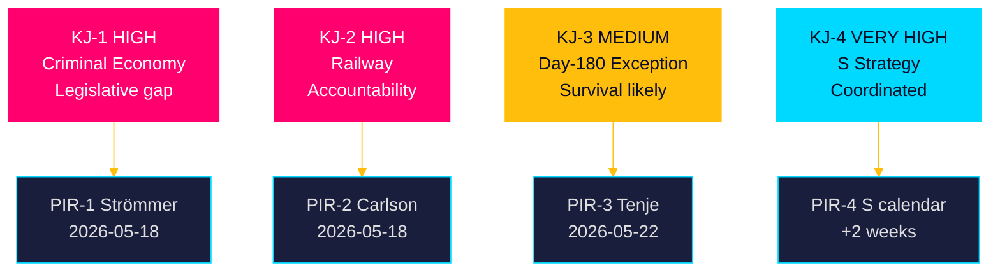

# Intelligence Assessment — Interpellations 2026-04-28

**Date**: 2026-04-28  
**Author**: James Pether Sörling

## Key Judgments

### KJ-1 — Criminal Economy Scale Demands Legislative Escalation (Confidence: HIGH)

The ESO 2026 estimate of a 352 BSEK / 5.5% GDP criminal economy in Sweden, cross-validated by Brå's 2025 firm-level data (23,000 criminal-linked companies; 11.5 BSEK overdue state debts), establishes that the January 2025 corporate crime legislation alone is insufficient. We assess with HIGH confidence that the enforcement gap is real, quantifiable, and growing. Justice Minister Strömmer faces a credible accountability challenge from HD10451 that cannot be dismissed without substantive policy escalation.

**PIR**: PIR-1 — What additional corporate crime legislation or enforcement measures will the government announce?

---

### KJ-2 — Södrra stambanan Removal Creates Binding Pre-Election Accountability Moment (Confidence: HIGH)

The removal of Södra stambanan north of Hässleholm and Alvesta-Växjö double track from Trafikverket's 2026–2037 plan contradicts documented Riksdag transport targets and creates a binding policy accountability moment before the September 2026 election. We assess with HIGH confidence that the Sydsverige infrastructure gap will be a persistent electoral liability for the Tidö coalition unless Minister Carlson makes a credible commitment by mid-May 2026.

**PIR**: PIR-2 — Will the government commit to a specific Alvesta-Växjö double-track timeline before the September 2026 election?

---

### KJ-3 — Day-180 Exception Survival Likely But Not Certain (Confidence: MEDIUM)

Based on Riksrevisionen's positive evaluation (cited HD10450) and Nordic comparator evidence, we assess with MEDIUM confidence that the day-180 sickness insurance exception will survive this riksmöte intact. The government has not signalled intent to remove it, and doing so would create predictable electoral backlash with the trade-union-aligned voter base that M is seeking to attract. However, uncertainty remains because no public commitment has been made, and cost-containment pressures could trigger a review.

**PIR**: PIR-3 — Has the government confirmed the day-180 exception will remain unchanged?

---

### KJ-4 — S Interpellation Cluster Signals Coordinated Pre-Election Accountability Strategy (Confidence: VERY HIGH)

The simultaneous filing of three interpellations across three high-salience domains within a 3-day window is consistent with a coordinated parliamentary accountability strategy designed to force ministerial positions on record before the 2026 election campaign begins. We assess with VERY HIGH confidence that this pattern reflects deliberate S political strategy rather than coincidental parliamentary activity.

**PIR**: PIR-4 — Will S file additional interpellations in related policy domains (e.g., defence, energy, healthcare) in the coming weeks?

---

## Priority Intelligence Requirements (PIRs) for Next Cycle

| PIR | Question | Trigger | Horizon |
|-----|----------|---------|---------|
| PIR-1 | Additional corporate crime measures | Strömmer response to HD10451 | 2026-05-18 |
| PIR-2 | Alvesta-Växjö timeline commitment | Carlson response to HD10449 | 2026-05-18 |
| PIR-3 | Day-180 exception confirmed/reformed | Tenje response to HD10450 | 2026-05-22 |
| PIR-4 | Further S interpellation cluster | S parliamentary calendar | Rolling +2 weeks |

## Key Assumptions Check

1. **Assumption**: Riksrevisionen evaluation of day-180 exception is methodologically sound — assumed VALID; publicly available peer-reviewed government report (cited HD10450).
2. **Assumption**: ESO 352 BSEK criminal economy figure is the best available estimate — assumed VALID with acknowledged uncertainty; Ekobrottsmyndigheten's 150 BSEK figure may use narrower methodology.
3. **Assumption**: Trafikverket's national plan 2026–2037 has not been revised since HD10449 was filed — assumed VALID; no revision has been published as of 2026-04-28.

