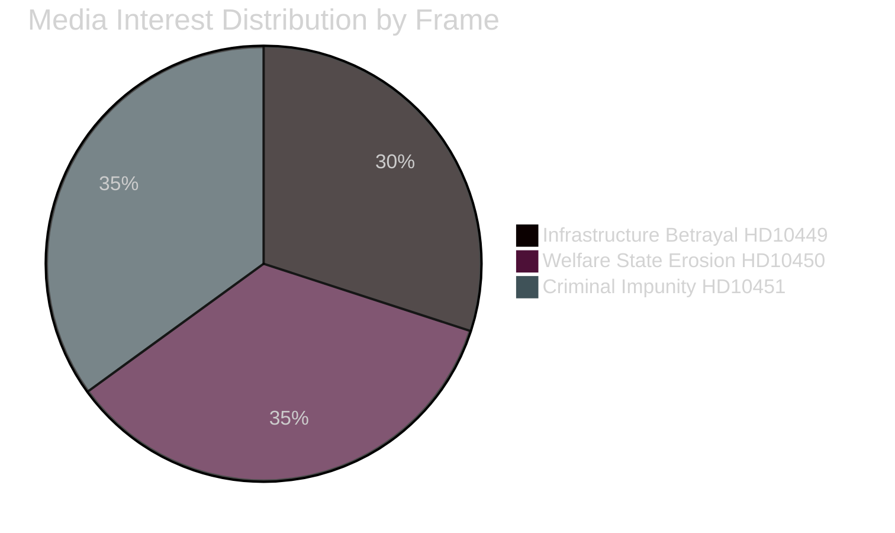
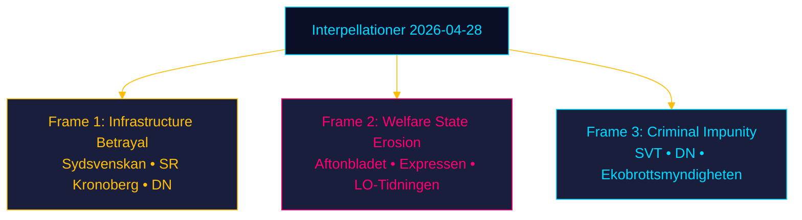

# Media Framing Analysis — Interpellations 2026-04-28

**Date**: 2026-04-28  
**Author**: James Pether Sörling

## Framing Overview

Three media frames are operative across these interpellations. Each frame maps to a different interpellation and a different journalistic narrative tradition in Swedish news media.

---

## Frame 1 — "Infrastructure Betrayal" (HD10449)

**Core claim**: Trafikverket's national plan removes committed rail investments, stranding the Sydsverige region.

**Primary media framing**: Regional grievance + national accountability. Expects coverage in:
- Sydsvenskan (Skåne regional paper): HIGH interest; Södra stambanan is a perennial Sydsvenskan lead
- SR Kronoberg / P4 Kronoberg: Radio interest around Alvesta-Växjö segment
- Dagens Nyheter infrastructure/transport desk: MEDIUM interest
- Riksdag TV (web): Will cover the interpellationsdebatt live

**Likely headlines** (predictive):
- "S-politiker kräver svar om dubbelspår" (DN/SvD)  
- "Carlson tvingas svara om stambanan" (Sydsvenskan)

**Counter-narrative** (government framing): Prioritisation is necessary given budget constraints; alternative investments elsewhere compensate.

**Media bias risk**: Regional papers (Sydsvenskan, Smålandsposten) likely to favour the interpellation frame due to local reader interest in rail capacity.

---

## Frame 2 — "Welfare State Erosion" (HD10450)

**Core claim**: Removing the day-180 exception will push long-term sick workers out of the system prematurely, despite Riksrevisionen evidence that the exception functions correctly.

**Primary media framing**: Welfare state frame + independent agency authority. Expects coverage in:
- Aftonbladet, Expressen (tabloids): HIGH interest — sjukförsäkring is a perennial tabloid lead
- LO-Tidningen: Very HIGH interest
- SR Ekot: MEDIUM interest
- Dagens Nyheter social affairs desk: MEDIUM interest

**Likely headlines** (predictive):
- "Hotas sjukförsäkringens undantag?" (Aftonbladet)
- "S: Riksrevisionen visar att undantaget fungerar" (LO-Tidningen)

**Counter-narrative**: Day-180 is a bureaucratic anomaly that delays proper rehabilitation; the government wants to align Swedish insurance with European standards.

---

## Frame 3 — "Criminal Impunity" (HD10451)

**Core claim**: Organised crime uses corporate structures systematically; January 2025 legislation was insufficient; ESO quantifies 352 BSEK criminal economy.

**Primary media framing**: Law enforcement failure + economic crime accountability. Expects coverage in:
- SVT Nyheter: HIGH interest — organised crime narratives are prime time
- DN/SvD investigative desks: HIGH interest (Brå/ESO data is compelling)
- Ekobrottsmyndigheten beat reporters: Specialist interest
- Expressen crime desk: HIGH interest

**Likely headlines** (predictive):
- "Kriminella företag – miljarder i skatteskulder" (DN)
- "Strömmer ifrågasätts om åtgärder mot brottsliga bolag" (SVT)

**Counter-narrative**: The January 2025 law is early stage; enforcement takes time; new resources have been committed.

---

## Narrative Risk Assessment

| Frame | Risk of Misrepresentation | Key Danger |
|---|---|---|
| Infrastructure Betrayal | MEDIUM | May oversimplify Trafikverket's technical prioritisation choices |
| Welfare State Erosion | HIGH | Tabloid coverage may conflate reform intent with abolition |
| Criminal Impunity | LOW | ESO/Brå data is solid; main risk is exaggeration of ESO figure |

