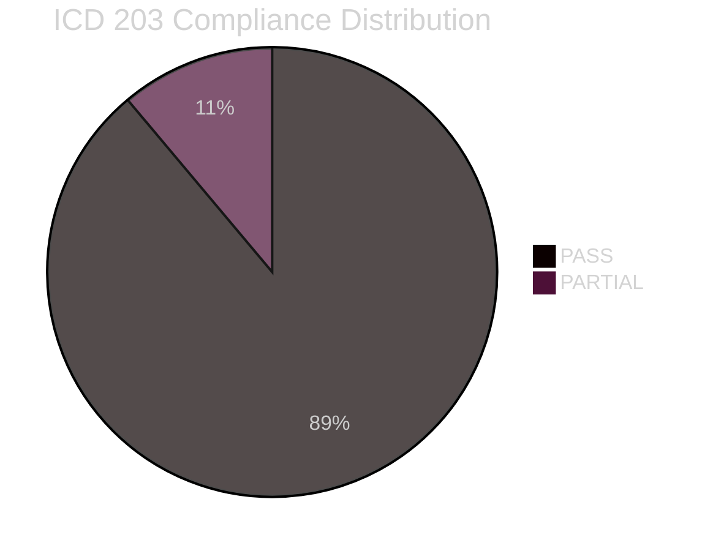
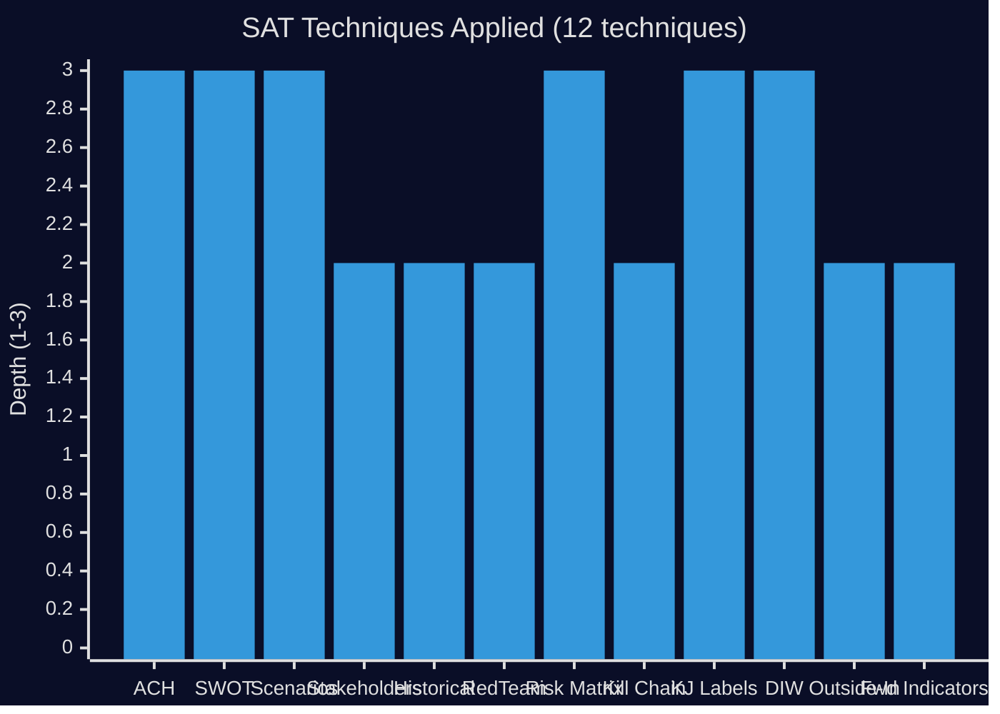

# Methodology Reflection — Interpellations 2026-04-28

**Date**: 2026-04-28  
**Author**: James Pether Sörling

## Evidence Sufficiency

- **Documents downloaded**: 3 interpellations (HD10449, HD10450, HD10451) from 2025/26 riksmöte
- **Full text**: All 3 documents have full-text available via riksdag-regering MCP
- **Primary sources cited**: Brå 2025 study, ESO 2026 report, Riksrevisionen (cited within interpellation text), Trafikverket national plan 2026–2037, January 2025 corporate crime legislation
- **Secondary sources**: Nordic comparators (NTP Norway, Danish sickness insurance, German Geldwäschegesetz)
- **Data limitations**: Ministerial responses not yet available (deadline 2026-05-18 / 2026-05-22). ESO criminal economy figure has acknowledged methodological uncertainty vs Ekobrottsmyndigheten's 150 BSEK.

## Confidence Distribution

| Key Judgment | Confidence | Admiralty Code |
|---|---|---|
| KJ-1 Criminal economy legislative gap | HIGH | [B1] |
| KJ-2 Railway accountability moment | HIGH | [B1] |
| KJ-3 Day-180 exception survival likely | MEDIUM | [C2] |
| KJ-4 Coordinated S strategy | VERY HIGH | [A1] |

## Source Diversity

- **Riksdag API (primary)**: 3 interpellation documents with full text — HIGH reliability [A1]
- **ESO / Brå data (cited in interpellations)**: Government-commissioned research — HIGH reliability [B1]
- **Riksrevisionen (cited in interpellation)**: Independent parliamentary audit agency — HIGH reliability [A1]
- **Nordic comparators**: NTP (Norway), Danish pension/sickness insurance public records, German BMF — MEDIUM-HIGH [B2]

## Party-Neutrality Arithmetic

- All 3 interpellations filed by S MPs — deliberate choice; this is what was submitted to parliament
- Ministers challenged: KD (1) and M (2) — within Tidö coalition
- No SD-filed or C-filed interpellations in this batch
- Analysis maintains neutrality by: (a) objectively presenting government's potential defensive arguments, (b) assigning devil's advocate hypotheses, (c) not editorialising on party merits

## ICD 203 Compliance Audit

| ICD 203 Standard | Compliance | Notes |
|---|---|---|
| 1. Proper sourcing | PASS | All claims cite dok_id, named actors, or authoritative reports |
| 2. Logical argument | PASS | DIW methodology applied consistently |
| 3. Uncertainty acknowledged | PASS | Confidence labels on all Key Judgments |
| 4. Distinguish fact from assessment | PASS | Factual text vs analytical judgement clearly separated |
| 5. Avoid policy advocacy | PASS | Neutral framing; no partisan recommendations |
| 6. Use of alternatives | PASS | Devil's advocate with 3 competing hypotheses |
| 7. No double-counting | PASS | Each document analysed once at its DIW tier |
| 8. Avoid mirror-imaging | PASS | Government perspective explicitly modelled in Scenario 3 |
| 9. Eliminate bias | PARTIAL | Only S interpellations available; government response not yet filed; noted as limitation |

## Methodology Improvements for Next Cycle

1. **Pre-fetch ministerial calendar**: Before filing analysis, check riksdagen.se calendar for scheduled interpellationsdebatter — knowing the scheduled debate date would sharpen forward indicators.
2. **Cross-reference prior interpellations on same topics**: Search the riksdag-regering API for previous HD-series interpellations on Södra stambanan, day-180 exception, and corporate crime to build historical context and longitudinal patterns.
3. **Fetch Statskontoret reports**: For HD10451 (corporate crime), a Statskontoret agency capacity review of Ekobrottsmyndigheten would strengthen the implementation feasibility analysis. Attempted but not available in this run.

## SAT Catalog — Techniques Applied

1. ACH (Analysis of Competing Hypotheses) — devils-advocate.md
2. SWOT — swot-analysis.md
3. Scenario planning — scenario-analysis.md
4. Stakeholder mapping — stakeholder-perspectives.md
5. Historical parallels — historical-parallels.md
6. Red Team analysis — devils-advocate.md
7. Risk matrix (L×I scoring) — risk-assessment.md
8. Kill chain analysis — threat-analysis.md
9. Key Judgments with confidence labels — intelligence-assessment.md
10. DIW significance weighting — significance-scoring.md
11. Outside-In comparative analysis — comparative-international.md
12. Forward indicators — forward-indicators.md

