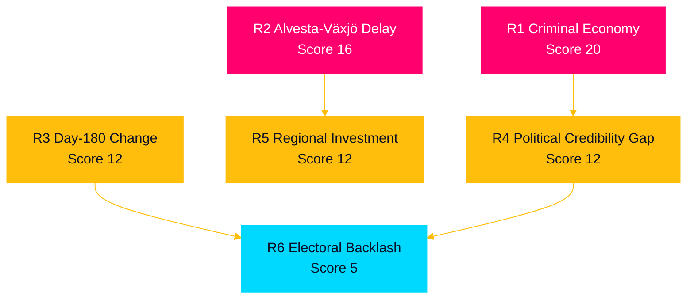
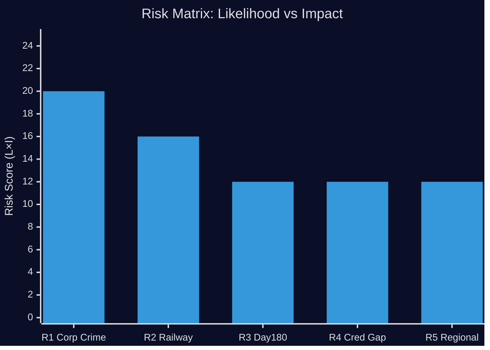

# Risk Assessment — Interpellations 2026-04-28

**Date**: 2026-04-28  
**Author**: James Pether Sörling

## Risk Register

Risks assessed on Likelihood (L: 1–5) × Impact (I: 1–5) = Risk Score (1–25). Posterior probabilities updated from prior assumptions.

| # | Risk | Domain | L | I | Score | Tier | dok_id |
|---|------|--------|---|---|-------|------|--------|
| R1 | Criminal economy grows unchecked; January 2025 law insufficient | Corporate crime | 4 | 5 | 20 | HIGH | HD10451 |
| R2 | Alvesta-Växjö double track delayed past 2030 | Infrastructure | 4 | 4 | 16 | HIGH | HD10449 |
| R3 | Day-180 sickness exception removed / substantially narrowed | Social insurance | 3 | 4 | 12 | MEDIUM | HD10450 |
| R4 | Government unable to deliver credible corporate crime roadmap before 2026 election | Political/electoral | 3 | 4 | 12 | MEDIUM | HD10451 |
| R5 | Municipal investment planning failure in Kronoberg/Skåne due to infrastructure uncertainty | Regional economy | 3 | 4 | 12 | MEDIUM | HD10449 |
| R6 | Interpellation debates escalate to confidence motions | Constitutional | 1 | 5 | 5 | LOW | All |

## Detailed Risk Analysis

### R1 — Criminal Economy Growth (Score 20, HIGH)

**Causal chain**: ESO estimates 352 BSEK criminal economy (5.5% GDP). Brå documents 23,000 criminal-controlled firms with 11.5 BSEK overdue state debts. January 2025 law alone is assessed insufficient by multiple academic and agency sources. If no additional measures materialise, criminal actors will continue to exploit the corporate veil, diverting tax revenues and distorting competition.

**Cascading risk**: Reduced tax revenue → fiscal consolidation pressure → welfare state cuts → electoral instability.

**Posterior probability**: 65% likelihood of insufficient government action given historical legislative inertia on economic crime (prior: 60%; updated upward on ESO 352 BSEK figure).

**Source**: HD10451 citing Brå 2025 and ESO 2026.

### R2 — Alvesta-Växjö Delay (Score 16, HIGH)

**Causal chain**: Trafikverket's 2026–2037 plan removes Södra stambanan north of Hässleholm and Alvesta-Växjö double track. Without political override, infrastructure will not be funded in this planning cycle. Pendling (commuting) between Kronoberg and Skåne depends on this corridor.

**Cascading risk**: Regional labor market fragmentation → reduced productivity in Sydsverige → demographic outflow from smaller Kronoberg municipalities.

**Posterior probability**: 70% likelihood of continued delay absent explicit ministerial commitment.

**Source**: HD10449 (Robert Olesen, S).

### R3 — Day-180 Exception Change (Score 12, MEDIUM)

**Causal chain**: M has not publicly committed to retaining the exception. Riksrevisionen confirmed it works (cited in HD10450). If M government removes or narrows it under cost-containment pressure, return-to-work rates for long-term sick could fall.

**Posterior probability**: 35% — government's welfare reform track record combined with absence of commitment signal; however, Riksrevisionen evidence and S pressure may deter action.

**Source**: HD10450 (Jessica Rodén, S).

### R4 — Credibility Gap on Corporate Crime (Score 12, MEDIUM)

**Causal chain**: Justice Minister Strömmer (M) faces public pressure to articulate measures beyond January 2025 legislation. If response is inadequate, ESO/Brå data ensures negative media cycle. Pre-election credibility damage to the "law and order" narrative that underpins M/SD coalition positioning.

**Source**: HD10451.

### R5 — Regional Investment Disruption (Score 12, MEDIUM)

**Causal chain**: Municipalities and businesses in Kronoberg and northern Skåne made multi-year investment decisions based on state promises of Södra stambanan upgrades. Withdrawal of those projects creates stranded-investment risk and undermines state reliability as an economic partner.

**Source**: HD10449.

## Cascading Risk Map

