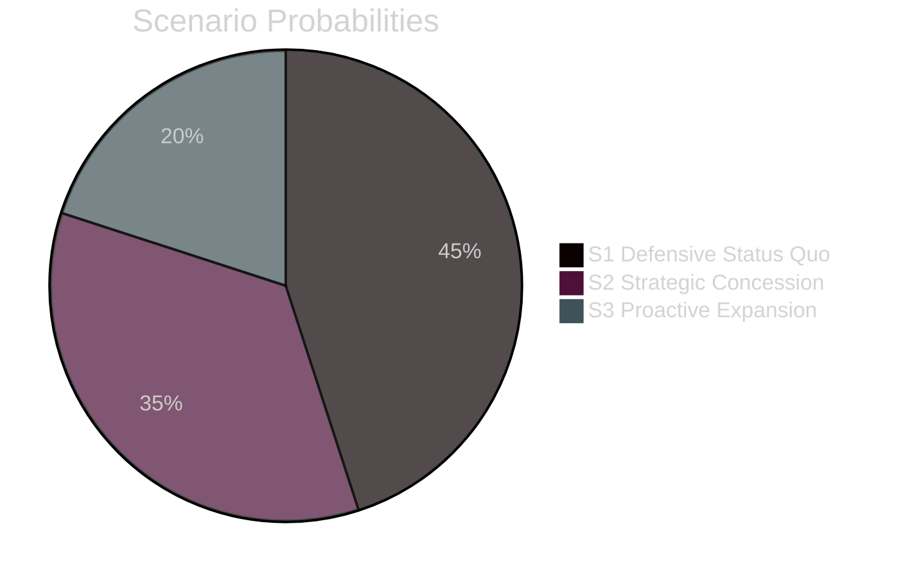
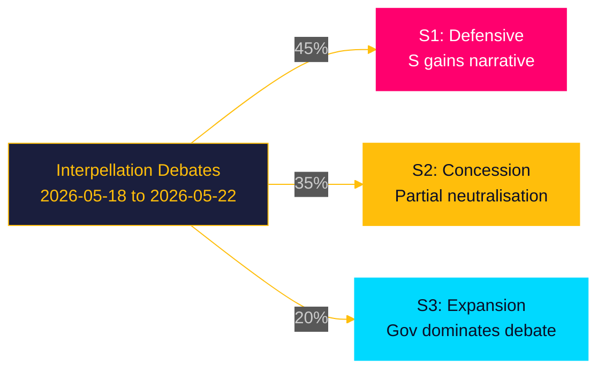

# Scenario Analysis — Interpellations 2026-04-28

**Date**: 2026-04-28  
**Author**: James Pether Sörling

## Scenario Framework

Three scenarios for the governmental response to all three interpellations (HD10449, HD10450, HD10451), assessed by probability and impact. Probabilities sum to 100%.

---

## Scenario 1 — "Defensive Status Quo" (45%)

**Description**: Ministers provide responses that defend current government policy without making new commitments. Carlson defends Trafikverket's national plan without Alvesta-Växjö timeline; Tenje neither confirms nor denies day-180 exception survival; Strömmer points to January 2025 law as sufficient.

**Probability**: 45%

**Leading indicators**:
- No new policy announcements by government press office before 2026-05-18
- Carlson quotes Trafikverket plan as authoritative
- Tenje references ongoing "review" without commitment
- Strömmer cites January 2025 law as adequate

**Implications**:
- S gains media narrative: government "failing on infrastructure, welfare, and rule of law"
- Pre-election pressure accumulates on Tidö bloc
- Regional Kronoberg and Skåne voters mobilised by infrastructure inaction

---

## Scenario 2 — "Strategic Concession" (35%)

**Description**: Government makes limited but visible concessions: Carlson announces some infrastructure timeline or study for Alvesta-Växjö; Tenje confirms the day-180 exception will be retained for this riksmöte; Strömmer announces a working group or further legislative review on corporate crime.

**Probability**: 35%

**Leading indicators**:
- Government press briefing ahead of interpellation debate announces partial commitment
- Tenje statement confirming day-180 exception is "not under current review"
- Ministry of Justice announces follow-up to January 2025 law

**Implications**:
- S's accountability attack partially neutralised
- Government demonstrates responsiveness; improves pre-election positioning
- ESO criminal economy data requires more than a working group to fully address

---

## Scenario 3 — "Proactive Policy Expansion" (20%)

**Description**: Government uses interpellation debates as platform for major policy announcements: new railway investment package for Sydsverige; confirmed day-180 exception retention plus enhanced return-to-work support; comprehensive corporate crime enforcement bill announced.

**Probability**: 20%

**Leading indicators**:
- Government budget amendment signals additional järnvägsanslag
- Justitiedepartementet circulates consultation memo on corporate crime law extension
- Infrastrukturminister Carlson makes region visit to Kronoberg before debate

**Implications**:
- Government dominates the debate narrative
- S interpellations paradoxically strengthen government position
- Significant electoral upside for Tidö bloc in swing regions and law-and-order voters

---

## Scenario Probability Summary

| Scenario | Probability | Key Leading Indicator |
|----------|------------|----------------------|
| S1 Defensive Status Quo | 45% | No policy announcements before 2026-05-18 |
| S2 Strategic Concession | 35% | Partial commitment on at least one domain |
| S3 Proactive Expansion | 20% | Major new policy package announcement |

