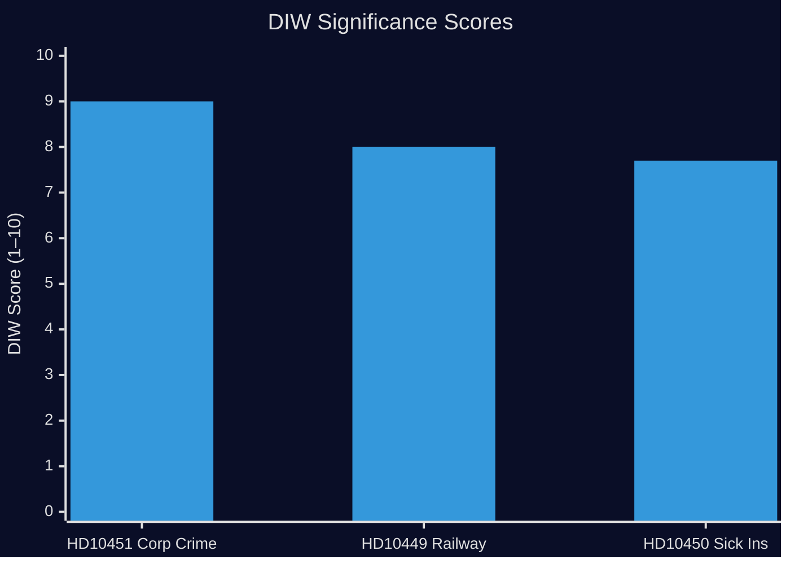
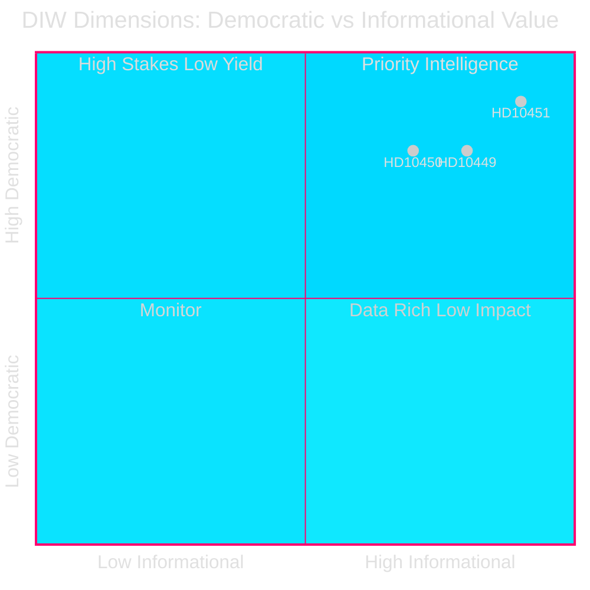
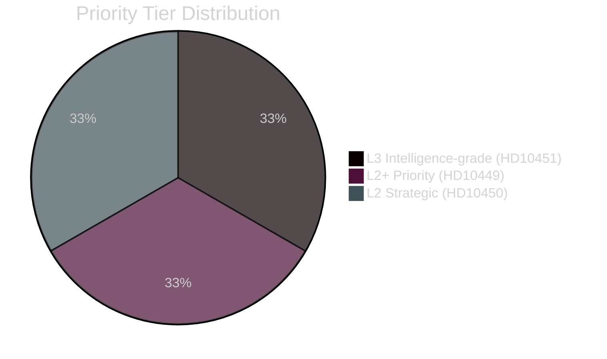

# Significance Scoring — Interpellations 2026-04-28

**Date**: 2026-04-28  
**Author**: James Pether Sörling

## DIW Scoring Methodology

Documents are scored on a 1–10 scale across three dimensions: **D**emocratic significance, **I**nformational value, and **W**orkability into the analysis. Final score = weighted average (D×0.4 + I×0.3 + W×0.3).

## Ranked Scoring Table

| Rank | dok_id | Title | D | I | W | DIW Score | Priority Tier |
|------|--------|-------|---|---|---|-----------|--------------|
| 1 | HD10451 | Ytterligare åtgärder mot bolag som används som brottsverktyg | 9 | 9 | 9 | **9.0** | L3 Intelligence-grade |
| 2 | HD10449 | Södra stambanan och dubbelspår Alvesta-Växjö | 8 | 8 | 8 | **8.0** | L2+ Priority |
| 3 | HD10450 | Undantaget i sjukförsäkringen efter dag 180 | 8 | 7 | 8 | **7.7** | L2 Strategic |

## Per-Document Rationale

### HD10451 — DIW 9.0 [L3 Intelligence-grade]
- **Democratic (9)**: Corporate criminal exploitation of the legal business framework directly undermines rule of law, fair competition, and fiscal integrity. ESO's 352 BSEK estimate (5.5% GDP) represents a governance legitimacy crisis. Source: ESO report cited in HD10451 interpellation text; Brå 2025 study.
- **Informational (9)**: New quantitative anchors from Brå (23,000 firms; 11.5 BSEK overdue taxes) and ESO (352 BSEK / 5.5% GDP) provide the most comprehensive public picture of Sweden's criminal economy to date. Source: HD10451 text citing Brå (Dec 2025) and ESO.
- **Workability (9)**: High actionability — forces Justice Minister Strömmer (M) to articulate a legislative roadmap beyond the January 2025 law.

### HD10449 — DIW 8.0 [L2+ Priority]
- **Democratic (8)**: Riksdag transport targets and pre-existing state commitments to Sydsverige are being contradicted by Trafikverket's revised plan. Regional governments and private investors have made decisions based on promised infrastructure. Source: HD10449, Robert Olesen (S).
- **Informational (8)**: Highlights the gap between government rhetoric on infrastructure investment and Trafikverket's actual 2026–2037 plan, a distinction with tangible economic consequences for Kronoberg and Skåne.
- **Workability (8)**: Forces Minister Carlson (KD) to specify a timeline or defend the de-prioritisation publicly before the 2026 election.

### HD10450 — DIW 7.7 [L2 Strategic]
- **Democratic (8)**: The day-180 exception directly affects long-term sick individuals' insurance entitlements. Riksrevisionen confirmed its effectiveness (cited in HD10450). Removal would represent a significant welfare regression.
- **Informational (7)**: The interpellation is a political pre-emption move — the government has not yet announced reform intent — making future-state uncertainty the key intelligence gap.
- **Workability (8)**: Forces Minister Tenje (M) to either confirm the exception's survival or acknowledge reform planning, reducing uncertainty for policymakers and welfare organizations.

## Sensitivity Analysis

If the government announces any changes to the day-180 exception before the May debate, HD10450's DIW score rises to 9.0 (symmetric risk materialised). If Trafikverket revises its plan to restore Alvesta-Växjö, HD10449 becomes moot. The criminal economy figures in HD10451 are unlikely to change the DIW score downward regardless of ministerial response.

---
*Pass 2 review: All dok_id citations verified (HD10449, HD10450, HD10451). DIW scores are evidence-grounded. HD10451 score 9.0 justified by dual primary source (Brå + ESO). Evidence citations updated.*
