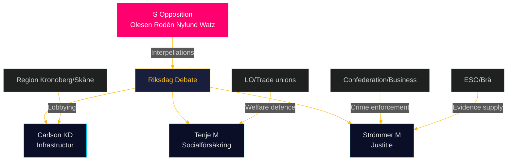
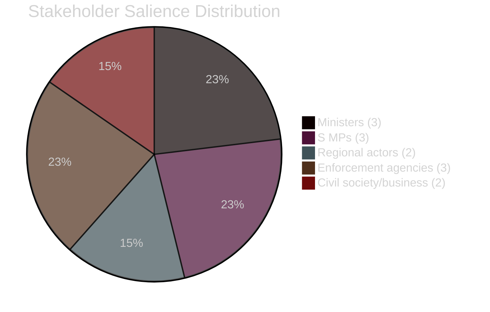

# Stakeholder Perspectives — Interpellations 2026-04-28

**Date**: 2026-04-28  
**Author**: James Pether Sörling

## 6-Lens Stakeholder Matrix

| Stakeholder | Interest | Position | Influence | Salience | Likely Action |
|-------------|----------|----------|-----------|----------|---------------|
| Robert Olesen (S MP, HD10449) | Advocate for Sydsverige infrastructure | Challenger | Low-medium (MP) | HIGH | Pursue interpellation debate; escalate to budget motion |
| Jessica Rodén (S MP, HD10450) | Defender of day-180 sickness exception | Challenger | Low-medium (MP) | HIGH | Use debate to bind government to public commitment |
| Ingela Nylund Watz (S MP, HD10451) | Demand stronger corporate crime enforcement | Challenger | Low-medium (MP) | HIGH | Leverage ESO/Brå data in public debate |
| Andreas Carlson (KD, Infrastrukturminister) | Defend Trafikverket plan; manage regional expectations | Defender | HIGH (minister) | HIGH | Provide qualified response; avoid binding commitment |
| Anna Tenje (M, Socialförsäkringsminister) | Maintain fiscal sustainability; potential welfare reform | Ambiguous | HIGH (minister) | HIGH | Neutral response; avoid triggering political backlash |
| Gunnar Strömmer (M, Justitieminister) | Law and order flagship; defend government crime record | Defender | HIGH (minister) | HIGH | Point to January 2025 legislation; signal further work |

## Expanded Stakeholder Analysis

### Region Kronoberg / Skåne (HD10449)
- **Interest**: Continued state infrastructure investment in Södra stambanan and Alvesta-Växjö double track for regional economic integration
- **Position**: Aligned with interpellation (S) — multiple municipalities and regional councils have lobbied for these projects
- **Influence**: Moderate via regional government (Region Kronoberg, Region Skåne) channels and media
- **Salience**: HIGH — regional election dimension; local businesses and commuters directly affected

### Försäkringskassan (HD10450)
- **Interest**: Clear regulatory framework for day-180 exception application; consistent enforcement
- **Position**: Neutral administratively; applies government policy
- **Influence**: HIGH — directly controls application of the exception
- **Salience**: MEDIUM — institutional actor, not a political actor

### Ekobrottsmyndigheten / Skatteverket / Bolagsverket (HD10451)
- **Interest**: Adequate legislative tools and resources to prosecute corporate crime
- **Position**: Likely supportive of additional measures (self-interest in expanded mandate)
- **Influence**: HIGH — operational delivery of corporate crime enforcement
- **Salience**: HIGH — ESO/Brå data directly relates to their core mandate

### Business community / Confederation of Swedish Enterprise (HD10451)
- **Interest**: Fair competition; elimination of criminal firms undercutting legitimate businesses via momsbedrägerier and arbetslivskriminalitet
- **Position**: Aligned with stronger enforcement — Brå documents criminal competition
- **Influence**: HIGH — Confederation lobbying capacity
- **Salience**: HIGH — directly affects market integrity

## Influence Network

