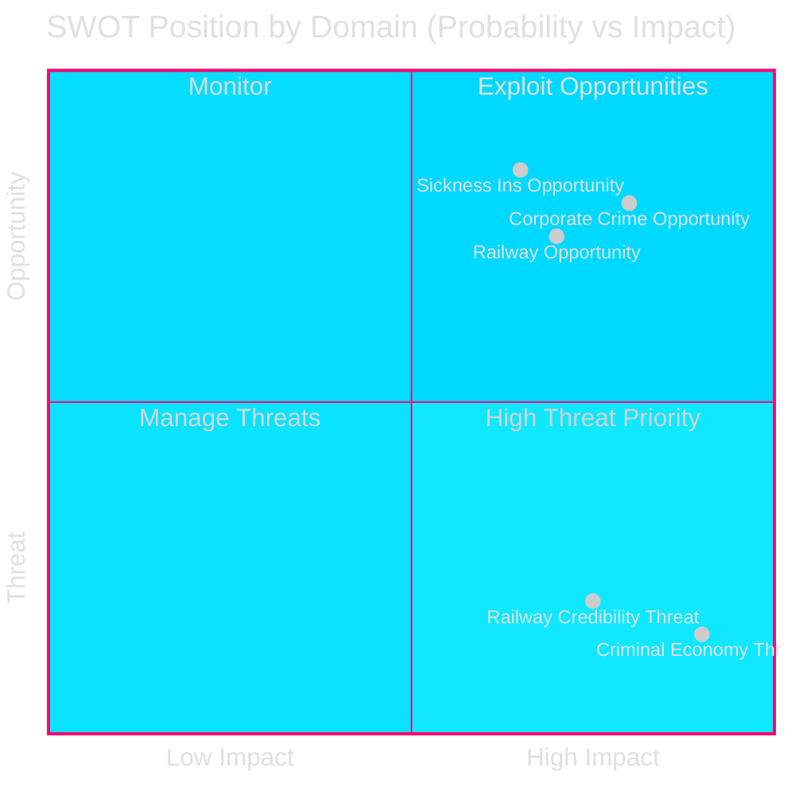

# SWOT Analysis — Interpellations 2026-04-28

**Date**: 2026-04-28  
**Author**: James Pether Sörling

## Analytical Frame

SWOT applied to the **Swedish democratic accountability system** as manifested in these three interpellations, and to the **Tidö coalition's governance position** in the policy areas challenged.

---

## Strengths (of the accountability mechanism and government position)

| Strength | Evidence | dok_id |
|----------|---------|--------|
| Riksdag interpellation mechanism creates mandatory public ministerial response | All three ministers must respond by 2026-05-18 or 2026-05-22; enables public scrutiny | HD10449, HD10450, HD10451 |
| Government can cite genuine legislative action on corporate crime | January 2025 legislation against corporate crime vehicles; referenced as baseline | HD10451 |
| KD government can cite historical infrastructure investments as context | "Historiska infrastruktursatsningar" mentioned in HD10449; government can rebut with facts | HD10449 |
| Riksrevisionen's positive evaluation of day-180 exception can be adopted as government evidence | Riksrevisionen (cited in HD10450) validated the policy introduced by S — government can use same evidence to defend status quo | HD10450 |

---

## Weaknesses (of the government position under challenge)

| Weakness | Evidence | dok_id |
|----------|---------|--------|
| Trafikverket's 2026–2037 plan removes Södra stambanan north of Hässleholm and Alvesta-Växjö double track | Explicitly stated in HD10449; Trafikverket plan documented | HD10449 |
| Järnvägsanslag (railway appropriations) have been reduced despite rhetoric | "Anslagen till järnväg har minskat" — Robert Olesen (S) assertion in HD10449; backed by Trafikverket omissions | HD10449 |
| No clear government statement on day-180 exception preservation | HD10450 exists precisely because the government has not committed publicly to retaining the exception | HD10450 |
| ESO estimate of 352 BSEK criminal economy far exceeds earlier Ekobrottsmyndigheten figure of 150 BSEK | ESO report cited in HD10451; gap between estimates signals measurement failure or scale of problem | HD10451 |
| Brå: 11.5 BSEK in overdue state debts from criminal firms | Concrete fiscal damage quantified; government must account for this | HD10451 |

---

## Opportunities (for the government to strengthen its position)

| Opportunity | Evidence | dok_id |
|------------|---------|--------|
| Commit to Alvesta-Växjö double track within this riksmöte — low cost, high regional reward | Kronoberg and Skåne voters are mobilisable swing constituencies | HD10449 |
| Explicitly confirm day-180 exception survival — pre-empts opposition attack and locks in welfare-state credibility | Riksrevisionen positive evaluation provides cover | HD10450 |
| Announce a follow-on legislative package or task force on corporate crime | January 2025 law is foundation; ESO data justifies escalation | HD10451 |
| Use interpellation debate as public platform to present updated corporate crime statistics | Transparency on ESO/Brå data builds rule-of-law credibility | HD10451 |

---

## Threats (to the government and to democratic outcomes)

| Threat | Evidence | dok_id |
|--------|---------|--------|
| Regional investor and municipal planning collapses if Södra stambanan commits are withdrawn permanently | Kommuner and näringsliv have already planned based on state promises — reversal erodes state credibility | HD10449 |
| 5.5% GDP criminal economy becoming systemic if additional measures not taken | ESO 352 BSEK assessment; trajectory could worsen pre-election | HD10451 |
| Day-180 exception removal could force tens of thousands of sick workers out of insurance prematurely | Implied reform risk; Försäkringskassan enforcement data not yet public | HD10450 |
| Opposition-government debate creates negative press cycle before 2026 election | Three interpellations in one day signals coordinated S media strategy | All |

---

## TOWS Matrix

| | Strengths | Weaknesses |
|---|---|---|
| **Opportunities** | SO: Use interpellation debates to publicise own legislative achievements (Jan 2025 law, infra investment rhetoric) — lock in policy narrative | WO: Commit to Alvesta-Växjö timeline and confirm day-180 exception to convert weaknesses into electoral assets |
| **Threats** | ST: Invoke accountability mechanisms' openness as evidence of democratic legitimacy despite policy gaps | WT: Avoid a defensive posture; proactive package announcements can neutralise all three threat vectors simultaneously |

---

## Cross-SWOT

The government's weakest position is on HD10451 (corporate crime): the ESO 352 BSEK figure creates a credibility gap that cannot be closed by reference to the January 2025 law alone. The strongest opportunity is on HD10450: a simple confirmation preserving the day-180 exception costs nothing politically and neutralises the opposition attack.

