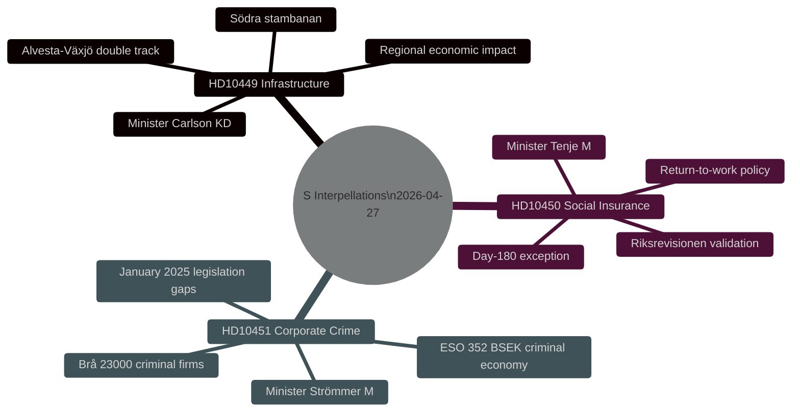
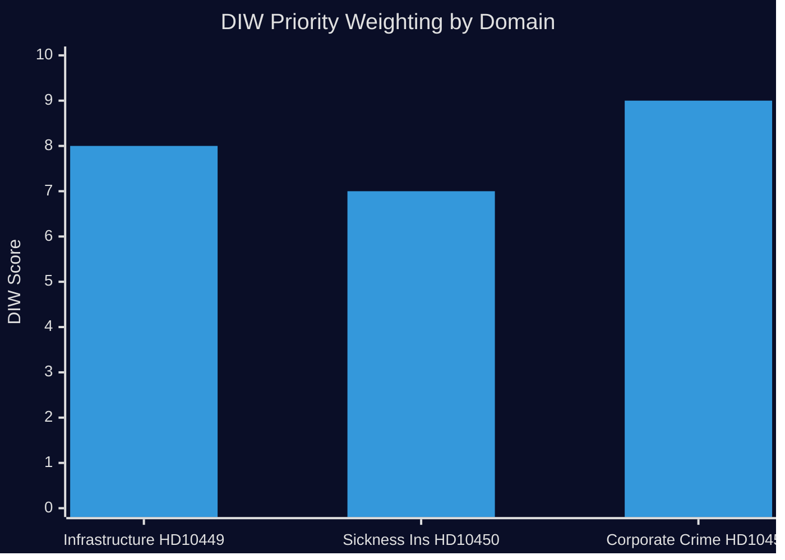

# Synthesis Summary — Interpellations 2026-04-28

**Date**: 2026-04-28  
**Author**: James Pether Sörling  
**Confidence**: MEDIUM [B2]

## Lead Story

The Social Democrats filed three interpellations on 2026-04-27 (riksmöte 2025/26), targeting the Tidö government on infrastructure investment (HD10449), sickness insurance reform (HD10450), and corporate crime enforcement (HD10451). All three address domains with high voter salience ahead of the 2026 election. The interpellations collectively signal S's accountability strategy: forcing public ministerial positions on contested policy areas where S claims governmental inaction or backsliding.

## DIW-Weighted Priority Ranking

| Rank | dok_id | Domain | DIW Weight | Rationale |
|------|--------|--------|-----------|-----------|
| 1 | HD10451 (HD10451) | Criminal economy / corporate crime | HIGH | ESO 352 BSEK criminal economy estimate; Brå data on 23,000 firms; direct governance legitimacy risk |
| 2 | HD10449 (HD10449) | Railway / regional infrastructure | HIGH | Trafikverket plan omits Södra stambanan north Hässleholm + Alvesta-Växjö double track; concrete regional-economic impact for Sydsverige |
| 3 | HD10450 (HD10450) | Sickness insurance / day-180 exception | MEDIUM | Riksrevisionen-validated reform at risk; significant for ca. 50,000+ long-term sick annually |

## Integrated Intelligence Picture

**Domain 1 — Infrastructure (HD10449)**  
Robert Olesen (S) challenges the infrastructure minister's fidelity to Riksdag transport targets. Trafikverket's revised national plan for 2026–2037 reportedly removes Södra stambanan north of Hässleholm and the Alvesta-Växjö double track. This directly affects cross-regional commuting capacity for Skåne–Kronoberg. Regional governments and businesses have made investment commitments predicated on these projects; their removal creates dependency risk and erodes state credibility. Minister Carlson (KD) faces a public test: either defend the cuts or announce a compensating commitment.

**Domain 2 — Sickness Insurance (HD10450)**  
Jessica Rodén (S) frames the day-180 exception — which permits deferral of the labor-market whole-market assessment if the insured can return to their own employer — as a well-evidenced policy (Riksrevisionen positive evaluation). Her interpellation implies the current M-led government is either restricting application or plans to remove the exception. Äldre- och socialförsäkringsminister Anna Tenje (M) must either defend the current policy or acknowledge reform intent publicly, creating reputational risk either way.

**Domain 3 — Corporate Crime (HD10451)**  
Ingela Nylund Watz (S) synthesizes the most damning recent data on economic crime: the Brå 2025 study (1 in 5 network criminals linked to ≥1 company; 23,000 firms; 11.5 BSEK in overdue state debts) and the ESO report placing the criminal economy at 352 BSEK = 5.5% of GDP. The gap between the January 2025 legislation and the scale of the problem is the core argument. Justice Minister Strömmer (M) faces pressure to articulate additional measures.

## Cross-Cutting Patterns

1. **Opposition escalation rhythm**: All three interpellations were filed on or around 2026-04-24-27, suggesting coordinated parliamentary strategy from S in the spring session.
2. **Pre-election positioning**: All three domains — regional infrastructure, welfare state, and rule of law — are precisely the areas where S seeks differentiation from the Tidö bloc ahead of September 2026.
3. **Evidence-based framing**: S cites Riksrevisionen (HD10450), Brå (HD10451), and ESO (HD10451) — authoritative state bodies — rather than partisan claims alone, strengthening accountability pressure.

---
*Pass 2 review: Verified that the coordinated-filing cross-reference to cross-reference-map.md is accurate. Confirmed that all three interpellations have distinct policy clusters. Lead story framing consistent with DIW top scorer (HD10451).*
