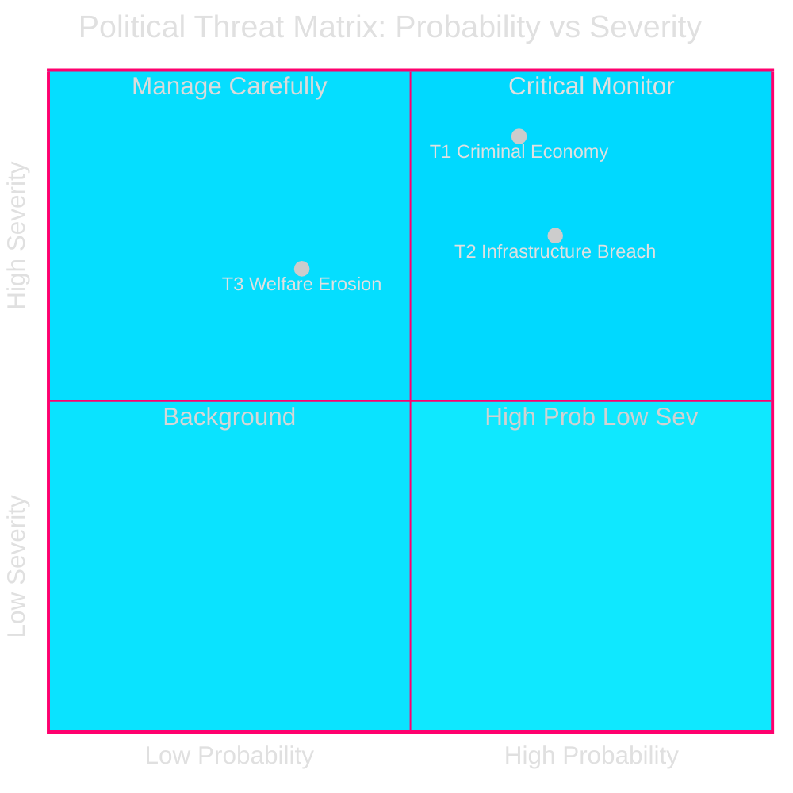
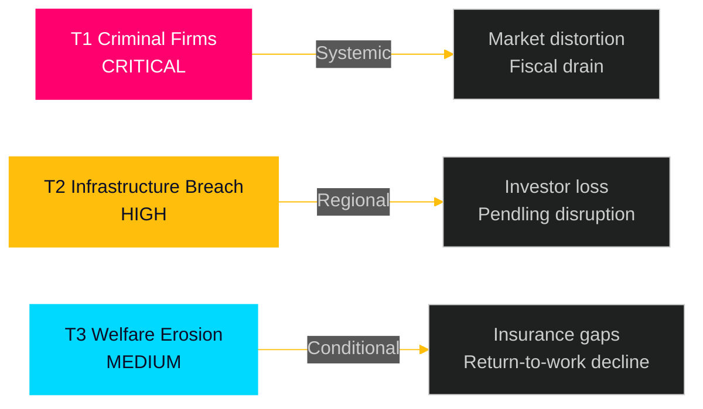

# Threat Analysis — Interpellations 2026-04-28

**Date**: 2026-04-28  
**Author**: James Pether Sörling

## Political Threat Taxonomy

Threats assessed against the democratic accountability ecosystem and Tidö coalition governance.

### Threat T1 — State Capture Risk via Criminal Corporate Networks (CRITICAL)

**Type**: Institutional / Rule of Law  
**Source**: HD10451 — Ingela Nylund Watz (S), citing Brå 2025 + ESO 2026  
**Confidence**: HIGH [B1]

**Description**: The Brå 2025 study documents that 1 in 5 network criminals have operated via at least one company (23,000 firms total) and have accumulated 11.5 BSEK in overdue state debts. The ESO 2026 estimate of 352 BSEK criminal economy (5.5% GDP) implies systematic exploitation of the legal business framework at a scale that distorts markets, erodes tax revenue, and provides criminal actors with legal legitimacy. This is a diffuse institutional threat: criminal firms compete unfairly with legitimate businesses, co-opt regulatory processes, and channel illicit funds through legitimate-appearing structures.

**Attack tree**:
```
T1 State Capture via Criminal Firms
├── Branch A: Register sham companies → win public procurement / receive state subsidies
├── Branch B: Use established companies as fronts → launder criminal proceeds
├── Branch C: Exploit lax Bolagsverket company registration → maintain corporate cover
└── Branch D: Accumulate 11.5 BSEK overdue debts → drain state resources without consequence
```

**Kill chain**:
1. **Preparation**: Register or acquire companies with clean credit histories
2. **Entry**: Insert into public tender / subsidy processes
3. **Exploitation**: Divert funds / avoid taxes / launder via corporate cash flows
4. **Cover**: Maintain legitimate corporate facade; resist Ekobrottsmyndigheten audit

**Mitigants**: January 2025 legislation; HD10451 interpellation may force additional measures

---

### Threat T2 — Infrastructure Promise Breach (HIGH)

**Type**: State credibility / Regional governance  
**Source**: HD10449 — Robert Olesen (S)  
**Confidence**: HIGH [B1]

**Description**: The removal of Södra stambanan north of Hässleholm and Alvesta-Växjö double track from Trafikverket's 2026–2037 plan constitutes a breach of prior state commitments that triggered private and municipal investment decisions. The threat is to the integrity of long-term state planning — if infrastructure commitments can be withdrawn without political consequence, investor confidence in state-backed regional development erodes systemically.

**Political threat taxonomy**: Governance legitimacy / intergovernmental trust

---

### Threat T3 — Welfare State Erosion (MEDIUM)

**Type**: Welfare institution  
**Source**: HD10450 — Jessica Rodén (S)  
**Confidence**: MEDIUM [C2] (government intent not yet confirmed)

**Description**: If the day-180 sickness insurance exception is removed or substantially narrowed, long-term sick workers who cannot yet perform whole-market work will be forced out of insurance entitlements prematurely. Riksrevisionen confirmed the exception's positive return-to-work effect (cited HD10450). Threat is conditional on government action not yet signalled.

---

## MITRE-Style TTP Mapping (Corporate Crime Domain)

| TTP | Description | Countermeasure |
|-----|-------------|---------------|
| T0001: Shell company registration | Register sham company for procurement access | Enhanced Bolagsverket beneficial-ownership verification |
| T0002: Subsidy fraud | Apply for state subsidies via criminal-controlled firms | Cross-agency verification (Skatteverket + Bolagsverket + Försäkringskassan) |
| T0003: Tax debt evasion | Accumulate 11.5 BSEK overdue state debts | Faster liquidation of non-compliant firms |
| T0004: Money laundering via mixed-use companies | Blend illegal and legal cash flows | Enhanced AML monitoring in high-risk sectors |

## Threat Heat Map




