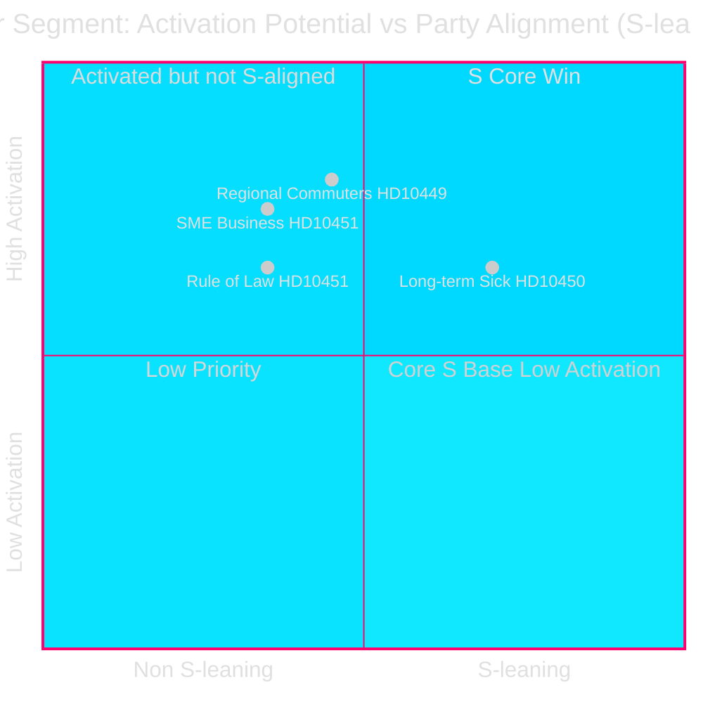
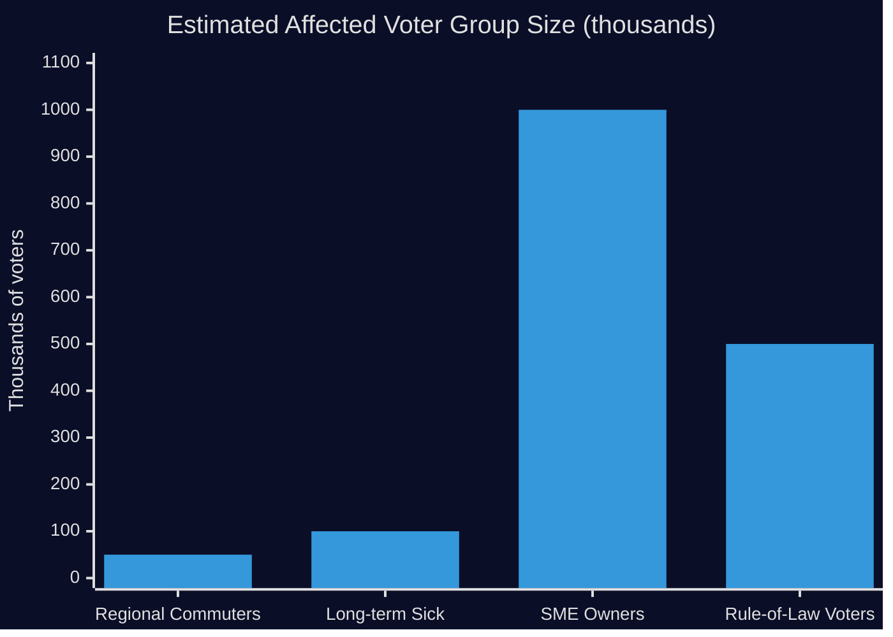

# Voter Segmentation — Interpellations 2026-04-28

**Date**: 2026-04-28  
**Author**: James Pether Sörling

## Segment Impact Analysis

### Segment 1 — Regional Commuters / Sydsverige Workforce (HD10449)

- **Profile**: Workers commuting between Kronoberg, Skåne, and Blekinge; estimated 30,000–50,000 daily commuters on Södra stambanan corridor
- **Current party alignment**: Mixed M/S/C; historically right-of-centre in Skåne but with significant S base in Kronoberg
- **Impact**: HIGH — cancelled double-track capacity directly increases commute unreliability; pendling disruption affects employment flexibility and regional economic integration
- **Activation potential**: HIGH — infrastructure discontent is a historically effective mobilisation frame in Swedish regional politics
- **Baseline position on interpellation day**: Dissatisfied with Trafikverket plan; likely supportive of HD10449's demands

### Segment 2 — Long-Term Sick / Sjukskrivna (HD10450)

- **Profile**: Approximately 50,000–100,000 workers currently covered by day-180 exception; predominantly 40–60 age group; higher representation in physically demanding occupations
- **Current party alignment**: Predominantly S and LO-affiliated
- **Impact**: HIGH if exception removed — would force earlier labour market assessment; Riksrevisionen evidence shows return-to-work rates decline without the exception
- **Activation potential**: MEDIUM — group is politically engaged through LO and health advocacy organizations
- **Baseline position**: Strongly supportive of HD10450; reliant on existing protection

### Segment 3 — SME Business Owners / Legitimate Entrepreneurs (HD10451)

- **Profile**: Small and medium enterprise owners who compete against criminal-controlled companies in sectors including construction, restaurant, transport, cleaning; estimated 500,000–1M small business owners
- **Current party alignment**: Mixed; historically M/C-leaning but not homogeneous
- **Impact**: HIGH — criminal firms undercut via momsbedrägerier, arbetslivskriminalitet, and subsidy fraud; ESO/Brå evidence quantifies competitive distortion
- **Activation potential**: HIGH — business-facing criminal competition is a grievance that crosses party lines
- **Baseline position**: Aligned with HD10451 on substance; may not associate it with S politically

### Segment 4 — Rule-of-Law / Tax-Fairness Voters (HD10451)

- **Profile**: Voters for whom fiscal integrity, fair competition, and law enforcement are primary concerns; cross-cutting demographic
- **Current party alignment**: Distributed across M, SD, C; S seeks to peel off this segment
- **Impact**: HIGH — 352 BSEK criminal economy (ESO) represents 5.5% GDP; voter perception that government is insufficiently aggressive on economic crime damages "law and order" bloc credibility
- **Activation potential**: MEDIUM-HIGH — ESO/Brå data is accessible and persuasive

## Demographic Summary

