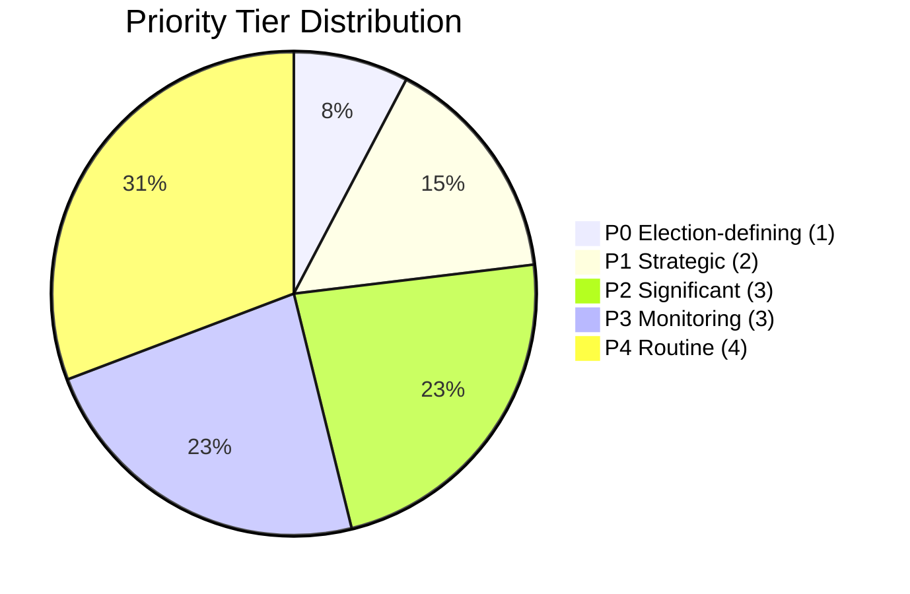
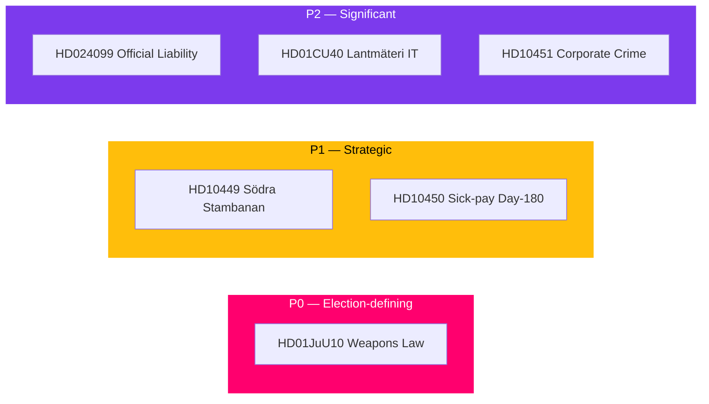

# Classification Results — May 2026 Month Ahead

**Author**: James Pether Sörling  
**Date**: 2026-04-28  
**Framework**: 7-Dimension Political Classification

## Classification Matrix

| dok_id | Policy Domain | Political Salience | Party Alignment | Electoral Relevance | Legislative Stage | GDPR Category | Priority Tier |
|--------|--------------|-------------------|-----------------|--------------------|--------------------|---------------|---------------|
| HD01JuU10 | Criminal Justice | HIGH | M/SD (pro); S/V (con) | VERY HIGH — core election narrative | Final vote | Art.9(2)(e) | P0 |
| HD10449 | Transport/Infrastructure | HIGH | S (pro); KD exposed | HIGH — regional electoral | IP filed | Art.9(2)(e) | P1 |
| HD10450 | Social Insurance | HIGH | S (pro); M (con) | HIGH — welfare narrative | IP filed | Art.9(2)(e) | P1 |
| HD024099 | Criminal Justice | MEDIUM-HIGH | JuU cross-party | MEDIUM — accountability | Committee | Art.9(2)(e) | P2 |
| HD01CU40 | Digital Government | MEDIUM | Government | MEDIUM — modernisation | Betänkande | Public | P2 |
| HD10451 | Criminal Justice | MEDIUM | Cross-party potential | MEDIUM — business accountability | IP filed | Art.9(2)(e) | P2 |
| HD11752 | Foreign Policy/Russia | MEDIUM | UU cross-party | LOW-MEDIUM | Motion | Public | P3 |
| HD11753 | Foreign Policy/Russia | MEDIUM | UU cross-party | LOW-MEDIUM | Motion | Public | P3 |
| HD11755 | Defence/Military | LOW-MEDIUM | FöU | LOW | Motion | Public | P3 |
| HD11750 | Energy Infrastructure | LOW | NU | LOW | Motion | Public | P4 |
| HD11751 | Consumer Safety | LOW | SoU | LOW | Motion | Public | P4 |
| HD11754 | Defence Heritage | LOW | FöU | LOW | Motion | Public | P4 |
| HD11756 | Environment/Water | LOW | MJU | LOW | Motion | Public | P4 |

## Retention & Access Classification

| Classification | Applies to | Retention | Access |
|----------------|-----------|-----------|--------|
| PUBLIC — political opinions under Art.9(2)(e) | All Riksdag documents | 5 years | Open |
| PUBLIC — substantial public interest Art.9(2)(g) | Parliamentary records | Permanent | Open |
| INTERNAL — analysis working papers | This analysis folder | 2 years | Internal |

## Priority Tier Summary

