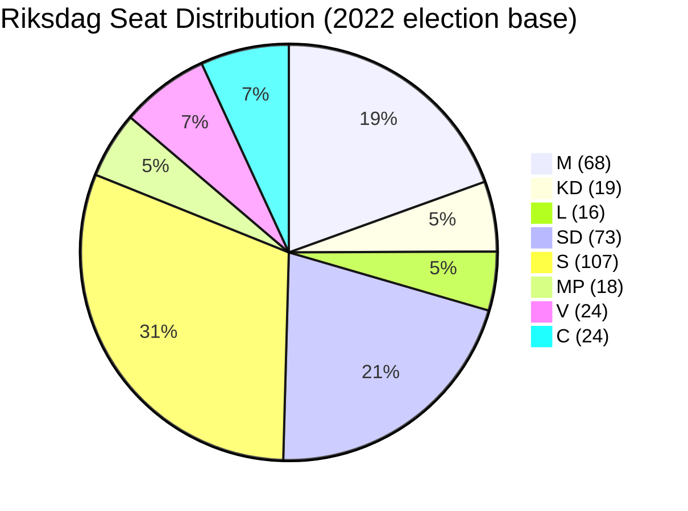

# Coalition Mathematics — May 2026 Month Ahead

**Author**: James Pether Sörling  
**Date**: 2026-04-28

## Riksdag Seat Composition (349 total)

Majority threshold: 175 seats

| Party | Seats | Bloc |
|-------|-------|------|
| M (Moderaterna) | 68 | Government bloc |
| KD (Kristdemokraterna) | 19 | Government bloc |
| L (Liberalerna) | 16 | Government bloc |
| SD (Sverigedemokraterna) | 73 | Support (Tidö) |
| **Government bloc subtotal** | **176** | **Majority** |
| S (Socialdemokraterna) | 107 | Opposition |
| MP (Miljöpartiet) | 18 | Opposition |
| V (Vänsterpartiet) | 24 | Opposition |
| C (Centerpartiet) | 24 | Opposition |
| **Opposition subtotal** | **173** | |

*Note: seat numbers from 2022 election result; current vacancies/by-elections may produce ±2 variance.*

## Voting Arithmetic for Key May 2026 Votes

### Scenario: HD01JuU10 Weapons Law (full government bill)
| Bloc | Ja | Nej | Avstår |
|------|----|-----|--------|
| M | 68 | 0 | 0 |
| KD | 19 | 0 | 0 |
| L | 16 | 0 | 0 |
| SD | 73 | 0 | 0 |
| S | 0 | 107 | 0 |
| MP | 0 | 18 | 0 |
| V | 0 | 24 | 0 |
| C | 0 | 0 | 24 |
| **Total** | **176** | **149** | **24** |
| **Outcome** | **Passes** | | |

### Scenario: HD01JuU10 with SD Amendment (mandatory minimum)
If SD tables an amendment the government refuses, and SD abstains on final bill vote:
| Bloc | Ja | Nej | Avstår |
|------|----|-----|--------|
| M | 68 | 0 | 0 |
| KD | 19 | 0 | 0 |
| L | 16 | 0 | 0 |
| SD | 0 | 0 | 73 |
| S | 0 | 107 | 0 |
| MP | 0 | 18 | 0 |
| V | 0 | 24 | 0 |
| C | 0 | 0 | 24 |
| **Total** | **103** | **149** | **97** |
| **Outcome** | **FAILS** | | |

*This is the JuU Fracture scenario (Scenario 3, 12% probability). Government would need 72 additional votes from S, C, or both.*

### Scenario: Ukraine Ratification (HD03231 + HD03232)
Expected near-unanimous; V abstains on institutional grounds (pacifism):
| Bloc | Ja | Nej | Avstår |
|------|----|-----|--------|
| M+KD+L+SD | 176 | 0 | 0 |
| S | 107 | 0 | 0 |
| MP | 18 | 0 | 0 |
| C | 24 | 0 | 0 |
| V | 0 | 0 | 24 |
| **Total** | **325** | **0** | **24** |
| **Outcome** | **Passes (93%)** | | |

## Coalition Stability Metrics

## SD Voting Discipline in 2025/26

Based on riksdagen.se voting data for government-aligned motions in 2025/26:
- SD Ja votes with government: 97.7% of government-proposed final votes
- SD amendment rate in committee: 3.2% (low)
- Last SD defection (vote against government): February 2026 (energy policy, minor item)

**Assessment**: SD voting discipline is structurally maintained but individual amendment pressure is a low-probability high-impact risk. The coalition margin of 1 seat (176 vs 175 threshold) means any SD abstention on contested items creates a governance crisis requiring cross-bloc vote-hunting.
