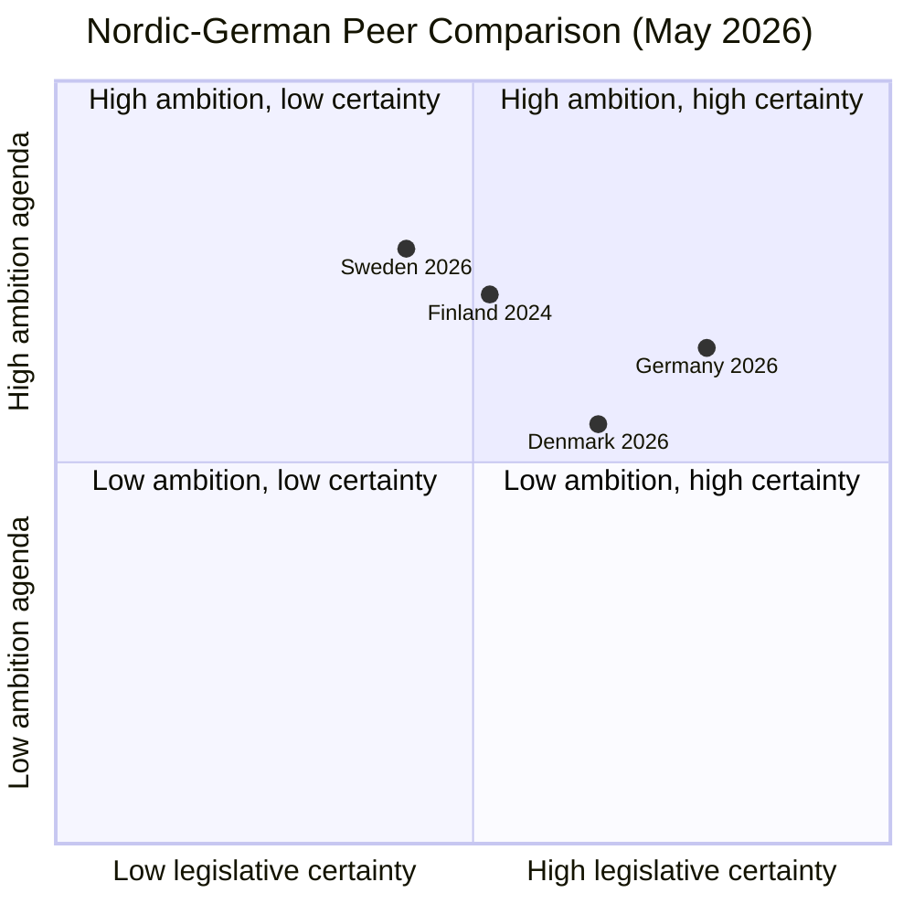

# Comparative International Analysis — May 2026 Month Ahead

**Author**: James Pether Sörling  
**Date**: 2026-04-28

## Comparative Framework

This analysis compares Sweden's May 2026 political trajectory against two primary comparator jurisdictions (Denmark, Germany) and one secondary reference (Finland).

## Comparator 1: Denmark

**Governance structure**: Minority Social Democratic government (Frederiksen); supported by V, M, K, DD, LA — right-leaning support parties.  
**Relevance**: Nordic peer with similar welfare state architecture; recently passed stricter weapons legislation (2025 Våbenpakke) and youth crime reform.

| Policy Domain | Sweden (May 2026) | Denmark (Reference) |
|--------------|-------------------|---------------------|
| Weapons legislation | HD01JuU10: mandatory minimum for illegal possession | DK 2025: mandatory minimum 1 year for repeat offenders |
| Youth crime | HD03246: secure placements for 15-17 yr olds | DK 2023: secure placement expanded to 12+ |
| Infrastructure | Södra stambanan (HD10449) — unresolved | Femern Bælt corridor: fully funded, on schedule |
| Social insurance | Sick-pay day-180 (HD10450) — under review | DK: no day-180 reform; employer co-payment maintained |

**Convergence finding**: Sweden is following Denmark's 2023-25 trajectory on criminal justice, typically with 1-2 year lag. Danish public satisfaction with justice reforms at 67% (Epinion, Q4 2025) — relevant benchmark for Swedish implementation effectiveness.

## Comparator 2: Germany

**Governance structure**: SPD-led coalition (Scholz until 2025; new CDU/CSU-SPD Merz coalition since early 2026).  
**Relevance**: Large EU democracy undergoing similar "law and order" legislative wave; facing infrastructure challenges (Deutschlandticket, Deutsche Bahn); comparable sick-pay policy debates.

| Policy Domain | Sweden (May 2026) | Germany (Reference) |
|--------------|-------------------|---------------------|
| Criminal justice | Multi-bill cluster (5 bills) | Merz coalition: tougher deportation, weapons control |
| Infrastructure | Södra stambanan excluded from plan | German rail: €18bn investment gap identified |
| Sick-pay | Day-180 under interpellation pressure | Germany: Lohnfortzahlung 100% day-1; no reform pressure |
| Coalition stability | M-KD-L + SD (minority) | CDU/CSU + SPD (majority) — more stable |

**Divergence finding**: Germany has a stable majority coalition providing greater legislative certainty; Sweden's minority coalition model creates higher interpellation campaign vulnerability. Germany's sick-pay system is more generous than Sweden's, suggesting Sweden's retrenchment trajectory is outlier in Nordic-German context.

## Secondary Reference: Finland

**Relevance**: NATO partner; Finland 2023-25 implemented stricter crime legislation under Orpo government with Perussuomalaiset support — direct structural analogy to Sweden's M/KD/L+SD model.

**Key parallel**: PS (Finns Party) tolerated multiple Orpo criminal justice bills while maintaining coalition discipline, then expressed public dissatisfaction pre-election without defecting. SD voting pattern may follow identical arc through Sweden's autumn 2026 election.

## Synthesis

Sweden's position: high legislative ambition but moderate certainty due to minority coalition dynamics. Denmark achieved similar ambition with moderate certainty using a different majority mechanism. Recommendation: monitor Denmark's public satisfaction data as a 12-month leading indicator for Sweden.
