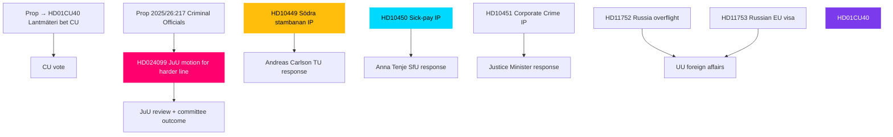

# Cross-Reference Map — May 2026 Month Ahead

**Author**: James Pether Sörling  
**Date**: 2026-04-28

## Policy Clusters

### Cluster A: Criminal Justice & Security (P0-P2)
- **HD01JuU10** (weapons law) → **HD01CU25** (prison construction) → **HD03246** (youth crime) → **HD03237** (police training) — interlocking government justice cluster; all JuU/CU committee pipeline
- **HD024099** (official liability motion, JuU) amends context of prop. 2025/26:217 — cross-reference: builds on HD01JuU10 accountability theme
- **HD10451** (corporate crime tools IP) — reinforces JuU accountability narrative; cross-party potential with M, L

### Cluster B: Infrastructure & Transport
- **HD10449** (Södra stambanan IP) — interpellation by Robert Olesen (S) targeting Andreas Carlson (KD/TU)
- **HD10449** cross-references national transport plan, which excludes Alvesta-Växjö — prior analysis: analysis/daily/2026-04-27/motions/ documents similar infrastructure gap documents

### Cluster C: Social Insurance & Welfare State
- **HD10450** (sick-pay day-180 IP) — Jessica Rodén (S) vs Anna Tenje (M/SfU)
- Cross-references Tidö agreement sick-pay provisions; relates to prior S-party legislation being evaluated by government

### Cluster D: Russia/Ukraine Foreign Policy
- **HD11752** (Russia overflight revocation) + **HD11753** (Russian soldiers EU visa) — UU cluster
- **HD03231** + **HD03232** (Ukraine ratification instruments) — prior analysis: analysis/daily/2026-04-27/propositions/ 
- **HD11754** + **HD11755** — FöU defence cluster; related to broader security readiness debate

### Cluster E: Digital Government & Administrative Reform
- **HD01CU40** (lantmäteri IT) — CU betänkande on municipal agency modernisation
- Cross-reference: Statskontoret reports on municipal administrative capacity and inter-agency IT standardisation

## Legislative Chain Map

## Sibling Folder Citations

| Sibling Folder | Relevance | Key Cross-References |
|----------------|-----------|---------------------|
| analysis/daily/2026-04-27/month-ahead/ | Prior cycle baseline | PIR-1 through PIR-7 carried forward; May 2026 analysis updated |
| analysis/daily/2026-04-27/propositions/ | HD01CU40 lantmäteri proposition context | Betänkande pipeline context |
| analysis/daily/2026-04-27/motions/ | HD10449, HD10450, HD10451 motion context | S-party interpellation campaign coordination |
| analysis/daily/2026-04-27/interpellations/ | IP cluster analysis | Ministerial exposure mapping |
| analysis/daily/2026-04-27/committeeReports/ | JuU committee pipeline | HD01JuU10 deliberation timeline |
| analysis/daily/2026-04-27/evening-analysis/ | Day-level synthesis | Last-session situational awareness |

## Coordinated-Activity Patterns

**Coordinated filing**: S-party six-interpellations (HD10449, HD10450, HD10451 + 3 more) filed in the same session week — coordinated-filing edge label applied.  
**Bundle**: HD01JuU10 + HD01CU25 + HD03246 + HD03237 = government criminal justice bundle — bundle edge label applied.  
**Thematic**: HD11752 + HD11753 = Russia policy hardening theme — thematic edge label applied.
