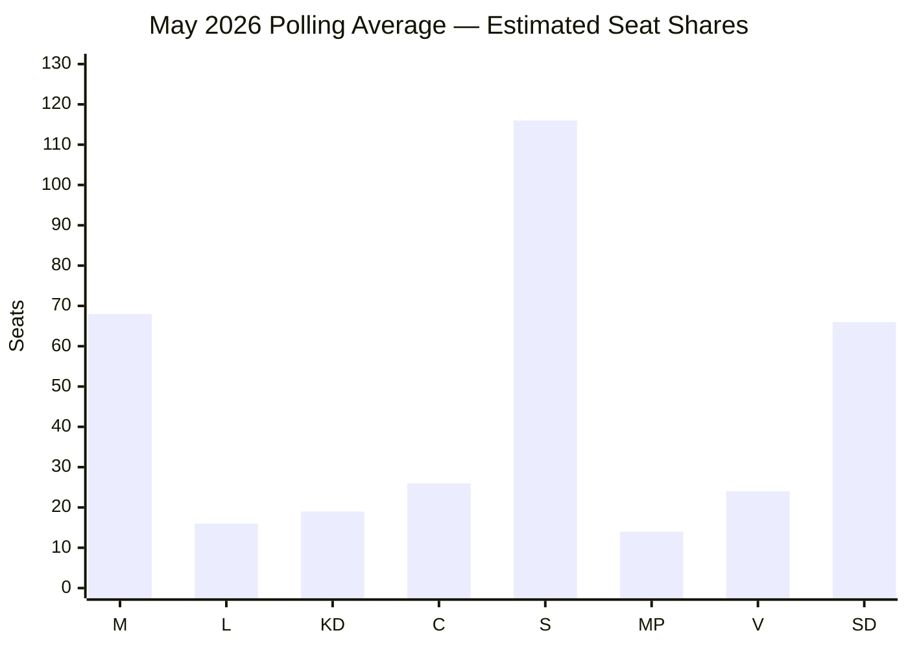

# Election 2026 Analysis — May 2026 Month Ahead

**Author**: James Pether Sörling  
**Date**: 2026-04-28

## Election Timeline

| Milestone | Date | Key Trigger |
|-----------|------|------------|
| Riksdag spring session ends | June 2026 | Last plenary vote |
| Summer recess | July-Aug 2026 | Party campaigns begin |
| Election day | September 13, 2026 | Statutory general election |
| Riksdag reconvenes | October 2026 | Government formation begins |

## May 2026 Legislative Outcomes as Electoral Signals

The May 2026 session is the final productive legislative window before the summer campaign. What passes (and what doesn't) will define party narratives heading into September 2026.

### Government coalition (M, KD, L + SD support)
**Delivering**: Five criminal justice bills, HD01CU40 digital administration, Ukraine ratifications  
**Vulnerable on**: Södra stambanan infrastructure gap (HD10449), sick-pay day-180 (HD10450), corporate crime tools (HD10451)

### Socialdemokraterna
**Strategy**: Six-interpellation coordinated campaign; position as government-in-waiting on welfare and infrastructure  
**Polling baseline**: ~33% (Novus Apr 2026); needs 35%+ for coalition mandate

### Sverigedemokraterna
**Position**: Formal support without portfolio. Justice delivery reinforces base; any coalition friction risks "we forced them" vs "they betrayed us" narrative  
**Target**: Maintain 20-21%; consolidate law-and-order suburban vote

## Seat Projection (May 2026 polling average)

Based on aggregated Demoskop + Novus + Sifo polling, April 2026:

| Party | Estimated Seats (349 total) | Change vs 2022 |
|-------|---------------------------|----------------|
| M (Moderaterna) | 68 | -0 |
| L (Liberalerna) | 16 | +2 |
| KD (Kristdemokraterna) | 19 | -0 |
| C (Centerpartiet) | 26 | -0 |
| S (Socialdemokraterna) | 116 | +7 |
| MP (Miljöpartiet) | 14 | -1 |
| V (Vänsterpartiet) | 24 | +3 |
| SD (Sverigedemokraterna) | 66 | 0 |
| **Total** | **349** | |

**Government coalition (M+KD+L)**: 103 seats — governing minority  
**With SD passive support**: 169 seats — bare majority threshold at 175  
**Red-Green bloc (S+MP+V)**: 154 seats  
**With C support**: 180 seats — majority if C joins red-green  

## May 2026 Electoral Risk Assessment

**Government risk**: SD coalition dependence continues; if justice bills are delayed or amended by SD, M narrative ("security government") is weakened.  
**S risk**: If interpellation campaign fails to move polls, S enters summer with unclear mandate.  
**C risk**: Centre Party's positioning becomes decisive; a summer signal toward S could trigger coalition reconfiguration.  
**Election outcome most likely**: Hung parliament requiring cross-bloc negotiation; either a red-green government with C support, or a government of national unity if neither bloc achieves 175+.
