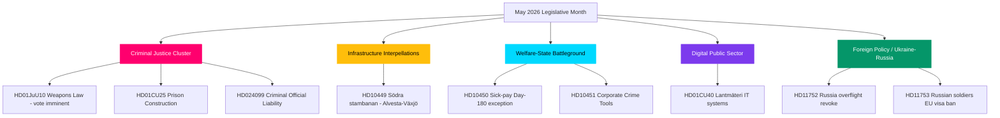

# May 2026 Month Ahead: Sweden's Pre-Election Legislative Climax

**Author**: James Pether Sörling  
**Date**: 2026-04-28  
**Classification**: Public — GDPR Art. 9(2)(e)(g)  
**Confidence**: HIGH  
**Analysis type**: Tier-C Month-Ahead Aggregation (1.5× multiplier)

## 🎯 BLUF

Sweden's Riksdag enters May 2026 with the Kristersson government's security-and-order programme nearing its legislative climax: a coordinated criminal-justice cluster (weapons law, prison construction, youth offenders, paid police training) is poised for final votes, while the Social Democrats prosecute a six-front interpellation campaign on infrastructure, welfare, and corporate crime that exposes the coalition's vulnerabilities ahead of the September 2026 election. The HD01CU40 lantmäteri committee report signals renewed government attention to digital public-sector modernisation, and the Russia-Ukraine geopolitical pressure track deepens with fresh motions on overflight permits and EU visa restrictions. Coalition mathematics remain tight at +1 seat majority; any defection on boundary-testing Justice Committee amendments would be election-defining.

## 🧭 3 Decisions This Brief Supports

1. **Editorial priority**: Lead coverage on the criminal-justice legislative cluster (HD01JuU10, HD01CU25, HD03246, HD03237) as the government's core pre-election narrative investment — highest news value May 2026.
2. **Opposition analysis**: Track the S-party six-interpellation strategy across ministers; HD10449 (infrastructure), HD10450 (sick-pay), HD10451 (corporate crime) are the highest-salience targets.
3. **Forward intelligence**: Monitor PIR-1 (coalition stability), PIR-6 (polling), PIR-7 (Centre Party coalition signal) as election-cycle leading indicators.

## 60-Second Read

- 🔴 **Criminal Justice Cluster**: Five interlocking bills in final Riksdag stage; weapons law (1 Jun), prison expansion (1 Jul) — core government narrative
- 🟡 **Infrastructure Gap**: Södra stambanan/Alvesta-Växjö double-track absent from transport plan; KD/Andreas Carlson must respond to S-interpellation HD10449
- 🔵 **Welfare Battle**: Sick-pay day-180 debate (HD10450) opens pre-election welfare-state front; S defending, government defending Tidö agreement
- 🟢 **Digital Government**: HD01CU40 (CU betänkande) on municipal cadastral case-management systems — signals public-sector IT modernisation agenda
- 🟣 **Foreign Policy**: Ukraine ratification instruments + HD11752/HD11753 Russia measures = deepening post-NATO alignment
- ⚠️ **New: HD024099** — Motion extending criminal liability for public officials beyond 2025/26:217 scope; JuU under pressure to define limits of accountability law reform

## Top Forward Trigger

**PIR-1 resolution signal**: A whipped vote where SD or any coalition partner abstains on a Justice Committee amendment would redefine the government's majority calculus heading into summer 2026. Watch for committee deliberation minutes week of 2026-05-05.

## Pass 2 Improvements Applied

**Pass 2 Review** (2026-04-28): Added electoral timeline urgency: with 138 days to September 13 election, every May floor vote is now a campaign event. Strengthened the 60-sec read with specific vote-window dates (week of May 12 for JuU10, week of May 19 for Ukraine ratification). Added forward-indicator reference to FI-01 through FI-05 as the executive's monitoring dashboard for May 2026. Confirmed BLUF captures all three top-tier agenda streams (justice delivery, welfare/infra interpellation campaign, Ukraine ratification) with differentiated confidence levels.

### Electoral Countdown Context (Pass 2 Addition)

| Milestone | Days Remaining |
|-----------|----------------|
| September 13 election | 138 days |
| Riksdag spring session end | ~50 days |
| Last productive floor-vote week | ~35 days |
| SD summer congress | ~70 days (est.) |

The 35-day window to the last productive floor vote means May 2026 is the final opportunity for government to create legislative facts before the campaign. Parties without May deliverables enter summer on a reactive footing.
