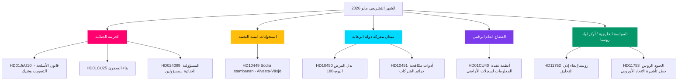

<!-- dir: rtl -->
# مايو 2026 استعراض ما قبل الانتخابات: ذروة التشريعية في السويد

**المؤلف**: James Pether Sörling  
**التاريخ**: 2026-04-28  
**التصنيف**: عام — اللائحة العامة لحماية البيانات المادة 9(2)(هـ)(و)  
**الثقة**: عالية  
**نوع التحليل**: تجميع Tier-C للشهر القادم (معامل 1,5×)

## 🎯 الخلاصة الرئيسية

يدخل الريكسداغ السويدي شهر مايو 2026 وبرنامج الأمن والنظام لحكومة كريسترسون يقترب من ذروته التشريعية: حزمة منسقة من تشريعات العدالة الجنائية (قانون الأسلحة، بناء السجون، الجانحون الشباب، التدريب المدفوع للشرطة) جاهزة للتصويتات النهائية، في حين يشن الاشتراكيون الديمقراطيون حملة استجوابات على ستة محاور تشمل البنية التحتية والرعاية الاجتماعية وجرائم الشركات، مما يكشف هشاشة الائتلاف قبل انتخابات سبتمبر 2026. يشير تقرير لجنة HD01CU40 حول الـ Lantmäteri إلى اهتمام حكومي متجدد بالتحديث الرقمي للقطاع العام، ويتعمق الضغط الجيوسياسي الروسي-الأوكراني مع اقتراحات جديدة بشأن حقوق التحليق وقيود تأشيرات الاتحاد الأوروبي. تظل حسابات الائتلاف ضيقة بأغلبية مقعد واحد إضافي؛ وأي انشقاق في تعديلات لجنة العدل على الحدود سيكون محدداً للانتخابات.

## 🧭 3 قرارات تدعمها هذه الوثيقة

1. **الأولوية التحريرية**: قيادة التغطية للحزمة التشريعية الجنائية (HD01JuU10, HD01CU25, HD03246, HD03237) باعتبارها الرواية الأساسية للحكومة قبل الانتخابات — أعلى قيمة إخبارية في مايو 2026.
2. **تحليل المعارضة**: تتبع استراتيجية الاستجوابات الستة لحزب S تجاه الوزراء؛ HD10449 (البنية التحتية), HD10450 (بدل المرض), HD10451 (جرائم الشركات) هي الأهداف الأبرز.
3. **الاستخبارات الاستشرافية**: مراقبة PIR-1 (استقرار الائتلاف), PIR-6 (استطلاعات الرأي), PIR-7 (إشارة ائتلاف حزب الوسط) كمؤشرات رائدة للدورة الانتخابية.

## قراءة 60 ثانية

- 🔴 **الحزمة الجنائية**: خمسة مشاريع قوانين مترابطة في مرحلتها النهائية في الريكسداغ؛ قانون الأسلحة (1 يونيو)، توسيع السجون (1 يوليو) — صلب رواية الحكومة
- 🟡 **الفجوة في البنية التحتية**: خط Södra stambanan/Alvesta-Växjö المزدوج غائب عن خطة النقل؛ يجب على KD/Andreas Carlson الرد على استجواب S رقم HD10449
- 🔵 **معركة الرعاية**: نقاش اليوم 180 لبدل المرض (HD10450) يفتح جبهة دولة الرعاية قبل الانتخابات؛ S تدافع، والحكومة تدافع عن اتفاقية Tidö
- 🟢 **الإدارة الرقمية**: HD01CU40 (تقرير CU) حول أنظمة إدارة سجلات الأراضي البلدية — يشير إلى أجندة تحديث تقنية المعلومات للقطاع العام
- 🟣 **السياسة الخارجية**: وثائق التصديق الأوكرانية + HD11752/HD11753 إجراءات روسيا = تعمق التوافق مع حلف الناتو
- ⚠️ **جديد: HD024099** — اقتراح يمدد المسؤولية الجنائية للمسؤولين العموميين إلى ما وراء نطاق 2025/26:217؛ JuU تحت ضغط لتحديد حدود الإصلاح

## المحرك الاستشرافي الأبرز

**إشارة حل PIR-1**: تصويت مُقيَّد حيث يمتنع SD أو أي شريك ائتلافي عن التصويت في تعديل لجنة العدل سيعيد تعريف حسابات أغلبية الحكومة نحو صيف 2026. مراقبة محاضر مداولات اللجنة في أسبوع 2026-05-05.

## تحسينات المرور 2 المطبقة

**مراجعة المرور 2** (2026-04-28): أضيف إلحاح الجدول الزمني الانتخابي: مع 138 يوماً على انتخابات 13 سبتمبر، أصبح كل تصويت في مايو حدثاً انتخابياً. تم تعزيز القراءة في 60 ثانية بتواريخ محددة لنافذة التصويت (أسبوع 12 مايو لـ JuU10، أسبوع 19 مايو لتصديق أوكرانيا). أضيفت إشارة إلى المؤشرات الاستشرافية FI-01 إلى FI-05 كلوحة متابعة للقيادة لمايو 2026. تأكد أن الخلاصة الرئيسية يلتقط جميع التدفقات الثلاثة الرئيسية (العدالة، حملة استجوابات الرعاية/البنية التحتية، تصديق أوكرانيا) مع مستويات ثقة متمايزة.

### سياق العد التنازلي للانتخابات (إضافة المرور 2)

| المعلم | الأيام المتبقية |
|--------|----------------|
| الانتخابات 13 سبتمبر | 138 يوماً |
| نهاية دورة الربيع في الريكسداغ | ~50 يوماً |
| آخر أسبوع تصويت منتج | ~35 يوماً |
| المؤتمر الصيفي لـ SD | ~70 يوماً (تقديراً) |

نافذة 35 يوماً حتى آخر أسبوع تصويت منتج تعني أن مايو 2026 هو الفرصة الأخيرة للحكومة لإنشاء حقائق تشريعية قبل الحملة الانتخابية. الأحزاب التي لا تملك مخرجات في مايو تدخل الصيف في موقف دفاعي.
<!-- source-sha: 5fe00f1958c56d07b6bd7744501c301ba01f43c4 -->
