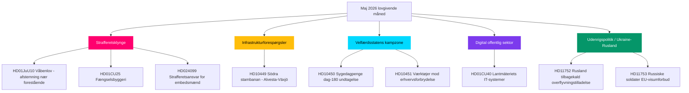

# Maj 2026 månedsoversigt: Sveriges lovgivningsklimaks op til valget

**Forfatter**: James Pether Sörling  
**Dato**: 2026-04-28  
**Klassifikation**: Offentlig — GDPR Art. 9(2)(e)(g)  
**Konfidensgrad**: HØJ  
**Analysetype**: Tier-C månedsoversigt (1,5× multiplikator)

## 🎯 Kernekonklusion

Sveriges Riksdag indleder maj 2026 med Kristerssonregeringens sikkerheds- og ordensprogram tæt på sit lovgivningsklimaks: en koordineret strafferetsklynge (våbenlov, fængselsbyggeri, unge lovovertrædere, betalt politiuddannelse) er klar til slutafstemninger, mens Socialdemokraterne fører en seksfrontkampagne med forespørgsler om infrastruktur, velfærd og erhvervsforbrydelse, der blotlægger koalitionens svagheder forud for valget i september 2026. HD01CU40 lantmäteri-betænkningsrapporten signalerer fornyet regeringsopmærksomhed på digital modernisering af den offentlige sektor, og det russisk-ukrainske geopolitiske pres intensiveres med nye motioner om overflyvningstilladelser og EU-visumrestriktioner. Koalitionsmatematikken er fortsat tæt med +1 mandats flertal; ethvert svigt ved Justitsudvalgets grænseoverskridende ændringsforslag ville være valg­definerende.

## 🧭 3 beslutninger dette PM understøtter

1. **Redaktionel prioritet**: Led dækning om den strafferetlige lovgivningsklynge (HD01JuU10, HD01CU25, HD03246, HD03237) som regeringens kerne­fortælling før valget — højeste nyhedsværdi maj 2026.
2. **Oppositionsanalyse**: Følg S-partiets seks-forespørgselsstrategi mod ministre; HD10449 (infrastruktur), HD10450 (sygedagpenge), HD10451 (erhvervsforbrydelse) er de mest fremtrædende mål.
3. **Fremadrettet efterretning**: Overvåg PIR-1 (koalitionsstabilitet), PIR-6 (meningsmålinger), PIR-7 (Centerpartiets koalitionssignal) som ledende valgkredssindikatorer.

## 60-sekunders læsning

- 🔴 **Strafferetsklynge**: Fem sammenkoblede lovforslag i slutfase i Riksdagen; våbenlov (1. jun), fængselsudvidelse (1. jul) — kerne i regeringens fortælling
- 🟡 **Infrastrukturhul**: Södra stambanan/Alvesta-Växjö dobbeltspor mangler i transportplanen; KD/Andreas Carlson skal svare på S-forespørgsel HD10449
- 🔵 **Velfærds­kamp**: Sygedagpengedag-180-debat (HD10450) åbner front om velfærdsstaten før valget; S forsvarer, regeringen forsvarer Tidö-aftalen
- 🟢 **Digital forvaltning**: HD01CU40 (CU-betænkning) om kommunale matrikelregistersystemer — signalerer IT-moderniseringsdagsordenen for den offentlige sektor
- 🟣 **Udenrigspolitik**: Ukraine-ratificeringsinstrumenter + HD11752/HD11753 Ruslands­foranstaltninger = uddybet post-NATO-tilpasning
- ⚠️ **Nyt: HD024099** — Motion om udvidet strafferetligt ansvar for embedsmænd ud over 2025/26:217's rækkevidde; JuU under pres for at definere grænser for regnskabs­lovsreformen

## Topfremudløser

**PIR-1 løsningssignal**: En pisket afstemning, hvor SD eller en koalitionspartner afholder sig fra at stemme på et Justitsudvalgsændringsforslag, ville omdefinere regeringens flertalsberegning op til sommeren 2026. Overvåg udvalgets drøftelsesprotokol ugen 2026-05-05.

## Pass 2-forbedringer anvendt

**Pass 2-gennemgang** (2026-04-28): Tilføjede valgfristens hast: med 138 dage til valget den 13. september er hver majsafstemning nu et kampagnearrangement. Styrkede 60-sekunders­læsningen med specifikke afstemningsvinduedatoer (ugen 12. maj for JuU10, ugen 19. maj for Ukraine-ratificeringen). Tilføjede fremadindikatorhenvisning til FI-01 til FI-05 som ledelsens overvågningspanel for maj 2026. Bekræftede at kernekonklusionen fanger alle tre topniveaustrømme (retfærdighed, velfærd/infrastrukturforespørgselskampagne, Ukraine-ratificering) med differentierede konfidensniveauer.

### Valgoptællingskontekst (Pass 2-tilføjelse)

| Milepæl | Resterende dage |
|---------|-----------------|
| Valg 13. september | 138 dage |
| Riksdagens forårssession slut | ~50 dage |
| Sidste produktive afstemningsuge | ~35 dage |
| SD's sommerkongres | ~70 dage (anslået) |

35-dages-vinduet til den sidste produktive afstemningsuge betyder, at maj 2026 er den sidste mulighed for regeringen for at skabe lovgivningsfakta inden valgkampagnen. Partier uden maj-leverancer indleder sommeren i reaktiv position.
<!-- source-sha: 5fe00f1958c56d07b6bd7744501c301ba01f43c4 -->
