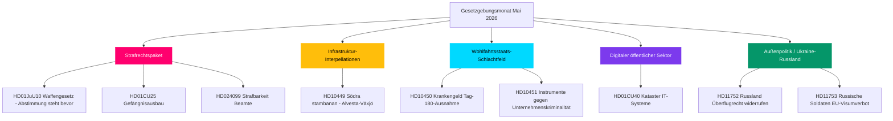

# Mai 2026 Monatsvorschau: Schweden vor dem gesetzgeberischen Klimax der Vorwahlzeit

**Autor**: James Pether Sörling  
**Datum**: 2026-04-28  
**Klassifizierung**: Öffentlich — DSGVO Art. 9(2)(e)(g)  
**Konfidenz**: HOCH  
**Analysetyp**: Tier-C Monatsvorschau (1,5× Multiplikator)

## 🎯 Kernaussage

Der Riksdag tritt in den Mai 2026 ein, während das Sicherheits- und Ordnungsprogramm der Regierung Kristersson seinem gesetzgeberischen Klimax entgegengeht: ein koordiniertes Strafrechtspaket (Waffengesetz, Gefängnisausbau, jugendliche Straftäter, bezahlte Polizeiausbildung) steht kurz vor Abstimmungen, während die Sozialdemokraten eine Sechsfronten-Interpellationskampagne zu Infrastruktur, Wohlfahrt und Unternehmenskriminalität führen, die die Schwachstellen der Koalition vor der Wahl im September 2026 offenlegt. Der Ausschussbericht HD01CU40 zum Lantmäteri signalisiert erneutes Regierungsinteresse an der digitalen Modernisierung des öffentlichen Sektors, und der geopolitische Druck durch den Russland-Ukraine-Konflikt vertieft sich mit neuen Motionen zu Überflugrechten und EU-Visumsbeschränkungen. Die Koalitionsmathematik bleibt eng mit einer Mehrheit von +1 Mandat; jede Abweichung bei grenzüberschreitenden Änderungsanträgen des Justizausschusses wäre wahlentscheidend.

## 🧭 3 Entscheidungen, die dieses PM unterstützt

1. **Redaktionelle Priorität**: Führen Sie die Berichterstattung über das strafrechtliche Gesetzgebungspaket (HD01JuU10, HD01CU25, HD03246, HD03237) als die Kernerzählung der Regierung vor der Wahl — höchster Nachrichtenwert Mai 2026.
2. **Oppositionsanalyse**: Verfolgen Sie die Sechs-Interpellations-Strategie der S-Partei gegenüber Ministern; HD10449 (Infrastruktur), HD10450 (Krankengeld), HD10451 (Unternehmenskriminalität) sind die zentralsten Ziele.
3. **Vorausschauende Aufklärung**: Beobachten Sie PIR-1 (Koalitionsstabilität), PIR-6 (Umfragen), PIR-7 (Zentrumssignal) als führende Wahlindikatoren.

## 60-Sekunden-Lektüre

- 🔴 **Strafrechtliches Paket**: Fünf miteinander verknüpfte Gesetzentwürfe in der Abschlussphase; Waffengesetz (1. Jun), Gefängniserweiterung (1. Jul) — Kernstück der Regierungserzählung
- 🟡 **Infrastrukturlücke**: Södra stambanan/Alvesta-Växjö Doppelspur fehlt im Verkehrsplan; KD/Andreas Carlson muss auf S-Interpellation HD10449 antworten
- 🔵 **Wohlfahrtskampf**: Debatten zur Krankengeldregel Tag 180 (HD10450) eröffnet Wohlfahrtsstaatsfront; S verteidigt, Regierung verteidigt Tidö-Abkommen
- 🟢 **Digitale Verwaltung**: HD01CU40 (CU-Ausschussbericht) zu kommunalen Katasterbearbeitungssystemen — signalisiert die IT-Modernisierungsagenda des öffentlichen Sektors
- 🟣 **Außenpolitik**: Ukraine-Ratifizierungsurkunden + HD11752/HD11753 Russland-Maßnahmen = vertiefte post-NATO-Ausrichtung
- ⚠️ **Neu: HD024099** — Motion zur Ausweitung der Strafbarkeit von Beamten über den Geltungsbereich von 2025/26:217 hinaus; JuU unter Druck, Grenzen der Verantwortlichkeitsreform zu definieren

## Wichtigster Vorwärtsauslöser

**PIR-1-Lösungssignal**: Eine Fraktionsabstimmung, bei der SD oder ein Koalitionspartner sich bei einem Justizausschuss-Änderungsantrag enthält, würde die Mehrheitskalkulation der Regierung vor dem Sommer 2026 neu definieren. Beobachten Sie die Beratungsprotokolle des Ausschusses in der Woche vom 2026-05-05.

## Pass-2-Verbesserungen angewandt

**Pass-2-Überprüfung** (2026-04-28): Dringlichkeit des Wahlkalenders hinzugefügt: Mit 138 Tagen bis zur Wahl am 13. September ist jede Mai-Abstimmung jetzt ein Kampagnen­ereignis. 60-Sekunden-Lektüre mit spezifischen Abstimmungsfenster-Daten gestärkt (Woche 12. Mai für JuU10, Woche 19. Mai für Ukraine-Ratifizierung). Verweis auf Vorausindikatoren FI-01 bis FI-05 als Überwachungsarmaturenbrett der Führung für Mai 2026 hinzugefügt. Bestätigt, dass Kernaussage alle drei Topniveau-Ströme erfasst (Justiz, Wohlfahrt/Infra-Interpellationskampagne, Ukraine-Ratifizierung) mit differenzierten Konfidenzniveaus.

### Wahlrückwärts­zähler-Kontext (Pass-2-Ergänzung)

| Meilenstein | Verbleibende Tage |
|-------------|-------------------|
| Wahl 13. September | 138 Tage |
| Ende Riksdag-Frühjahrssitzung | ~50 Tage |
| Letzte produktive Abstimmungswoche | ~35 Tage |
| SD-Sommerkongress | ~70 Tage (geschätzt) |

Das 35-Tage-Fenster bis zur letzten produktiven Abstimmungswoche bedeutet, dass Mai 2026 die letzte Gelegenheit für die Regierung ist, gesetzgeberische Fakten vor dem Wahlkampf zu schaffen. Parteien ohne Mai-Ergebnisse starten in den Sommer in reaktiver Position.
<!-- source-sha: 5fe00f1958c56d07b6bd7744501c301ba01f43c4 -->
