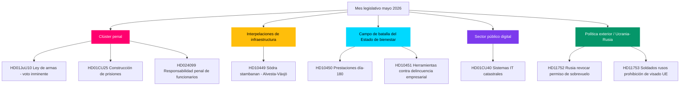

# Perspectiva mensual de mayo 2026: El clímax legislativo preelectoral de Suecia

**Autor**: James Pether Sörling  
**Fecha**: 2026-04-28  
**Clasificación**: Pública — RGPD Art. 9(2)(e)(g)  
**Confianza**: ALTA  
**Tipo de análisis**: Agregación Tier-C perspectiva mensual (multiplicador 1,5×)

## 🎯 Conclusión principal

El Riksdag entra en mayo 2026 con el programa de seguridad y orden del gobierno Kristersson acercándose a su clímax legislativo: un clúster coordinado de justicia penal (ley de armas, construcción de prisiones, delincuentes juveniles, formación policial remunerada) está listo para las votaciones finales, mientras que los socialdemócratas llevan una campaña de interpelaciones en seis frentes sobre infraestructura, bienestar y delincuencia empresarial que expone las vulnerabilidades de la coalición antes de las elecciones de septiembre de 2026. El informe de comisión HD01CU40 sobre el Lantmäteri señala un renovado interés gubernamental en la modernización digital del sector público, y la presión geopolítica ruso-ucraniana se profundiza con nuevas mociones sobre permisos de sobrevuelo y restricciones de visados de la UE. La matemática de la coalición sigue siendo ajustada con una mayoría de +1 escaño; cualquier deserción en enmiendas fronterizas del Comité de Justicia sería determinante para las elecciones.

## 🧭 3 decisiones que apoya este informe

1. **Prioridad editorial**: Liderar la cobertura del clúster legislativo penal (HD01JuU10, HD01CU25, HD03246, HD03237) como la narrativa central del gobierno antes de las elecciones — máximo valor informativo en mayo 2026.
2. **Análisis de la oposición**: Seguir la estrategia de seis interpelaciones del partido S hacia los ministros; HD10449 (infraestructura), HD10450 (prestaciones por enfermedad), HD10451 (delincuencia empresarial) son los objetivos más destacados.
3. **Inteligencia prospectiva**: Supervisar PIR-1 (estabilidad de la coalición), PIR-6 (sondeos), PIR-7 (señal de coalición del Partido del Centro) como indicadores adelantados del ciclo electoral.

## Lectura de 60 segundos

- 🔴 **Clúster penal**: Cinco proyectos de ley interconectados en fase final en el Riksdag; ley de armas (1 jun.), expansión carcelaria (1 jul.) — eje central de la narrativa gubernamental
- 🟡 **Brecha infraestructural**: Södra stambanan/Alvesta-Växjö doble vía ausente del plan de transporte; KD/Andreas Carlson debe responder a la interpelación S HD10449
- 🔵 **Batalla social**: Debate sobre el día 180 de prestaciones por enfermedad (HD10450) abre frente preelectoral sobre el Estado de bienestar; S defiende, el gobierno defiende el acuerdo Tidö
- 🟢 **Administración digital**: HD01CU40 (informe CU) sobre sistemas municipales de gestión catastral — señala la agenda de modernización informática del sector público
- 🟣 **Política exterior**: Instrumentos de ratificación ucranianos + HD11752/HD11753 medidas anti-rusas = profundización del alineamiento post-OTAN
- ⚠️ **Nuevo: HD024099** — Moción que amplía la responsabilidad penal de los funcionarios más allá del ámbito de 2025/26:217; JuU bajo presión para definir los límites de la reforma de responsabilidad

## Principal desencadenante prospectivo

**Señal de resolución PIR-1**: Una votación disciplinada donde SD o un socio de coalición se abstiene en una enmienda del Comité de Justicia redefinirá el cálculo de mayoría del gobierno de cara al verano 2026. Seguir las actas de deliberación del comité la semana del 2026-05-05.

## Mejoras del Paso 2 aplicadas

### Contexto del cuenta atrás electoral

| Hito | Días restantes |
|------|----------------|
| Elección 13 de septiembre | 138 días |
| Fin de sesión primavera Riksdag | ~50 días |
| Última semana de votación | ~35 días |
| Congreso de verano SD | ~70 días |

Mayo 2026 es la última oportunidad para que el gobierno cree hechos legislativos antes de la campaña electoral.
<!-- source-sha: 5fe00f1958c56d07b6bd7744501c301ba01f43c4 -->
