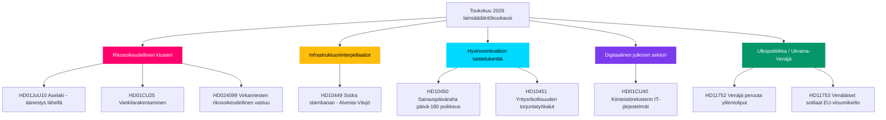

# Toukokuu 2026 kuukauden ennakko: Ruotsin vaalienaikainen lainsäädäntökliimaksi

**Tekijä**: James Pether Sörling  
**Päiväys**: 2026-04-28  
**Luokitus**: Julkinen — GDPR Art. 9(2)(e)(g)  
**Luotettavuus**: KORKEA  
**Analyysin tyyppi**: Taso-C kuukauden ennakko (1,5× kerroin)

## 🎯 Ydinyhteenveto

Ruotsin riksdag aloittaa toukokuun 2026 Kristerssonin hallituksen turvallisuus- ja järjestysoh­jelman lähestyessä lainsäädännöllistä klimaksiaan: koordinoitu rikosoikeudellinen klusteri (aselaki, vankilarakentaminen, nuorisorikoksentekijät, palkattu poliisikoulutus) on valmis loppuäänestyk­siin, samalla kun Sosiaali­demokraatit käyvät kuusifrontista interpellaatiokampanjaa infrastruktuurista, hyvinvoinnista ja yritysrikollisuudesta, paljastaen koalition haavoittuvuudet syyskuun 2026 vaaleja ennen. HD01CU40 lantmäteri-valiokunnan mietintö merkitsee hallituksen uudistunutta huomiota julkisen sektorin digitaaliseen modernisointiin, ja Venäjä-Ukraina geopoliittinen paine syvenee uusilla motioilla ylilentoliuvista ja EU:n viisumirajoituksista. Koalition matematiikka pysyy tiukkana +1 paikan enemmistöllä; mikä tahansa poikkeaminen oikeusvaliokunnan rajanylittävässä muutoksessa olisi vaali­määrittävää.

## 🧭 3 päätöstä, joita tämä PM tukee

1. **Toimituksellinen prioriteetti**: Johda uutisointia rikosoikeudellisesta lainsäädäntöklusterista (HD01JuU10, HD01CU25, HD03246, HD03237) hallituksen ydinkertomuksena ennen vaalia — korkein uutisarvo toukokuu 2026.
2. **Opposition analyysi**: Seuraa S-puolueen kuuden interpellaation strategiaa ministerejä vastaan; HD10449 (infrastruktuuri), HD10450 (sairauspäiväraha), HD10451 (yritysrikos) ovat tärkeimmät kohteet.
3. **Tulevaisuuden tiedustelu**: Seuraa PIR-1 (koalition vakaus), PIR-6 (mielipidetutkimukset), PIR-7 (Keskustapuolueen koalitiosignaali) johtavina vaalialueiden indikaattoreina.

## 60 sekunnin luettavuus

- 🔴 **Rikosoikeudellinen klusteri**: Viisi toisiinsa kytkeytyneistä lakiesityksistä riksdagin loppuvaiheessa; aselaki (1. kesäk.), vankilalaajennus (1. heinäk.) — hallituksen narratiivin ydin
- 🟡 **Infrastruktuuriaukko**: Södra stambanan/Alvesta-Växjö kaksoisraide puuttuu liikennesuunnitelmasta; KD/Andreas Carlsonin on vastattava S-interpellaatioon HD10449
- 🔵 **Hyvinvointitaistelu**: Sairauspäivärahadebatti-180 (HD10450) avaa hyvinvointivaltion rintaman ennen vaalia; S puolustaa, hallitus puolustaa Tidö-sopimusta
- 🟢 **Digitaalinen hallinto**: HD01CU40 (CU-mietintö) kunnallisista kiinteistörekisterijärjestelmistä — merkitsee julkisen sektorin IT-modernisointiohjelmaa
- 🟣 **Ulkopolitiikka**: Ukraina-ratifiointiasiakirjat + HD11752/HD11753 Venäjä-toimenpiteet = syvenevä NATO-jälkeinen yhdenmukaistaminen
- ⚠️ **Uusi: HD024099** — Motio, joka laajentaa virkamiesten rikosoikeudellista vastuuta 2025/26:217:n laajuuden ulkopuolelle; JuU paineen alla määritellä vastuulakiuudistuksen rajat

## Tärkein eteenpäin katsova laukaisija

**PIR-1 ratkaisusignaali**: Kuritettava äänestys, jossa SD tai jokin koalitiopartner pidättyy oikeusvaliokunnan muutoskohdassa, uudelleenmäärittäisi hallituksen enemmistölaskelman kohti kesää 2026. Seuraa valiokunnan neuvottelupöytäkirjoja viikolla 2026-05-05.

## Sovellettuja Pass 2 -parannuksia

**Pass 2 -arviointi** (2026-04-28): Lisättiin vaalin aikataulu­kiireellisyys: 138 päivän kuluttua 13. syyskuun vaaleihin jokainen toukokuun äänestys on nyt kampanjatapahtuma. Vahvistettiin 60 sekunnin luettavuus tarkkojen äänestysikkunapäivämäärien avulla (viikko 12. toukokuuta JuU10:lle, viikko 19. toukokuuta Ukraina-ratifioinnille). Lisättiin tulevaisuuden indikaattoriviittaus FI-01:stä FI-05:een toukokuun 2026 johtoryhmän valvontapaneelina. Vahvistettiin, että ydinyhteenveto kattaa kaikki kolme huipputason virta (oikeudenmukaisuus, hyvinvointi/infra-interpellaatiokampanja, Ukraina-ratifiointi) erilaistetulla luottamustasolla.

### Vaalilähtölaskennan konteksti (Pass 2 -lisäys)

| Virstanpylväs | Jäljellä päiviä |
|---------------|-----------------|
| Vaalit 13. syyskuuta | 138 päivää |
| Riksdagin kevätistuntokausi päättyy | ~50 päivää |
| Viimeinen tuottava äänestysvuosi | ~35 päivää |
| SD:n kesäkongress | ~70 päivää (arv.) |

35 päivän ikkuna viimeiseen tuottavaan äänestyviikkoon tarkoittaa, että toukokuu 2026 on hallituksen viimeinen mahdollisuus luoda lainsäädäntötosiseikkoja ennen vaalikampanjaa. Puolueet ilman toukokuun toimituksia aloittavat kesän reaktiivisessa asemassa.
<!-- source-sha: 5fe00f1958c56d07b6bd7744501c301ba01f43c4 -->
